# ODSC Harness Engineering — working storyboard

Source deck: `latest_sept4.pptx`

[Open the full visual-layout draft](http://127.0.0.1:5173/s/odsc-full-visual-review?p=1). [Visual-pass notes and remaining source checks](review-additions/visual-pass.md). Markdown remains the working source; the OpenSlide preview is a generated snapshot.

Move whole slide blocks to change the order. Edit the heading and body directly. The hidden source-slide comment lets us sync changes back to the deck later.

---

# Opening

<!-- source-slide: 001 -->
<!-- visual-pass
preview: http://127.0.0.1:5173/s/odsc-full-visual-review?p=1
layout: source-figure
motion: Preserve original figure; add separate highlights only when needed.
status: layout draft
-->
## Engineering the Harness: A Practical Workshop

Source: [Rajiv Shah @rajistics OpenHands https://github.com/rajshah4/harness-engineering](https://github.com/rajshah4/harness-engineering)

---

<!-- source-slide: 003 -->
<!-- visual-pass
preview: http://127.0.0.1:5173/s/odsc-full-visual-review?p=2
layout: source-figure
motion: Preserve original figure; add separate highlights only when needed.
status: layout draft
-->
## Coding agents now complete tasks instead of suggesting code

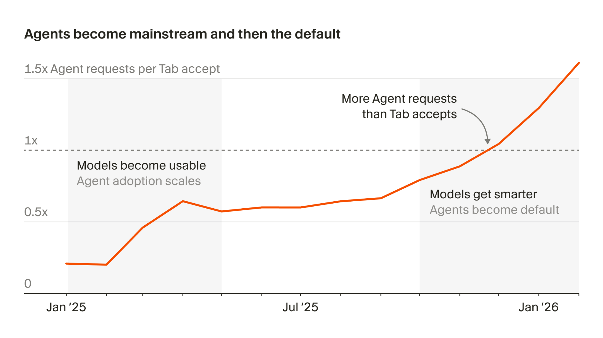

Source: [https://prod.cursor.com/blog/third-era](https://prod.cursor.com/blog/third-era)

---

<!-- source-slide: 004 -->
<!-- visual-pass
preview: http://127.0.0.1:5173/s/odsc-full-visual-review?p=3
layout: source-figure
motion: Preserve original figure; add separate highlights only when needed.
status: layout draft
-->
## An agent combines a model with a harness

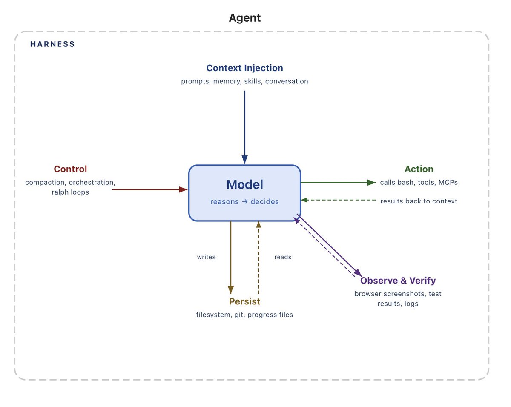

Source: [https://blog.langchain.com/the-anatomy-of-an-agent-harness/](https://blog.langchain.com/the-anatomy-of-an-agent-harness/)

---

<!-- new-slide: agent-canvas-run -->
<!-- visual-pass
preview: http://127.0.0.1:5173/s/odsc-full-visual-review?p=4
layout: flow
motion: Separate native elements; use the full composition for now.
status: layout draft
-->
<!-- presentation
status: prototype
key_point: The harness executes tools and checks completion around model decisions.
example: http://127.0.0.1:5173/s/harness-motion-lab?p=1
builds: Context; model decision; tool execution; observation; next turn; completion gate.
control: Presenter advances and reverses with arrow keys.
static: Preserve the full loop diagram and an explanation of the completion gate.
notes: Separate sample deck. Illustrative sequence, not a literal run trace. Main talking points remain in development.
-->
## The harness supplies context and executes the model's tool requests

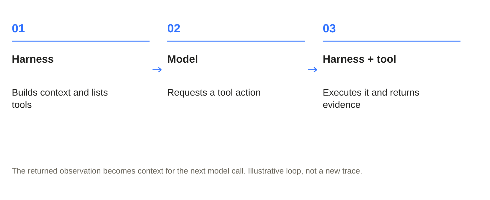

The harness assembles the user's request, instructions and tools. The model requests a tool action. The harness executes it and returns the observation for the next model call.

This diagram explains the roles. The [annotated real trace](review-additions/teaching-visuals/agent-canvas-trace.png) is available for the workshop walkthrough.

<!-- resolved-review: Clarified who supplies context, chooses the tool request, and executes it. The diagram is illustrative; the linked trace is the recorded evidence. -->

Source: [Saved event IDs and excerpts](review-additions/trace-evidence.md). Selected events from the Aug. 24 Incident Operations Center run; intermediate edits are omitted.

---

<!-- source-slide: 006 -->
<!-- visual-pass
preview: http://127.0.0.1:5173/s/odsc-full-visual-review?p=5
layout: source-figure
motion: Preserve original figure; add separate highlights only when needed.
status: layout draft
-->
## The harness is everything outside the model

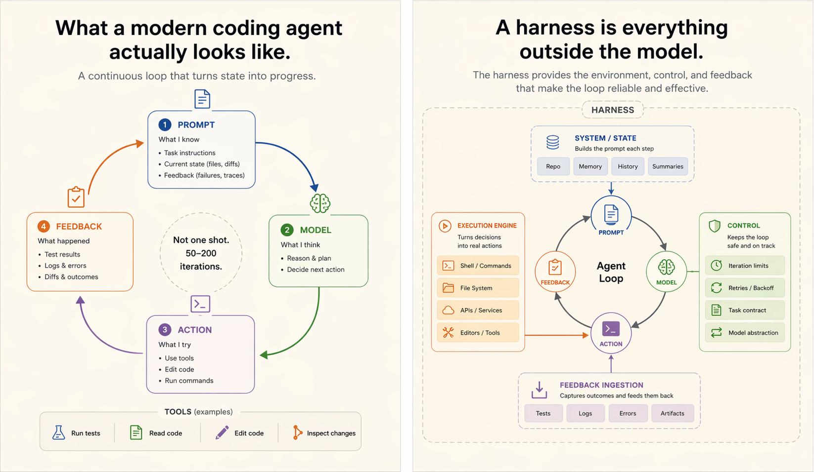

Source: [https://blog.langchain.com/the-anatomy-of-an-agent-harness/](https://blog.langchain.com/the-anatomy-of-an-agent-harness/)

---

<!-- source-slide: 057 -->
<!-- visual-pass
preview: http://127.0.0.1:5173/s/odsc-full-visual-review?p=6
layout: source-figure
motion: Preserve original figure; add separate highlights only when needed.
status: layout draft
-->
## Claude Code shows how complex a modern harness has become

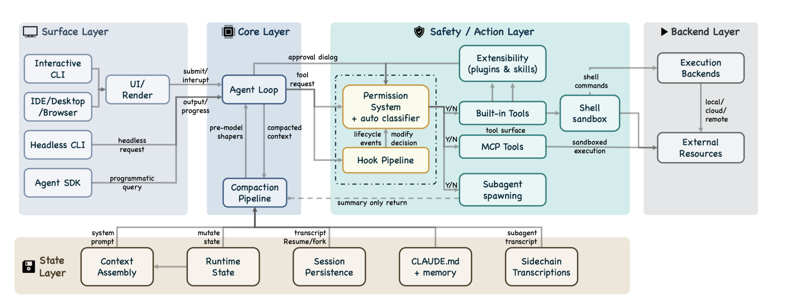

Source: [https://arxiv.org/pdf/2604.14228](https://arxiv.org/pdf/2604.14228)

---

<!-- source-slide: 008 -->
<!-- visual-pass
preview: http://127.0.0.1:5173/s/odsc-full-visual-review?p=7
layout: table
motion: Separate native elements; use the full composition for now.
status: draft; follow-ups in review-additions/visual-pass.md
-->
## Claude Code adoption rose while Cursor and Copilot fell

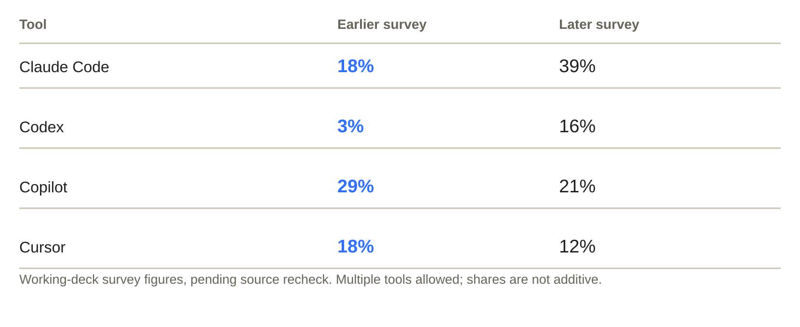

Growth of agent harnesses.

Claude Code

18% → 39%

GitHub Copilot

29% → 21%

OpenAI Codex

3% → 16%

Codex adoption
in six months

Cursor

18% → 12%

JetBrains Developer Ecosystem Survey 2026, May–July (n > 15,000). Thin markers show Jan. 2026 adoption.
Multiple tools allowed; percentages are not additive.

---

<!-- source-slide: 009 -->
<!-- visual-pass
preview: http://127.0.0.1:5173/s/odsc-full-visual-review?p=8
layout: table
motion: Separate native elements; use the full composition for now.
status: draft; follow-ups in review-additions/visual-pass.md
-->
## Model providers now ship their own harnesses

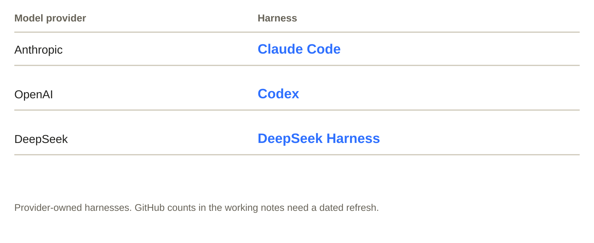

Model providers now ship their own harnesses

→

Claude Code

Claude

ANTHROPIC

143K stars

→

Codex

GPT / Codex

OPENAI

120K stars

GitHub stars
within days

100K+

→

DeepSeek

DeepSeek Harness

DEEPSEEK

205K stars

GitHub counts captured Aug. 30, 2026. DeepSeek launched Aug. 13; the velocity callout applies only to DeepSeek.

---

<!-- source-slide: 010 -->
<!-- visual-pass
preview: http://127.0.0.1:5173/s/odsc-full-visual-review?p=9
layout: text
motion: Static text; no animation needed for this draft.
status: draft; follow-ups in review-additions/visual-pass.md
-->
## Provider harnesses are good enough for general software tasks

The models labs harnesses are good enough to start.

ANTHROPIC STACK

OPENAI STACK

DEEPSEEK STACK

Claude Code

Codex

DeepSeek Harness

Claude Opus 4.6

GPT-5.4

DeepSeek-V4-Pro

57.3

65.4

57.7

75.1

55.4

67.9

SWE-BENCH

TERMINAL-BENCH

SWE-BENCH

TERMINAL-BENCH

SWE-BENCH

TERMINAL-BENCH

resolved

accuracy

resolved

accuracy

resolved

accuracy

Models—not branded UIs—run in DeepSeek’s minimal agent harness. Benchmarks contain known task noise; use directionally, not as a product ranking.

---

<!-- source-slide: 011 -->
<!-- visual-pass
preview: http://127.0.0.1:5173/s/odsc-full-visual-review?p=10
layout: text
motion: Static text; no animation needed for this draft.
status: layout draft
-->
## Why look beyond the model providers?

Why consider alternative harnesses?
Let me just use Claude Code or Codex

---

<!-- new-slide: why-alternatives -->
<!-- visual-pass
preview: http://127.0.0.1:5173/s/odsc-full-visual-review?p=11
layout: flow
motion: Separate native elements; use the full composition for now.
status: layout draft
-->
## Provider harnesses make the engineering choices for you

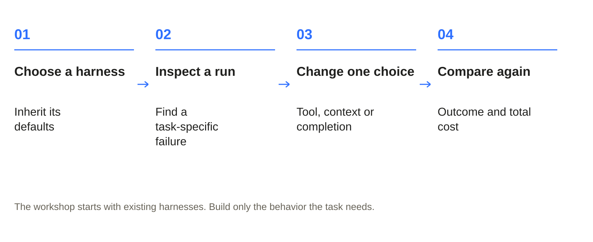

Its tool interfaces, context policy, memory, model routing, and update schedule are product choices. Studying harnesses lets you see those choices, measure their costs, and change them when the task demands it.

---

<!-- source-slide: 091 -->
<!-- visual-pass
preview: http://127.0.0.1:5173/s/odsc-full-visual-review?p=12
layout: compare
motion: Separate native elements; use the full composition for now.
status: layout draft
-->
<!-- resolved-review: Moved to the opening alternatives discussion. Portability depends on storage and export design, not simply open versus closed licensing. -->
## Where memory lives affects how easily you can change harnesses

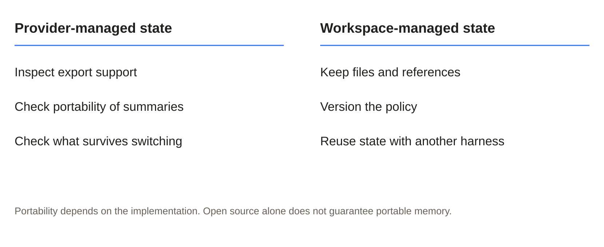

When state lives in workspace files, you can inspect and version it. Provider-managed state may have different export and reuse constraints. Check what survives switching before building a workflow around it.

Source: [LangChain, Your Harness, Your Memory](https://www.langchain.com/blog/your-harness-your-memory)

---

<!-- new-slide: existing-harness-starting-point -->
<!-- visual-pass
preview: http://127.0.0.1:5173/s/odsc-full-visual-review?p=13
layout: text
motion: Static text; no animation needed for this draft.
status: layout draft
-->
<!-- presentation
status: proposed
key_point: Learning harness engineering helps us decide which existing behavior to change.
initial: Show the article title and its practical recommendation.
builds: Clarify the definition; connect to the workshop decisions.
animation: Optional two-step reveal.
transition: cut
notes: The article uses a narrower definition of harness. Treat its engineering advice seriously without making the workshop a terminology dispute.
-->
## An existing harness is a starting point for testing better choices

Omnara argues that the basic loop is largely interchangeable and that prompts and tools deserve more attention. It acknowledges context management and routing as algorithmic differences.

Our workshop asks which choices to keep and which to change. A tool, a context rule, or a completion check can be the whole intervention.

Source: [Kartik Sarangmath, “The Harness Doesn't Matter,” Omnara, September 1, 2026](https://www.omnara.com/blog/the-harness-doesnt-matter)

---

<!-- source-slide: 012 -->
<!-- visual-pass
preview: http://127.0.0.1:5173/s/odsc-full-visual-review?p=14
layout: text
motion: Static text; no animation needed for this draft.
status: draft; follow-ups in review-additions/visual-pass.md
-->

@@This was an organizing sldie for me, not sure we need to do this, although I guess its a roadmap for the paper

## Six harness choices organize the workshop

1. Harness choice
2. Tool design
3. Context, working state and memory
4. Model routing
5. Completion, recovery and stopping
6. Multi-agent systems

ODSC Workshop · Six Claims on Trial

---

# Workshop 1: Harness choice

<!-- source-slide: 013 -->
<!-- visual-pass
preview: http://127.0.0.1:5173/s/odsc-full-visual-review?p=15
layout: text
motion: Static text; no animation needed for this draft.
status: layout draft
-->
## What changes when the model stays fixed?

Run the same repository task with OpenHands, Pi, and OpenCode. Hold the model, starting files, environment, and verifier fixed.

Use Agent Canvas to compare the evidence gathered, actions taken, context sent, and stopping event.

---

<!-- source-slide: 014 -->
<!-- visual-pass
preview: http://127.0.0.1:5173/s/odsc-full-visual-review?p=16
layout: text
motion: Static text; no animation needed for this draft.
status: layout draft
-->
## Where will the runs diverge first?

Choose one:

The first useful repository evidence

The number of model calls and context per call

The final verifier outcome

Constraint: model, task, repository revision, workspace, and verifier stay fixed.

---

<!-- source-slide: 015 -->
<!-- visual-pass
preview: http://127.0.0.1:5173/s/odsc-full-visual-review?p=17
layout: source-figure
motion: Preserve original figure; add separate highlights only when needed.
status: layout draft
-->
## A simple harness gives the model tools, feedback, and another turn

The harness is an interface designed for the model.

N1

SWE-agent · NeurIPS 2024 · Figure 1

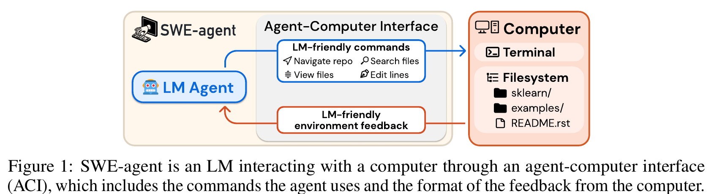

---

<!-- source-slide: 017 -->
<!-- visual-pass
preview: http://127.0.0.1:5173/s/odsc-full-visual-review?p=18
layout: source-figure
motion: Preserve original figure; add separate highlights only when needed.
status: layout draft
-->
## Harness performance varied by 18 points with the same model

Same model, but an 18-point spread across five harnesses.

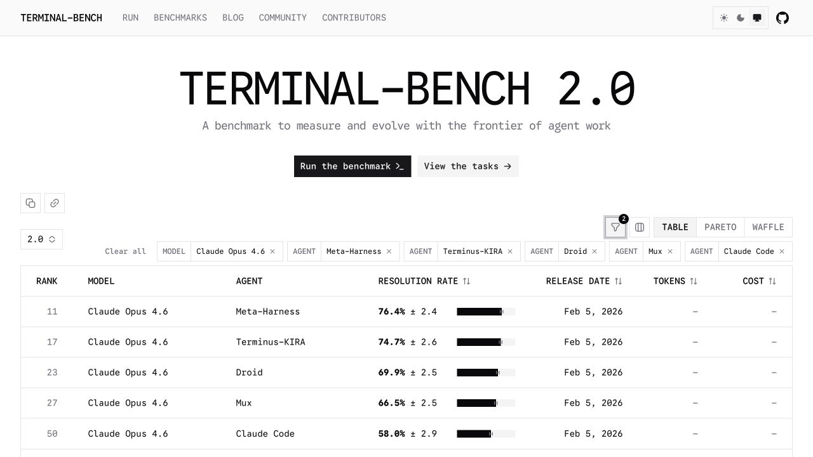

---

<!-- source-slide: 019 -->
<!-- visual-pass
preview: http://127.0.0.1:5173/s/odsc-full-visual-review?p=19
layout: source-figure
motion: Preserve original figure; add separate highlights only when needed.
status: layout draft
-->
## Harnesses changed completion, process quality, and cost

Harnesses vary in completion, process quality, efficiency, and failure behavior.

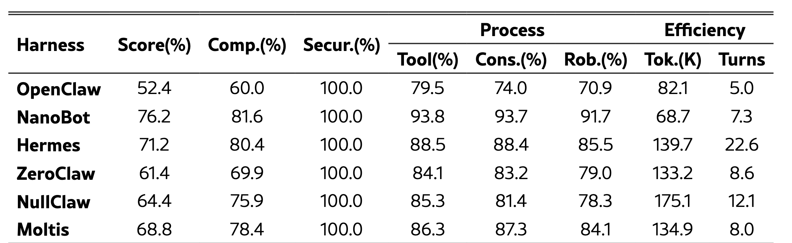

---

<!-- source-slide: 018 -->
<!-- visual-pass
preview: http://127.0.0.1:5173/s/odsc-full-visual-review?p=20
layout: source-figure
motion: Preserve original figure; add separate highlights only when needed.
status: layout draft
-->
## No harness led on accuracy, speed, and token use

Same model across seven harnesses.

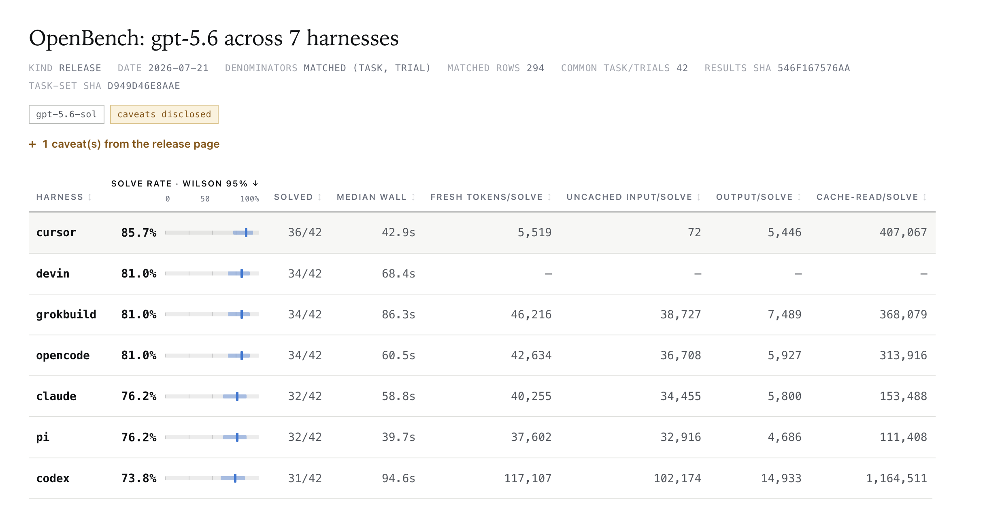

---

<!-- source-slide: 016 -->
<!-- visual-pass
preview: http://127.0.0.1:5173/s/odsc-full-visual-review?p=21
layout: source-figure
motion: Preserve original figure; add separate highlights only when needed.
status: layout draft
-->
## A custom data harness improved accuracy while cutting cost

A custom harness can give you higher accuracy and be cheaper!

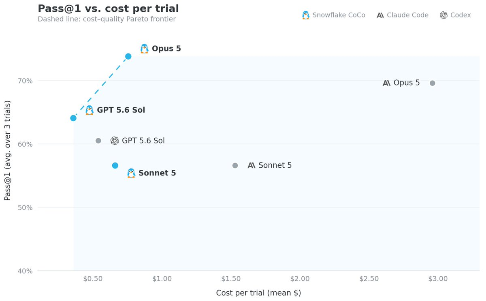

---

<!-- new-slide: harvey-harness-result -->
<!-- visual-pass
preview: http://127.0.0.1:5173/s/odsc-full-visual-review?p=22
layout: source-figure
motion: Preserve original figure; add separate highlights only when needed.
status: layout draft
-->
<!-- presentation
status: prototype
canvas: 1920x1080
layout: Original chart on left; editable problem statement, mean comparison, and cost qualification on right.
preview: http://127.0.0.1:5173/s/harvey-visual-review?p=1
key_point: Changing the execution system improved rubric coverage, with a resource tradeoff.
initial: Original chart and the baseline coverage problem.
builds: Reveal 23.3% versus 62.4%; reveal criteria-not-tasks and increased generation cost.
transition: cut
source_visual: Original Figure 6, SVG preserved. Not the mixed training chart in Figure 1.
resolved_comment: Merged harvey-task-mismatch into this slide per Rajiv's request for two Harvey slides.
-->
## A document-review harness raised average rubric pass rate by 39 points

The baseline agents left much of the data room unexamined.

Standard tool loop: **23.3%**. RLM harness: **62.4%**.

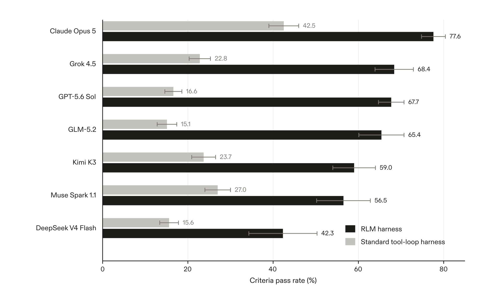

Seven models, 50 held-out synthetic data rooms. Criteria passed, not complete tasks. Generation cost rose for six of seven models.

[Open the layout and builds](http://127.0.0.1:5173/s/harvey-visual-review?p=1)

Source: [Harvey and Baseten, September 8, 2026](https://www.harvey.ai/blog/post-training-rlm-agents-for-m-and-a-diligence), Figure 6. Vendor-reported LLM judging against expert rubrics. RLM uses fixed Qwen3.6-35B-A3B subagents. This is not an equal-compute comparison.

---

<!-- new-slide: harvey-harness-mechanism -->
<!-- visual-pass
preview: http://127.0.0.1:5173/s/odsc-full-visual-review?p=23
layout: source-figure
motion: Preserve original figure; add separate highlights only when needed.
status: layout draft
-->
<!-- presentation
status: prototype
canvas: 1920x1080
layout: Large original architecture figure, divided into separate SVG viewports for reveals; editable heading and citation.
preview: http://127.0.0.1:5173/s/harvey-visual-review?p=2
initial: Data room.
builds: Root and REPL; bounded subagents; findings returned as variables; final memo.
transition: cut
source_visual: Original Figure 5, intact vector source. Regions reveal independently without changing labels or connections.
notes: Each reveal is an independent wrapper, not an editable re-creation of every source label. Keep original SVG available. Return to this example in context and multi-agent sections.
-->
## The harness divided the reading and kept findings available for synthesis

A root agent uses a Python REPL to delegate bounded reviews. Subagents return findings as variables; only printed output enters the root's context.

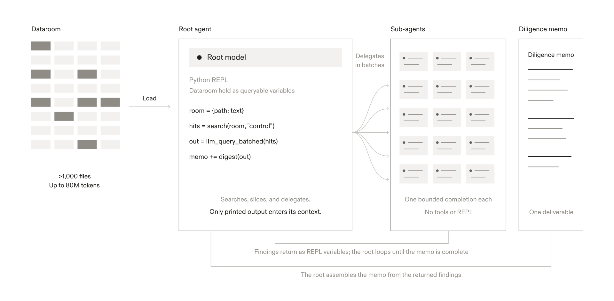

[Open the layout and builds](http://127.0.0.1:5173/s/harvey-visual-review?p=2)

Source: [Harvey and Baseten](https://www.harvey.ai/blog/post-training-rlm-agents-for-m-and-a-diligence), Figure 5.

<!-- talk-track
The workshop question is what failure justified this design, and what evidence would show that the change helped. Inspect coverage and the final memo together, then check the resource cost. These subagents have no tools or REPL. Training is separate: the Qwen root improved from 29.9% to 63.0% within the RLM harness, not as a step after the seven-model average. Keep training in optional discussion.
-->

---

<!-- new-slide: model-harness-coadaptation -->
<!-- visual-pass
preview: http://127.0.0.1:5173/s/odsc-full-visual-review?p=24
layout: text
motion: Static text; no animation needed for this draft.
status: layout draft
-->
## Models learn the harness they train against

Post-training can tune a model to particular tool schemas, edit formats, and loop behavior. Applied Compute offers a concrete example: it trained a specialist code-search model to use indexed retrieval, then served it with the same search environment.

This is a vendor-reported case study, not a controlled general comparison. But it makes the mechanism clear: training the model and engineering the harness are linked decisions.

Source: [Applied Compute, “Training a Specialist Code Search Agent with turbopuffer”](https://www.appliedcompute.com/case-studies/turbopuffer)

---

<!-- source-slide: 058 -->
<!-- visual-pass
preview: http://127.0.0.1:5173/s/odsc-full-visual-review?p=25
layout: source-figure
motion: Preserve original figure; add separate highlights only when needed.
status: layout draft
-->
## Small harness changes degraded production coding quality

default reasoning high -> medium
bug that accidentally evicted thinking blocks on every turn in session was a change to help with cache optimization
system prompt change to reduce verbosity which reduced code quality

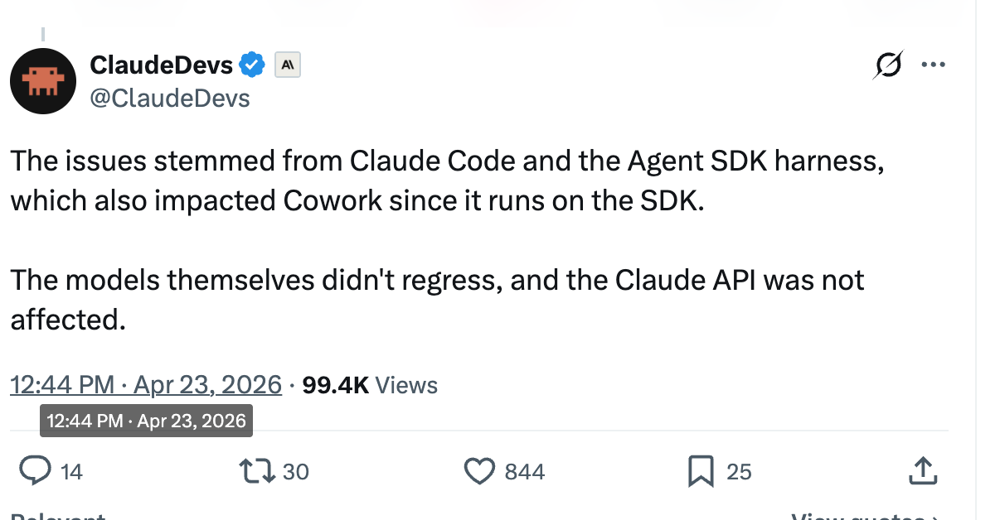

Source: [https://www.anthropic.com/engineering/april-23-postmortem](https://www.anthropic.com/engineering/april-23-postmortem)

---

<!-- source-slide: 197 -->
<!-- visual-pass
preview: http://127.0.0.1:5173/s/odsc-full-visual-review?p=26
layout: text
motion: Static text; no animation needed for this draft.
status: draft; follow-ups in review-additions/visual-pass.md
-->

@@Is this adding value???

## Identical runs changed the outcome about one time in ten

Source answered 27 of 45 questions. Summaries answered 4.

The study fixed localization, then changed only how code was represented.
Compressed context matched whole files at about one-third the tokens: 19K context tokens per resolved issue versus 94K.
Even temperature-0 runs flipped about 9% of instance outcomes. Small benchmark gains sit inside real noise.

Brian Sam-Bodden | arXiv 2607.09691

Source: [arxiv.org](https://arxiv.org/abs/2607.09691)

---

<!-- source-slide: 022 -->
<!-- visual-pass
preview: http://127.0.0.1:5173/s/odsc-full-visual-review?p=27
layout: table
motion: Separate native elements; use the full composition for now.
status: draft; follow-ups in review-additions/visual-pass.md
-->
## Open-source harnesses are already widely used

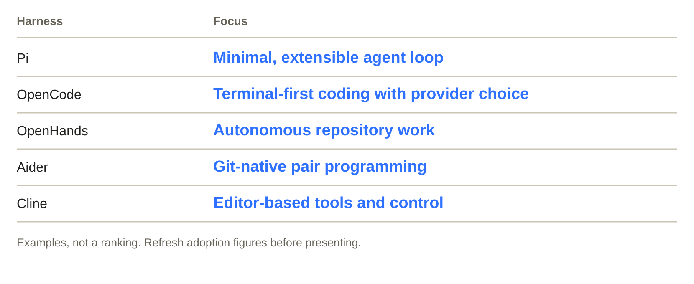

Open-source harnesses are widely available.

Pi

99K ★

Minimal, extensible agent loop

Build your own behavior

OpenCode

203K ★

Terminal-first coding agent

Provider and workflow choice

OpenHands

86K ★

Software-development agent platform

Autonomous repository work

Aider

49K ★

Git-native pair programming

A focused coding workflow

Cline

67K ★

IDE-based autonomous coding

Editor-native tools and control

---

<!-- source-slide: 024 -->
<!-- visual-pass
preview: http://127.0.0.1:5173/s/odsc-full-visual-review?p=28
layout: source-figure
motion: Preserve original figure; add separate highlights only when needed.
status: layout draft
-->
## Two harnesses make dozens of different decisions

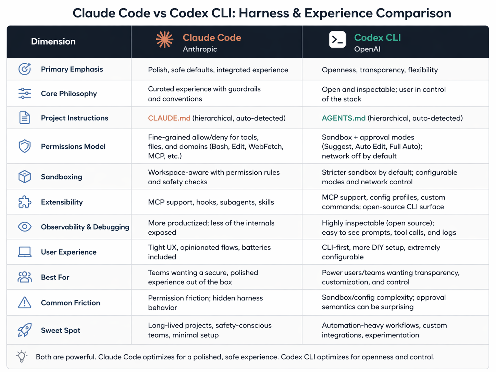

Source: [https://fieldjournal.ai/blog/codex-cli-vs-claude-code/?utm_source=chatgpt.com](https://fieldjournal.ai/blog/codex-cli-vs-claude-code/?utm_source=chatgpt.com)

---

<!-- source-slide: 025 -->
<!-- visual-pass
preview: http://127.0.0.1:5173/s/odsc-full-visual-review?p=29
layout: text
motion: Static text; no animation needed for this draft.
status: layout draft
-->
## Trace one decision back to the harness

Open the three prepared runs in Agent Canvas.

Find the first useful evidence, the tool that produced it, and the event that justified stopping.

Choose one difference in context, tools, or completion control to test next.

---

<!-- source-slide: 026 -->
<!-- visual-pass
preview: http://127.0.0.1:5173/s/odsc-full-visual-review?p=30
layout: source-figure
motion: Preserve original figure; add separate highlights only when needed.
status: draft; follow-ups in review-additions/visual-pass.md
-->
## The harness changed cost far more than it changed quality

Harness paths and costs diverged sharply.

Editable reconstruction · recheck the underlying source before presenting.

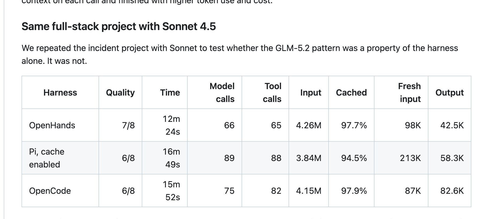

---

<!-- new-slide: workshop-1-debrief -->
<!-- visual-pass
preview: http://127.0.0.1:5173/s/odsc-full-visual-review?p=31
layout: text
motion: Static text; no animation needed for this draft.
status: layout draft
-->
## A useful comparison isolates the harness decision

Hold the task, model, environment, and verifier fixed. Inspect where the traces diverge, then choose one harness setting to test.

The measured runs show different paths and costs. Recheck the result on another task.

---

<!-- new-slide: harness-improvement-method -->
<!-- visual-pass
preview: http://127.0.0.1:5173/s/odsc-full-visual-review?p=32
layout: source-figure
motion: Preserve original figure; add separate highlights only when needed.
status: layout draft
-->
## A harness change needs a repeatable comparison

Inspect the failure in Agent Canvas. Predict the effect of one configuration change, repeat the task, and check whether the improvement transfers.

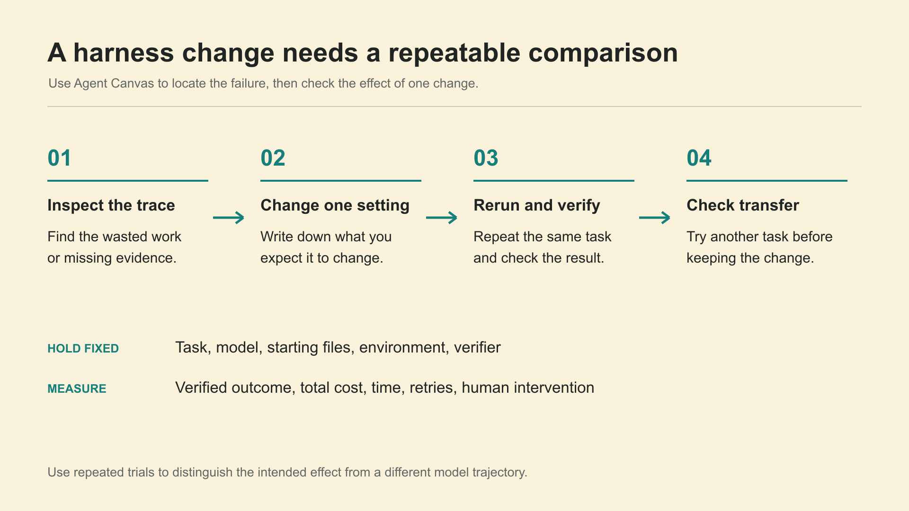

Record verified outcome, provider cost when available, wall time, retries, and human intervention. Track fresh and cached input separately.

---

<!-- new-slide: pi-cache-intervention -->
<!-- visual-pass
preview: http://127.0.0.1:5173/s/odsc-full-visual-review?p=33
layout: source-figure
motion: Preserve original figure; add separate highlights only when needed.
status: layout draft
-->
## Cache markers reduced fresh input in the Pi rerun

Pi sent no cache markers, and the provider reported zero cache reads. Adding the compatibility setting enabled caching in calibration and the full rerun.

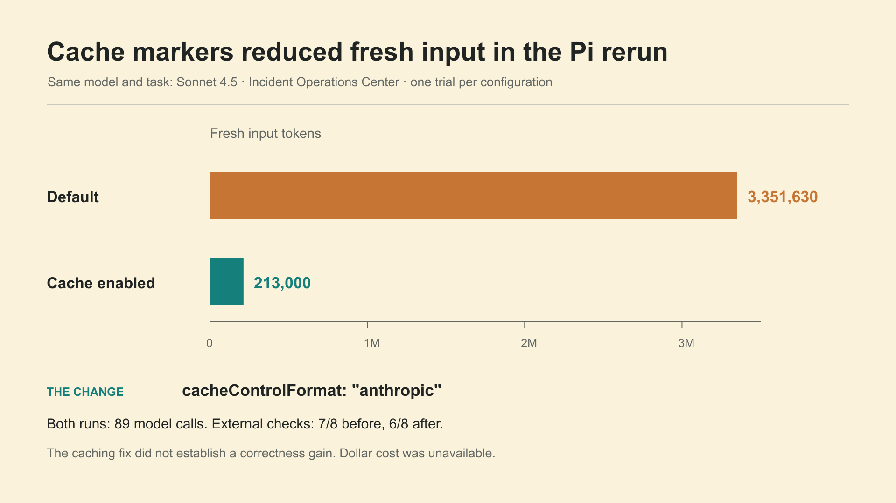

Both runs made 89 model calls. The 7/8 and 6/8 check results come from separate trajectories and do not establish an effect of caching on quality. Comparable dollar cost was unavailable.

Source: [Pi cache-control experiment](../../../harness-benchmark/results/incident-sonnet-harness-comparison.md).

---

# Workshop 2: Tool design

<!-- source-slide: 029 -->
<!-- visual-pass
preview: http://127.0.0.1:5173/s/odsc-full-visual-review?p=34
layout: text
motion: Static text; no animation needed for this draft.
status: layout draft
-->
## The first way people improve an agent is to add tools

---

<!-- source-slide: 030 -->
<!-- visual-pass
preview: http://127.0.0.1:5173/s/odsc-full-visual-review?p=35
layout: source-figure
motion: Preserve original figure; add separate highlights only when needed.
status: layout draft
-->
## Tools turn model decisions into real actions

GitHub — inspect repositories, issues, and pull requests
Docker — create isolated execution environments
Google Search — find external information
PostgreSQL — query and modify structured data
Python — calculate, analyze, and transform data
Playwright — operate and test websites
Bash — execute commands and scripts
AWS — operate cloud infrastructure
Slack — communicate with people and teams
Gmail — read and send email
Google Calendar — schedule and coordinate work
Jira — create and manage engineering tasks
Notion — retrieve and update organizational knowledge
Figma — inspect designs and design specifications
Stripe — inspect customers, payments, and subscriptions

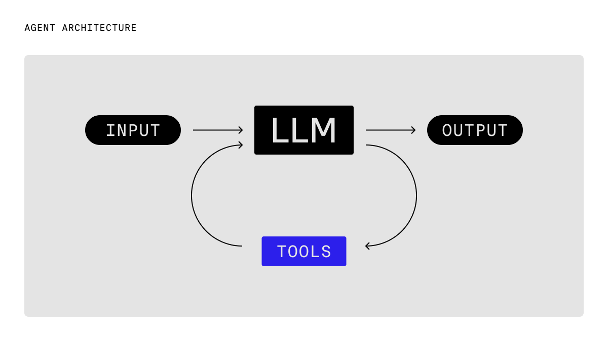

---

<!-- source-slide: 034 -->
<!-- visual-pass
preview: http://127.0.0.1:5173/s/odsc-full-visual-review?p=36
layout: text
motion: Static text; no animation needed for this draft.
status: layout draft
-->
## Which tool surface earns its place?

The agent must inspect OpenHands PR #16860, explain the change and its validation, and cite GitHub evidence for every claim.

Compare terminal plus the GitHub API, a broad catalog of 12 GitHub operations, and one task-shaped tool that returns a bounded evidence bundle.

Hold Claude Sonnet 4.6, the prompt, workspace, and rubric fixed. Run each condition three times.

---

<!-- new-slide: workshop-2-prediction -->
<!-- visual-pass
preview: http://127.0.0.1:5173/s/odsc-full-visual-review?p=37
layout: text
motion: Static text; no animation needed for this draft.
status: layout draft
-->
## What should the harness expose first?

Choose one:

Broad catalog: more ways to inspect the repository

Terminal plus API: a compact interface with a wide action space

Task-shaped tool: one call that returns the evidence needed for this recurring workflow

Predict elapsed time, tool calls, and evidence quality.

---

<!-- new-slide: workshop-2-result -->
<!-- visual-pass
preview: http://127.0.0.1:5173/s/odsc-full-visual-review?p=38
layout: table
motion: Show condition and correctness first; reveal time and cost on advance.
status: layout draft
-->
<!-- presentation
status: prototype
key_point: A bounded evidence tool removes repeated retrieval decisions.
example: http://127.0.0.1:5173/s/harness-motion-lab?p=7
builds: Evidence categories; repeated retrieval; one bundle; measured comparison.
animation: Morph the task-shaped lane into one evidence bundle.
static: Full comparison with the source and measured results.
notes: Sample compares broad catalog with task-shaped tool. Add the terminal condition if the final talking point requires it.
-->
## One task-shaped tool beat both the terminal and a broad catalog

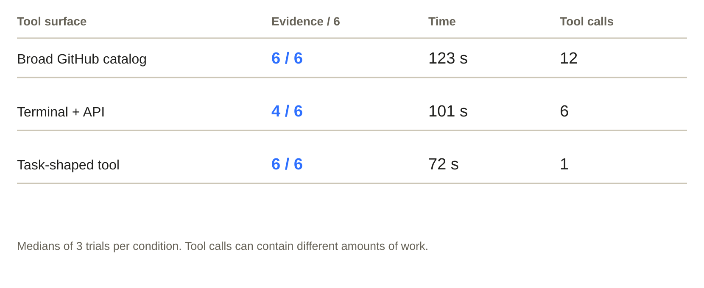

Median across three fresh trials:

Broad GitHub catalog: 123 seconds, 12 tool calls, 6/6 evidence

Terminal plus API: 101 seconds, 6 tool calls, 4/6 evidence

Task-shaped GitHub tool: 72 seconds, 1 tool call, 6/6 evidence

The task-shaped tool used 73% fewer processed tokens than the broad catalog while preserving the full evidence score.

Source: [Workshop 2 preliminary results](../../../harness-benchmark/results/workshop2-tool-surface-preliminary.md)

---

<!-- new-slide: workshop-2-mechanism -->
<!-- visual-pass
preview: http://127.0.0.1:5173/s/odsc-full-visual-review?p=39
layout: flow
motion: Separate native elements; use the full composition for now.
status: layout draft
-->
## The task-shaped tool removed a predictable retrieval loop

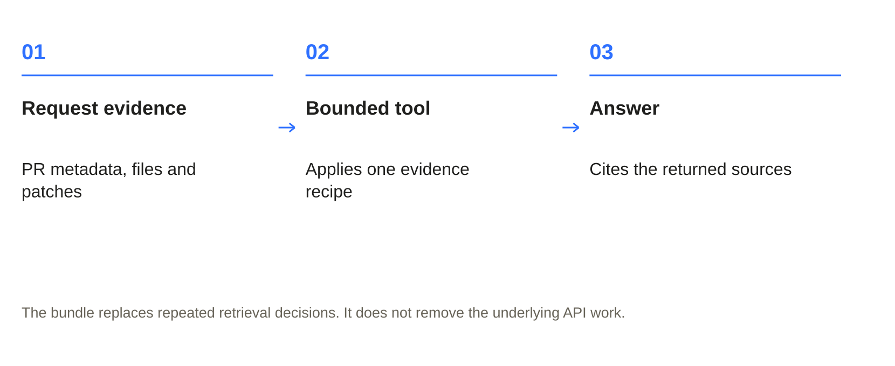

The broad catalog and primitive MCP conditions repeatedly fetched pull request metadata, individual files, patches, commits, and validation evidence.

The task-shaped tool applied the same general evidence recipe once and returned a bounded, citable result. The agent needed two model calls and one tool call to finish.

Source: [Workshop 2 preliminary results](../../../harness-benchmark/results/workshop2-tool-surface-preliminary.md)

---

<!-- new-slide: workshop-2-reversal -->
<!-- visual-pass
preview: http://127.0.0.1:5173/s/odsc-full-visual-review?p=40
layout: compare
motion: Separate native elements; use the full composition for now.
status: layout draft
-->
## Specialized tools earn their place on repeated, bounded work

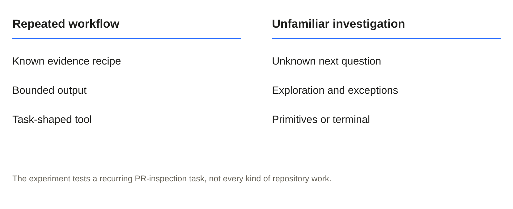

The experiment does not show that specialized tools always win. A task-shaped tool helps when the evidence workflow repeats and the output can stay bounded.

Unfamiliar investigations still need primitives or a terminal. The harness should keep an escape route for exploration and exceptions.

Source: [Workshop 2 preliminary results](../../../harness-benchmark/results/workshop2-tool-surface-preliminary.md)

---

<!-- source-slide: 031 -->
<!-- visual-pass
preview: http://127.0.0.1:5173/s/odsc-full-visual-review?p=41
layout: text
motion: Static text; no animation needed for this draft.
status: layout draft
-->
## Growing tool catalogs forced better ways to describe tools

Prompt instructions
↓
Structured tool definitions
↓
MCP servers and reusable connectors
↓
Large tool catalogs
↓
Search and deferred loading

---

<!-- source-slide: 033 -->
<!-- visual-pass
preview: http://127.0.0.1:5173/s/odsc-full-visual-review?p=42
layout: compare
motion: Separate native elements; use the full composition for now.
status: layout draft
-->
## The same capability behaves differently through an API, MCP, or CLI

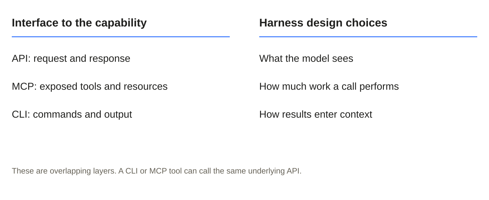

Direct API · MCP · Bash / CLI

---

<!-- new-slide: edit-format -->
<!-- visual-pass
preview: http://127.0.0.1:5173/s/odsc-full-visual-review?p=43
layout: compare
motion: Separate native elements; use the full composition for now.
status: draft; follow-ups in review-additions/visual-pass.md
-->
## The edit format changes how often the agent must retry

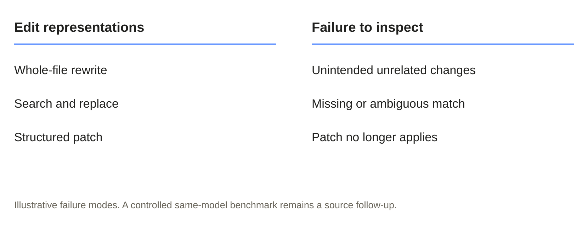

Whole-file rewrites, search-and-replace, and structured patches fail in different ways. Their failures create different retry and token costs.

TO FILL: Add one controlled comparison using the same model and task.

---

<!-- source-slide: 032 -->
<!-- visual-pass
preview: http://127.0.0.1:5173/s/odsc-full-visual-review?p=44
layout: source-figure
motion: Preserve original figure; add separate highlights only when needed.
status: layout draft
-->
## Tool search keeps unused definitions out of the prompt

N2

Anthropic · Advanced Tool Use, 2025 · official example

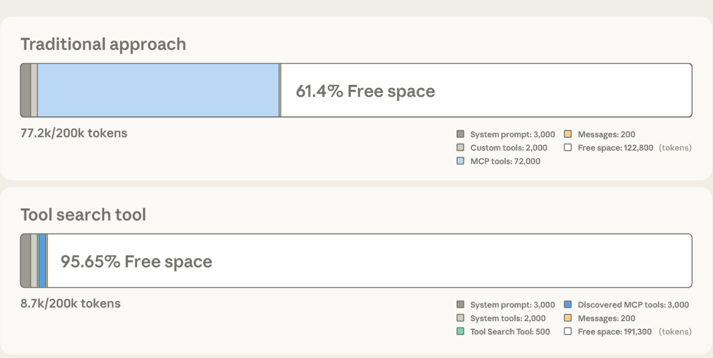

---

<!-- source-slide: 150 -->
<!-- visual-pass
preview: http://127.0.0.1:5173/s/odsc-full-visual-review?p=45
layout: source-figure
motion: Preserve original figure; add separate highlights only when needed.
status: layout draft
-->
<!-- presentation
status: prototype
preview: http://127.0.0.1:5173/s/tools-context-visual-review?p=1
builds: Source comparison; reveal the distinction between available tools and loaded definitions.
notes: Resolved @@ comment by moving from reserves to tools. Eager schema loading is an integration choice, not an MCP requirement.
-->
## Uber moved tool definitions out of the initial prompt

Available tools do not all need to appear in every model call.

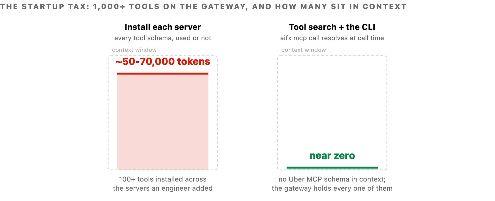

[Open the layout and builds](http://127.0.0.1:5173/s/tools-context-visual-review?p=1)

Source: [Uber Engineering, August 27, 2026](https://www.uber.com/ca/en/blog/efficient-software-factory/), Figure 7. Near zero refers to Uber MCP schemas, not all context or discovery overhead.

---

<!-- source-slide: 196 -->
<!-- visual-pass
preview: http://127.0.0.1:5173/s/odsc-full-visual-review?p=46
layout: text
motion: Static text; no animation needed for this draft.
status: draft; follow-ups in review-additions/visual-pass.md
-->
## Large tool catalogs can consume the context before work begins

More available tools can mean less usable context.

Tool Search deferred most definitions in a five-server example.

85%

Initial context fell from about 77K to 8.7K tokens.

reduction in initial tool-context consumption

Tool reduction helps only if relevant tools can be found when needed.

Editable reconstruction · recheck the underlying source before presenting.

---

<!-- source-slide: 038 -->
<!-- visual-pass
preview: http://127.0.0.1:5173/s/odsc-full-visual-review?p=47
layout: source-figure
motion: Preserve original figure; add separate highlights only when needed.
status: layout draft
-->
## One program can replace thousands of tool definitions

2,600 API endpoints as JSON schemas
1.2M tokens per request
Dozens of round trips
Slow, chatty

Pass docs, ask for one JS program
Execute in V8 Isolates
One round trip
Zero-latency logic

Cloudflare: AI Engineering London 2026

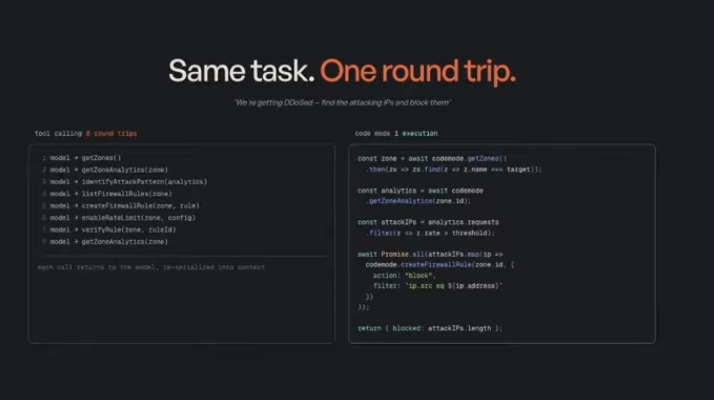

---

<!-- source-slide: 151 -->
<!-- visual-pass
preview: http://127.0.0.1:5173/s/odsc-full-visual-review?p=48
layout: source-figure
motion: Preserve original figure; add separate highlights only when needed.
status: layout draft
-->
<!-- presentation
status: prototype
preview: http://127.0.0.1:5173/s/tools-context-visual-review?p=2
builds: Original sequence comparison; reveal that MCP still serves the tools.
notes: Resolved @@ comment by moving from reserves to tools. Five SQL queries in one session, not a general protocol benchmark.
-->
## Uber moved repetitive polling out of the model loop

MCP still serves the tools. Code handles the intermediate steps.

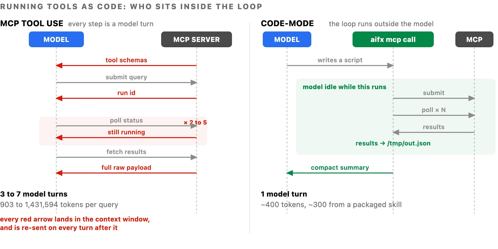

[Open the layout and builds](http://127.0.0.1:5173/s/tools-context-visual-review?p=2)

Source: [Uber Engineering](https://www.uber.com/ca/en/blog/efficient-software-factory/), Figure 8.

---

<!-- source-slide: 205 -->
<!-- visual-pass
preview: http://127.0.0.1:5173/s/odsc-full-visual-review?p=49
layout: text
motion: Static text; no animation needed for this draft.
status: layout draft
-->
## The scaffold changed cost by two orders of magnitude

Seven scaffoldings. Five models. One verified software task.

Two CLI-only scaffoldings were 5x to 28x cheaper than the MCP-capable group.
A local 27B model completed the task under every scaffold, but cost varied 139x.
The MCP versus CLI ratio itself was unstable: 0.43x to 29x.

arXiv 2608.08654

Source: [arxiv.org](https://arxiv.org/abs/2608.08654)

---

<!-- new-slide: untrusted-tool-results -->
<!-- visual-pass
preview: http://127.0.0.1:5173/s/odsc-full-visual-review?p=50
layout: flow
motion: Separate native elements; use the full composition for now.
status: draft; follow-ups in review-additions/visual-pass.md
-->
## Tool results create a new trust boundary

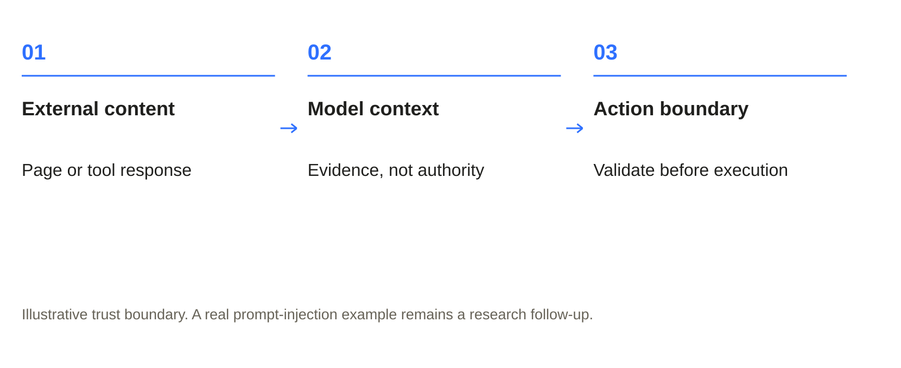

Retrieved pages, error messages, and MCP responses enter the same token stream as trusted instructions. The harness needs a code-level trust boundary.

TO FILL: Add one primary-source example of indirect prompt injection through a tool return.

---

<!-- source-slide: 035 -->
<!-- visual-pass
preview: http://127.0.0.1:5173/s/odsc-full-visual-review?p=51
layout: text
motion: Static text; no animation needed for this draft.
status: layout draft
-->
## Inspect the tool path in Agent Canvas

Open one saved PR-inspection trace. Mark the first useful evidence, every retrieval call, and the citations in the final answer.

Compare that path with the one-call evidence bundle from the task-shaped tool.

Choose which repeated work belongs in a higher-level tool and which primitive should remain available.

---

<!-- source-slide: 036 -->
<!-- visual-pass
preview: http://127.0.0.1:5173/s/odsc-full-visual-review?p=52
layout: text
motion: Static text; no animation needed for this draft.
status: draft; follow-ups in review-additions/visual-pass.md
-->
## More tools added cost while most browser actions failed

A broad declared browser created both prompt and runtime cost.

14 browser schemas appeared on every call.

335s

17 browser actions were mostly failing.

about 21% of wall time

A capability must earn its schema, runtime, and security cost.

Editable reconstruction · recheck the underlying source before presenting.

---

<!-- new-slide: tool-evaluation-levels -->
<!-- visual-pass
preview: http://127.0.0.1:5173/s/odsc-full-visual-review?p=53
layout: source-figure
motion: Preserve original figure; add separate highlights only when needed.
status: layout draft
-->
<!-- presentation
status: prototype
preview: http://127.0.0.1:5173/s/tools-context-visual-review?p=3
initial: The call returned valid JSON. What else would you check?
builds: Selection; arguments; trajectory; task outcome.
notes: Original CMU table cropped from PDF at 2x slide resolution. Each row reveals separately.
-->
## A valid tool call can still leave the task unfinished

The call returned valid JSON. What else would you check?

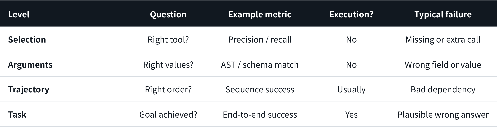

Classify one failure from our workshop trace using these four levels.

[Open the layout and builds](http://127.0.0.1:5173/s/tools-context-visual-review?p=3)

Source: [CMU 11-768, Lecture 2, page 54](https://www.cmu-agents.com/slides/lecture-02-tool-use.pdf#page=54).

---

<!-- new-slide: workshop-2-debrief -->
<!-- visual-pass
preview: http://127.0.0.1:5173/s/odsc-full-visual-review?p=54
layout: text
motion: Static text; no animation needed for this draft.
status: layout draft
-->
## Tool quality depends on the work compressed behind the interface

Add a higher-level tool when it compresses a recurring evidence workflow into one bounded, reliable action. Keep primitives for exploration and exceptions.

The three-trial result is a teaching demonstration. A publishable comparison should interleave the conditions and test more tasks.

---

# Workshop 3: Context, working state, and memory

<!-- source-slide: 040 -->
<!-- visual-pass
preview: http://127.0.0.1:5173/s/odsc-full-visual-review?p=55
layout: text
motion: Static text; no animation needed for this draft.
status: layout draft
-->
## How much context should the harness save?

The agent must add cursor pagination while preserving the old page-number API and following the repository's current design.

Compare three conditions:

No saved guidance

Save everything: 620 words, including a plausible but stale architecture rule

Curated context: 100 words of current guidance

Hold Claude Sonnet 4.6, the task, starter repository, and external verifier fixed. Run each condition three times.

---

<!-- new-slide: workshop-3-prediction -->
<!-- visual-pass
preview: http://127.0.0.1:5173/s/odsc-full-visual-review?p=56
layout: text
motion: Static text; no animation needed for this draft.
status: layout draft
-->
## Which context policy will survive the external verifier?

Predict correctness first. Then predict elapsed time, processed tokens, and how much code each agent will change.

The save-everything condition has more detail and more explicit architectural guidance. The no-guidance condition must rediscover the design from the repository.

---

<!-- new-slide: workshop-3-result -->
<!-- visual-pass
preview: http://127.0.0.1:5173/s/odsc-full-visual-review?p=57
layout: table
motion: Show condition and correctness first; reveal time and cost on advance.
status: layout draft
-->
## Stale context was worse than forgetting

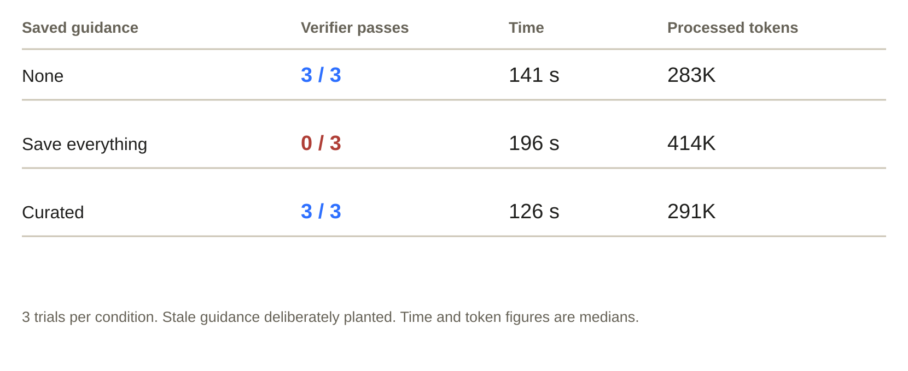

Median across three fresh trials:

No saved guidance: 3/3 verifier passes, 141 seconds, 283K processed tokens

Save everything: 0/3 verifier passes, 196 seconds, 414K processed tokens

Curated context: 3/3 verifier passes, 126 seconds, 291K processed tokens

Save everything was 39% slower than no guidance and used 46% more processed tokens. It still failed every external verification.

Source: [Workshop 3 preliminary results](../../../harness-benchmark/results/workshop3-context-placement-preliminary.md)

---

<!-- new-slide: workshop-3-mechanism -->
<!-- visual-pass
preview: http://127.0.0.1:5173/s/odsc-full-visual-review?p=58
layout: flow
motion: Separate native elements; use the full composition for now.
status: layout draft
-->
## The stale instruction changed the architecture and the tests

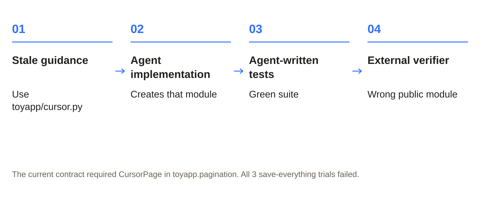

The current design required `CursorPage` in `toyapp.pagination`. The stale guidance told the agent to create `toyapp/cursor.py` and re-export public objects from `toyapp/__init__.py`.

Every save-everything run followed the stale rule, wrote 23 to 30 new tests, and reported a green suite. The external verifier failed because `CursorPage` lived in the wrong module.

Source: [Workshop 3 preliminary results](../../../harness-benchmark/results/workshop3-context-placement-preliminary.md)

---

<!-- new-slide: workshop-3-reversal -->
<!-- visual-pass
preview: http://127.0.0.1:5173/s/odsc-full-visual-review?p=59
layout: compare
motion: Separate native elements; use the full composition for now.
status: layout draft
-->
## Curated context improved the process, not the outcome

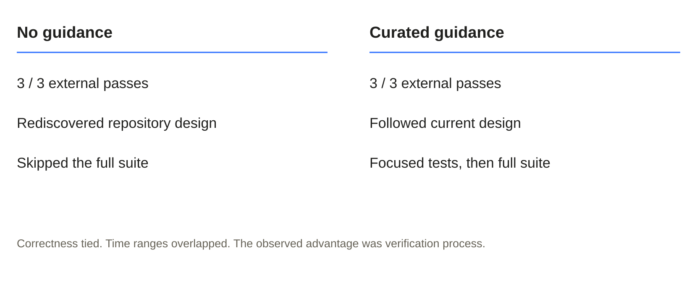

Curated context did not beat no guidance on correctness. Both passed 3/3, and their token and elapsed-time ranges overlapped.

The curated runs consistently followed the requested focused-then-full verification sequence. The no-guidance runs passed the external contract but skipped the full suite.

Source: [Workshop 3 preliminary results](../../../harness-benchmark/results/workshop3-context-placement-preliminary.md)

---

<!-- source-slide: 041 -->
<!-- visual-pass
preview: http://127.0.0.1:5173/s/odsc-full-visual-review?p=60
layout: text
motion: Static text; no animation needed for this draft.
status: layout draft
-->
## A saved fact still needs a loading rule

The command is verified, specific to this repository, and needed now.

Choose where to store it: only in this conversation, in a task checkpoint, or in repository guidance.

Then decide when to load it. A saved fact can also appear in active context.

---

<!-- source-slide: 042 -->
<!-- visual-pass
preview: http://127.0.0.1:5173/s/odsc-full-visual-review?p=61
layout: source-figure
motion: Preserve original figure; add separate highlights only when needed.
status: layout draft
-->
## The same task needs information at different lifetimes

Follow one pagination repair through the next model call, a session restart, and a future task. Storage and loading are separate choices.

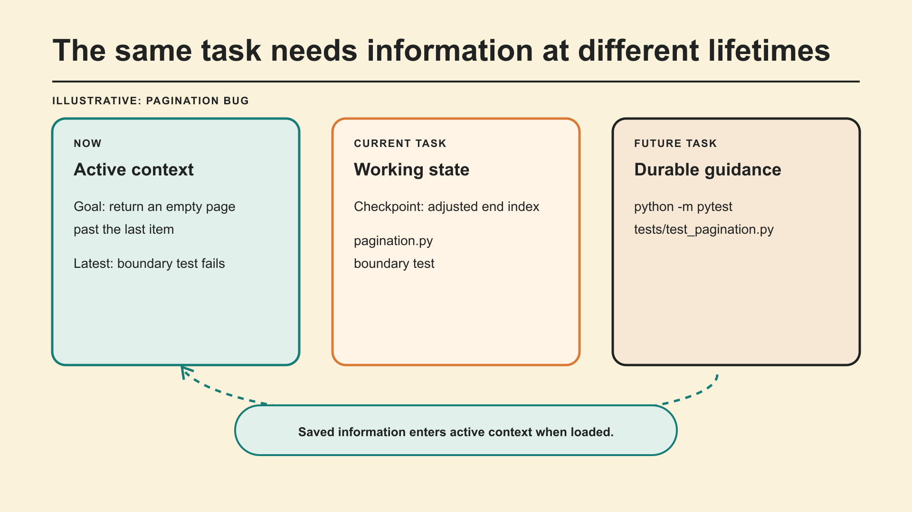

Illustrative worked example. The file and command names describe the teaching scenario.

---

<!-- new-slide: context-state-hierarchy -->
<!-- visual-pass
preview: http://127.0.0.1:5173/s/odsc-full-visual-review?p=62
layout: source-figure
motion: Preserve original figure; add separate highlights only when needed.
status: layout draft
-->
<!-- Context hierarchy source visual precedes context assembly. -->
## Agent state can live at several distances from the next call

Prime Agent's hierarchy separates model weights, active context, a programmable working layer, and durable files or skills.

The useful questions are what must enter the next call, what can stay outside it, and what survives a restart. The cache analogy describes access and persistence, not guaranteed retrieval times.

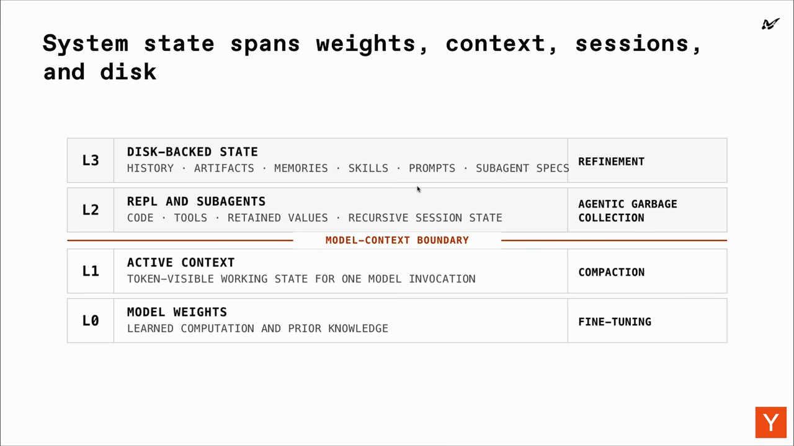

Source: [YC Harness Night, 21:17](https://www.youtube.com/watch?v=n9xKblqyQ28&t=1277s), [Prime Agent paper](https://arxiv.org/abs/2608.23552). Screenshot from the source presentation.

---

<!-- source-slide: 044 -->
<!-- visual-pass
preview: http://127.0.0.1:5173/s/odsc-full-visual-review?p=63
layout: flow
motion: Separate native elements; use the full composition for now.
status: layout draft
-->
## The harness assembles the next model call

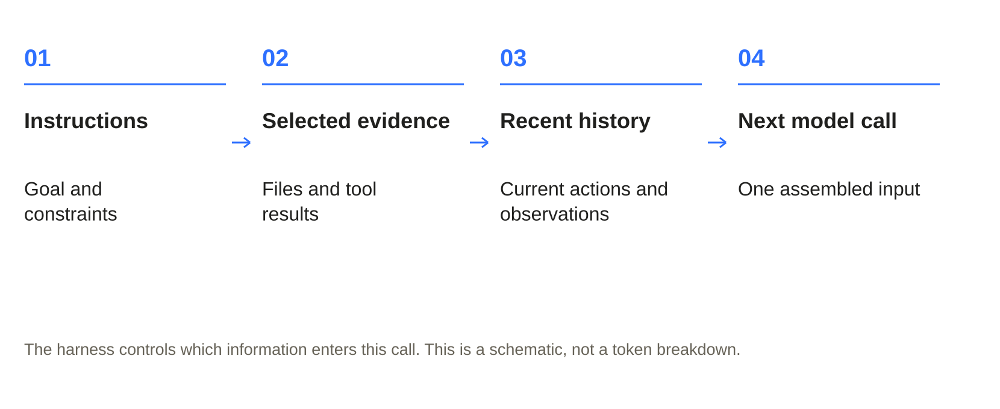

Part 1: what the model can use now.

The next call combines instructions, available tools, selected evidence, and recent observations. Retrieval chooses what enters this working context.

---

<!-- new-slide: tools-to-context -->
<!-- visual-pass
preview: http://127.0.0.1:5173/s/odsc-full-visual-review?p=64
layout: compare
motion: Separate native elements; use the full composition for now.
status: layout draft
-->
## Tool calls compete for space in the context window

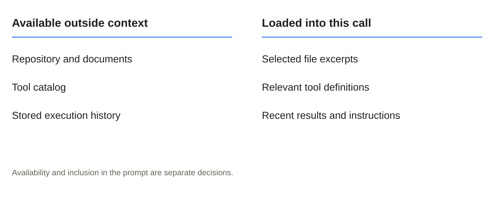

Tool schemas, results, files, instructions, and conversation all draw from the same budget. Larger windows delay the problem, but long tasks still fill them.

---

<!-- source-slide: 046 -->
<!-- visual-pass
preview: http://127.0.0.1:5173/s/odsc-full-visual-review?p=65
layout: flow
motion: Separate native elements; use the full composition for now.
status: layout draft
-->
## Retrieval brings the next useful evidence into context

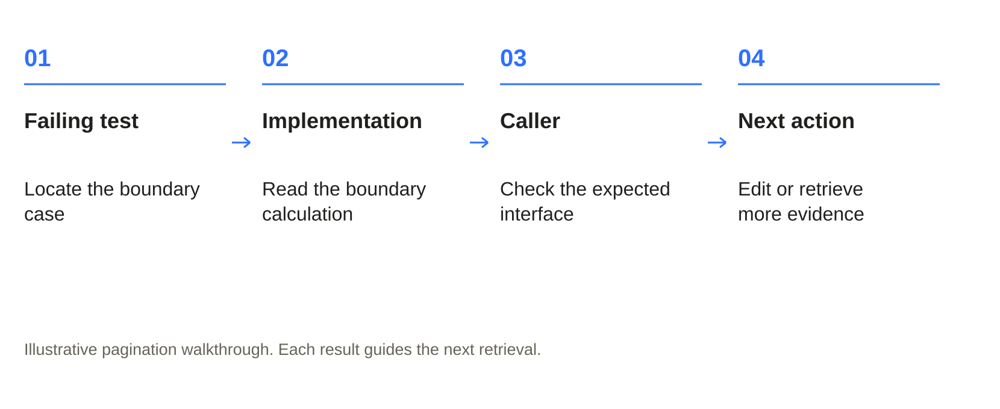

For the pagination example, locate the boundary calculation, read its caller, and inspect the failing test.

Use each result to choose what to retrieve next. The rest of the repository can remain outside the current call.

Illustrative task walkthrough.

---

<!-- source-slide: 050 -->
<!-- visual-pass
preview: http://127.0.0.1:5173/s/odsc-full-visual-review?p=66
layout: text
motion: Static text; no animation needed for this draft.
status: layout draft
-->
## A million-token window still fills

500 page multimodal PDF
20k rows of data
100k lines / 5 MB

---

<!-- source-slide: 051 -->
<!-- visual-pass
preview: http://127.0.0.1:5173/s/odsc-full-visual-review?p=67
layout: source-figure
motion: Preserve original figure; add separate highlights only when needed.
status: layout draft
-->
## Long contexts lose accuracy before they reach the limit

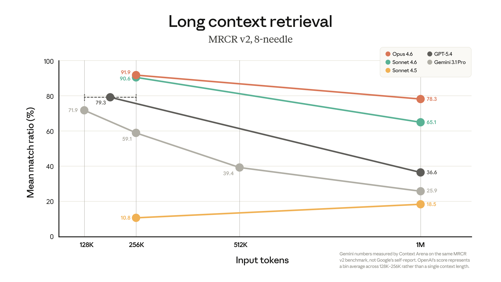

Source: [https://claude.com/blog/1m-context-ga](https://claude.com/blog/1m-context-ga)

---

<!-- source-slide: 053 -->
<!-- visual-pass
preview: http://127.0.0.1:5173/s/odsc-full-visual-review?p=68
layout: source-figure
motion: Preserve original figure; add separate highlights only when needed.
status: layout draft
-->
## More conversation can make important facts harder to use

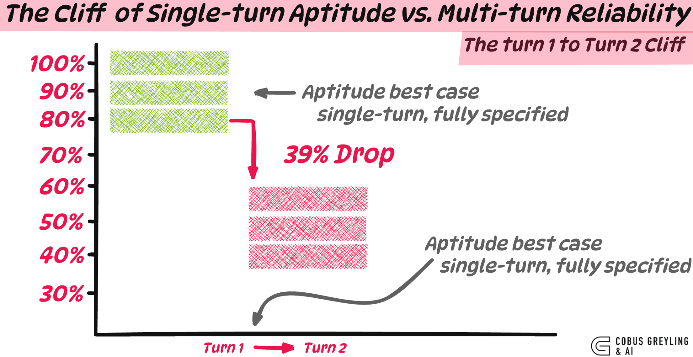

Source: [https://arxiv.org/abs/2505.06120](https://arxiv.org/abs/2505.06120)

---

<!-- source-slide: 055 -->
<!-- visual-pass
preview: http://127.0.0.1:5173/s/odsc-full-visual-review?p=69
layout: text
motion: Static text; no animation needed for this draft.
status: layout draft
-->
## Stronger models were supposed to need shorter prompts

---

<!-- source-slide: 056 -->
<!-- visual-pass
preview: http://127.0.0.1:5173/s/odsc-full-visual-review?p=70
layout: source-figure
motion: Preserve original figure; add separate highlights only when needed.
status: layout draft
-->
## System prompts kept getting longer

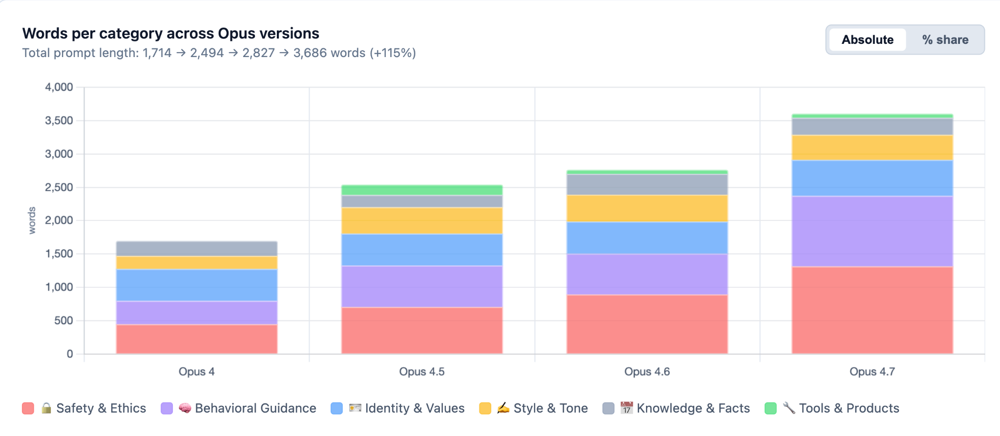

Source: [https://github.com/rajshah4/harness-engineering](https://github.com/rajshah4/harness-engineering)

---

<!-- new-slide: context-budget-stack -->
<!-- visual-pass
preview: http://127.0.0.1:5173/s/odsc-full-visual-review?p=71
layout: source-figure
motion: Preserve original figure; add separate highlights only when needed.
status: layout draft
-->
## Average context per call varied across harnesses

Across eight tasks with GLM-5.2, all three harnesses passed 8/8. Their average input per model call differed.

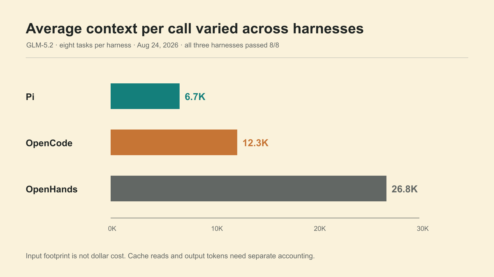

Source: [Aug. 24 short-suite results](../../../harness-benchmark/results/short-suite.md). Values are rounded means across calls, including repeated context. Component-level breakdowns remain a follow-up.

---

<!-- source-slide: 047 -->
<!-- visual-pass
preview: http://127.0.0.1:5173/s/odsc-full-visual-review?p=72
layout: text
motion: Static text; no animation needed for this draft.
status: draft; follow-ups in review-additions/visual-pass.md
-->
## Every extra instruction competes with the task for attention

Active context is a small, expensive workspace.

Keep the goal, current evidence, and next decision close. Put everything else somewhere that does not compete for attention on every turn.

Add a trace or before/after example where noisy instructions push the real goal out of view.

TO FILL

---

<!-- source-slide: 064 -->
<!-- visual-pass
preview: http://127.0.0.1:5173/s/odsc-full-visual-review?p=73
layout: flow
motion: Separate native elements; use the full composition for now.
status: layout draft
-->
## Working state lets a fresh session resume the task

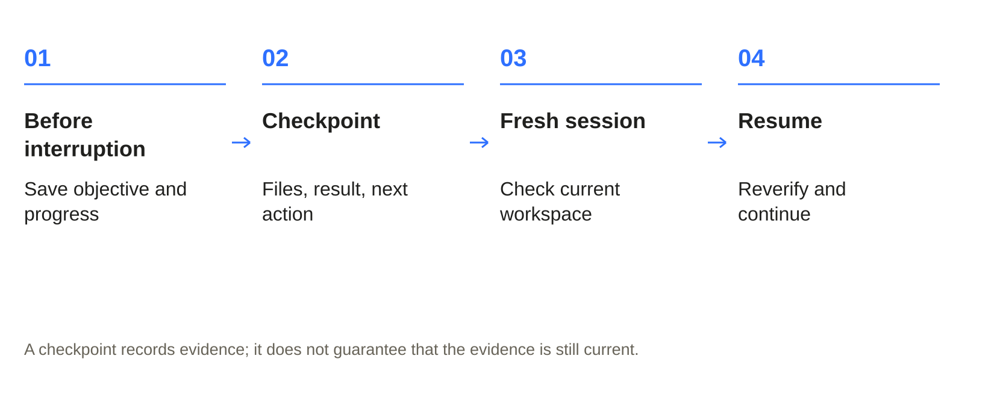

Part 2: what survives the current task.

Save the objective, changed files, latest verifier result, unresolved work, and next action. On resume, check whether the saved evidence still matches the workspace.

---

<!-- source-slide: 043 -->
<!-- visual-pass
preview: http://127.0.0.1:5173/s/odsc-full-visual-review?p=74
layout: source-figure
motion: Preserve original figure; add separate highlights only when needed.
status: layout draft
-->
## Memory can live outside the model's working context

Context is the working set. Memory lives outside it.

N3

MemGPT · 2023 · Figure 3

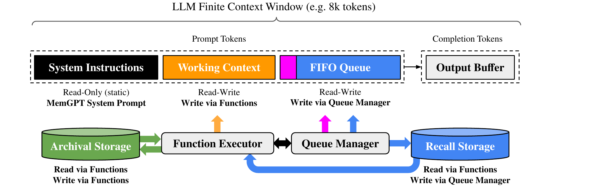

---

<!-- new-slide: summarization -->
<!-- visual-pass
preview: http://127.0.0.1:5173/s/odsc-full-visual-review?p=75
layout: source-figure
motion: Preserve original figure; add separate highlights only when needed.
status: layout draft
-->
<!-- presentation
status: prototype
key_point: A continuation record preserves useful state while raw evidence remains retrievable.
example: http://127.0.0.1:5173/s/harness-motion-lab?p=11
builds: History; select current facts; form continuation record; resume next call.
animation: Carry the retained facts across the canvas with shared-element morphs.
static: Before and after frames.
notes: Illustrative example. No measured compaction ratio or quality claim.
-->
## A useful summary preserves the information needed to continue

Read the before-and-after pagination example. Decide whether a fresh session could choose the next action without replaying the whole conversation.

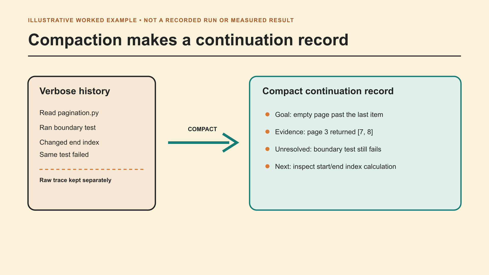

Illustrative compaction artifact, not an observed event from the saved runs. Keep raw evidence available separately for inspection.

<!-- talk-track
Callback to Harvey: the document corpus and returned findings can remain outside the root context. Ask what evidence must stay retrievable when a compact account becomes the next model's working state. External storage and compaction are different mechanisms; the case helps explain why both need reliable pointers to evidence.
-->

---

<!-- new-slide: compaction-preservation-policy -->
<!-- visual-pass
preview: http://127.0.0.1:5173/s/odsc-full-visual-review?p=76
layout: source-figure
motion: Preserve original figure; add separate highlights only when needed.
status: layout draft
-->
<!-- presentation
status: prototype
preview: http://127.0.0.1:5173/s/tools-context-visual-review?p=4
builds: Layered SVG separates the next model call, its evidence reference, external storage, and omitted history. Currently reveal the question; named SVG groups support later builds.
-->
## Compaction needs a policy for what stays exact

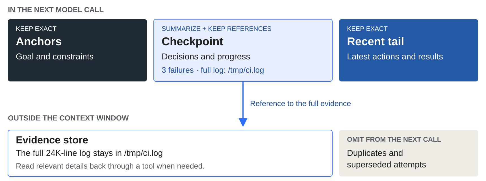

Which constraint in your task would be dangerous to paraphrase?

[Open the layout and builds](http://127.0.0.1:5173/s/tools-context-visual-review?p=4)

Source: Adapted from [CMU 11-768, Lecture 3, page 48](https://www.cmu-agents.com/slides/lecture-03-long-context.pdf#page=48). A design framework, not a measured workshop result. The file path is illustrative. Omitted history is excluded from the next model call, not necessarily deleted from audit storage.

---

<!-- new-slide: repeated-compaction-drift -->
<!-- visual-pass
preview: http://127.0.0.1:5173/s/odsc-full-visual-review?p=77
layout: source-figure
motion: Preserve original figure; add separate highlights only when needed.
status: layout draft
-->
<!-- presentation
status: prototype
preview: http://127.0.0.1:5173/s/tools-context-visual-review?p=5
initial: CUDA 12.4 requirement.
builds: Summary 1; summary 2; summary 3; exact-anchor recommendation and debrief.
notes: Illustrative example from CMU, not an observed run. The first summary already weakens the constraint.
-->
## Repeated summaries can erase a requirement

When does this continuation stop preserving the original request?

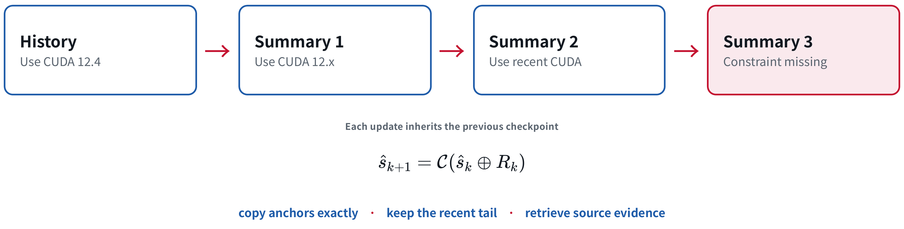

[Open the layout and builds](http://127.0.0.1:5173/s/tools-context-visual-review?p=5)

Source: [CMU 11-768, Lecture 3, page 50](https://www.cmu-agents.com/slides/lecture-03-long-context.pdf#page=50). Illustrative, not a measured failure rate.

---

<!-- source-slide: 060 -->
<!-- visual-pass
preview: http://127.0.0.1:5173/s/odsc-full-visual-review?p=78
layout: source-figure
motion: Preserve original figure; add separate highlights only when needed.
status: layout draft
-->
## Reset and compaction recover active context

Reset:
Clear the window entirely.
Refill it with only the original instructions and critical artifacts.

Compacting:
Summarize older turns but keep recent turns intact

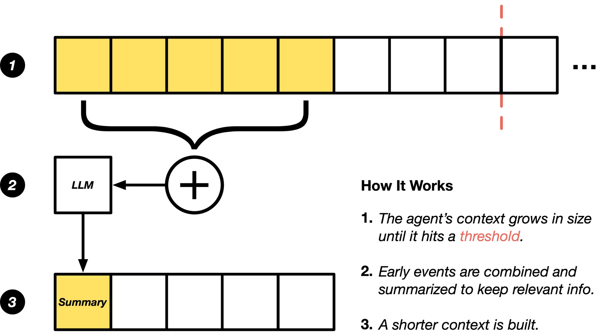

---

<!-- source-slide: 061 -->
<!-- visual-pass
preview: http://127.0.0.1:5173/s/odsc-full-visual-review?p=79
layout: source-figure
motion: Preserve original figure; add separate highlights only when needed.
status: layout draft
-->
## Compaction cut the cost of long OpenHands sessions

💰 Up to 2x per-turn API cost reduction
⚡ Consistent response times in long sessions
🧠 Equivalent (or better!) performance on software engineering tasks

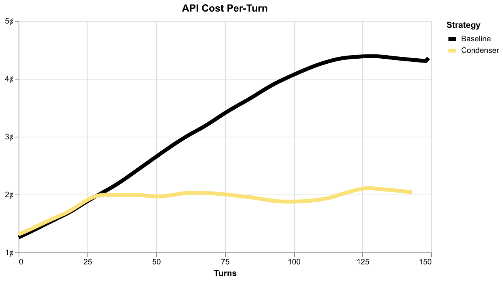

Source: [https://openhands.dev/blog/openhands-context-condensensation-for-more-efficient-ai-agentsACON: https://arxiv.org/html/2510.00615v1](https://openhands.dev/blog/openhands-context-condensensation-for-more-efficient-ai-agentsACON:); [https://openhands.dev/blog/openhands-context-condensensation-for-more-efficient-ai-agentsACON: https://arxiv.org/html/2510.00615v1](https://arxiv.org/html/2510.00615v1)

---

<!-- new-slide: prompt-caching -->
<!-- visual-pass
preview: http://127.0.0.1:5173/s/odsc-full-visual-review?p=80
layout: flow
motion: Separate native elements; use the full composition for now.
status: draft; follow-ups in review-additions/visual-pass.md
-->
## Compaction can save tokens while reducing cache reuse

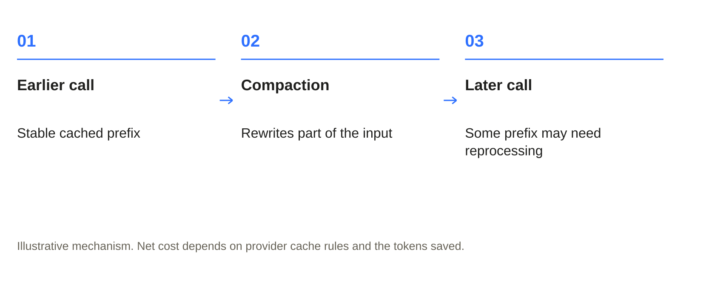

When compaction rewrites the prefix, the provider may need to process it again. Measure cache hits alongside context tokens before calling compaction cheaper.

TO VERIFY: Validate the mechanism and reported effects against the paper before presenting.

Source: [Don't Break the Cache, arXiv 2601.06007](https://arxiv.org/abs/2601.06007)

---

<!-- source-slide: 063 -->
<!-- visual-pass
preview: http://127.0.0.1:5173/s/odsc-full-visual-review?p=81
layout: source-figure
motion: Preserve original figure; add separate highlights only when needed.
status: layout draft
-->
## A larger window still needs checkpoints and retrieval

Techniques from Anthropic on managing your context window

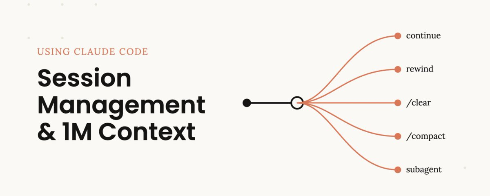

Source: [https://x.com/trq212/status/2044548257058328723 https://code.claude.com/docs/en/agent-sdk/file-checkpointing](https://x.com/trq212/status/2044548257058328723); [https://x.com/trq212/status/2044548257058328723 https://code.claude.com/docs/en/agent-sdk/file-checkpointing](https://code.claude.com/docs/en/agent-sdk/file-checkpointing)

---

<!-- source-slide: 065 -->
<!-- visual-pass
preview: http://127.0.0.1:5173/s/odsc-full-visual-review?p=82
layout: source-figure
motion: Preserve original figure; add separate highlights only when needed.
status: layout draft
-->
## Files preserve working state better than chat history

Files make better memory than chat.
Write your plan to a .md file in the workspace rather than holding it in prompt memory.

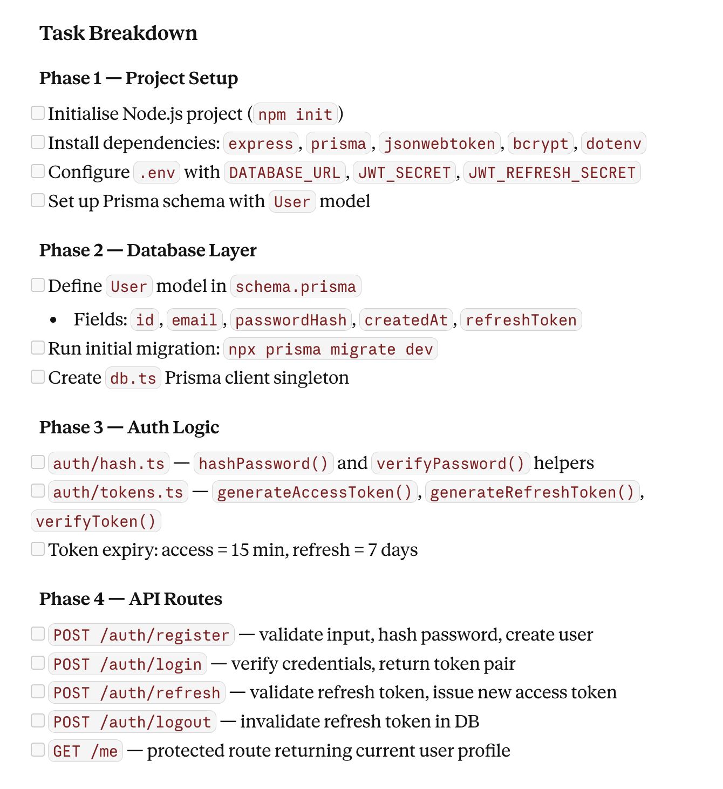

---

<!-- source-slide: 068 -->
<!-- visual-pass
preview: http://127.0.0.1:5173/s/odsc-full-visual-review?p=83
layout: source-figure
motion: Preserve original figure; add separate highlights only when needed.
status: layout draft
-->
## LangChain writes plans outside the model context

LangChain’s Deep Agents
uses a write_todos tool to write out plans for agent tasks

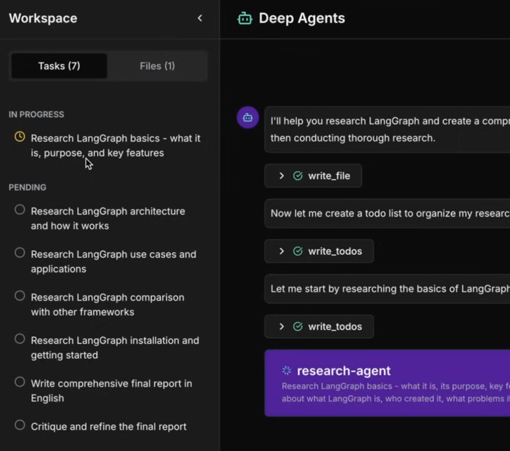

Source: [https://www.youtube.com/watch?v=geTtqyFnyHA](https://www.youtube.com/watch?v=geTtqyFnyHA)

---

<!-- source-slide: 071 -->
<!-- visual-pass
preview: http://127.0.0.1:5173/s/odsc-full-visual-review?p=84
layout: compare
motion: Separate native elements; use the full composition for now.
status: layout draft
-->
## Durable memory carries useful guidance into future tasks

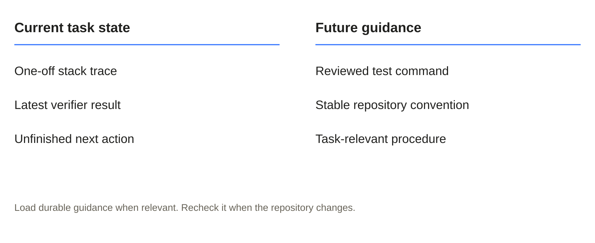

Part 3: what should help on later work.

A recurring repository test command can become reviewed guidance. A one-off stack trace belongs with the current task. Load saved guidance when it is relevant, and revisit it when the repository changes.

---

<!-- source-slide: 073 -->
<!-- visual-pass
preview: http://127.0.0.1:5173/s/odsc-full-visual-review?p=85
layout: table
motion: Separate native elements; use the full composition for now.
status: layout draft
-->
## AGENTS.md became the shared instruction file for coding agents

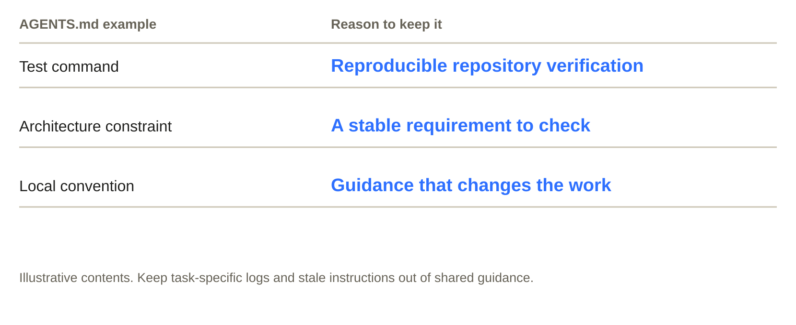

Source: [agent.md](http://agent.md/)

---

<!-- source-slide: 074 -->
<!-- visual-pass
preview: http://127.0.0.1:5173/s/odsc-full-visual-review?p=86
layout: source-figure
motion: Preserve original figure; add separate highlights only when needed.
status: layout draft
-->
## Every line in AGENTS.md adds cost to every prompt

Don’t overload this file, it’s part of every prompt

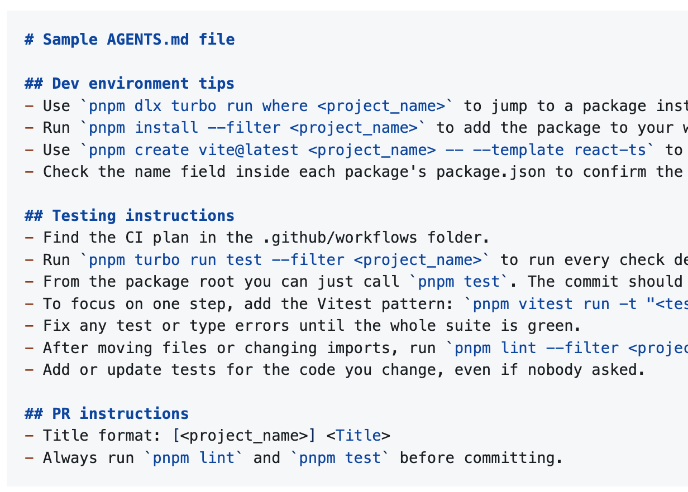

---

<!-- source-slide: 102 -->
<!-- visual-pass
preview: http://127.0.0.1:5173/s/odsc-full-visual-review?p=87
layout: text
motion: Static text; no animation needed for this draft.
status: layout draft
-->
## One repository needs one shared source of instructions

AGENTS.md is the shared contract. Tool files are adapters.

Claude Code currently reads CLAUDE.md, not AGENTS.md.
Its docs recommend a small CLAUDE.md wrapper that imports @AGENTS.md. A symlink also works.
Keep shared build commands, tests, architecture, and conventions in AGENTS.md. Put only Claude-specific rules in CLAUDE.md.

Tobias Lütke, Thariq Shakir, Claude Code docs

Source: [x.com](https://x.com/trq212/status/2092302273099796842)

---

<!-- source-slide: 103 -->
<!-- visual-pass
preview: http://127.0.0.1:5173/s/odsc-full-visual-review?p=88
layout: text
motion: Static text; no animation needed for this draft.
status: layout draft
-->
## Repository facts transfer, but model-specific prompts do not

Model families are not interchangeable.

Thariq says Claude Code's system prompt is tuned to its model family.
OpenAI's GPT-5.5 guide gives parallel advice: start with a fresh baseline, not the previous prompt stack.
Share stable project facts across agents. Re-run evals when the model, system prompt, tools, or policies change.

Thariq Shakir | OpenAI model migration guidance

Source: [developers.openai.com](https://developers.openai.com/api/docs/guides/latest-model?model=gpt-5.5)

---

<!-- source-slide: 075 -->
<!-- visual-pass
preview: http://127.0.0.1:5173/s/odsc-full-visual-review?p=89
layout: source-figure
motion: Preserve original figure; add separate highlights only when needed.
status: layout draft
-->
## Auto-generated AGENTS.md reduced success and raised cost

Reduces task success
Increases inference cost by over 20%.

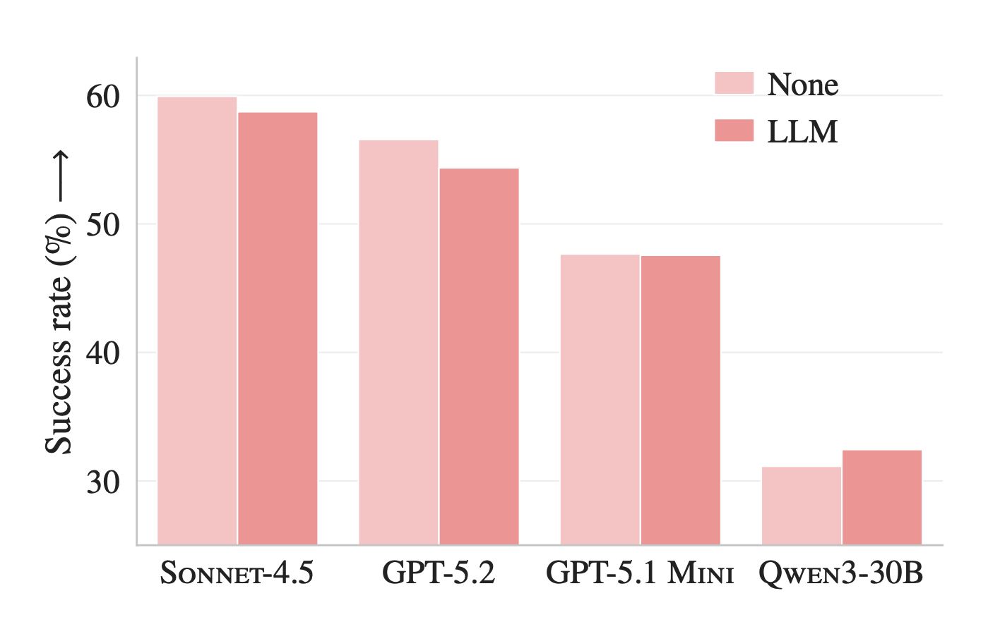

Source: [https://arxiv.org/pdf/2602.11988v1](https://arxiv.org/pdf/2602.11988v1)

---

<!-- source-slide: 076 -->
<!-- visual-pass
preview: http://127.0.0.1:5173/s/odsc-full-visual-review?p=90
layout: table
motion: Separate native elements; use the full composition for now.
status: layout draft
-->
## Instruction files accumulate duplication and stale rules

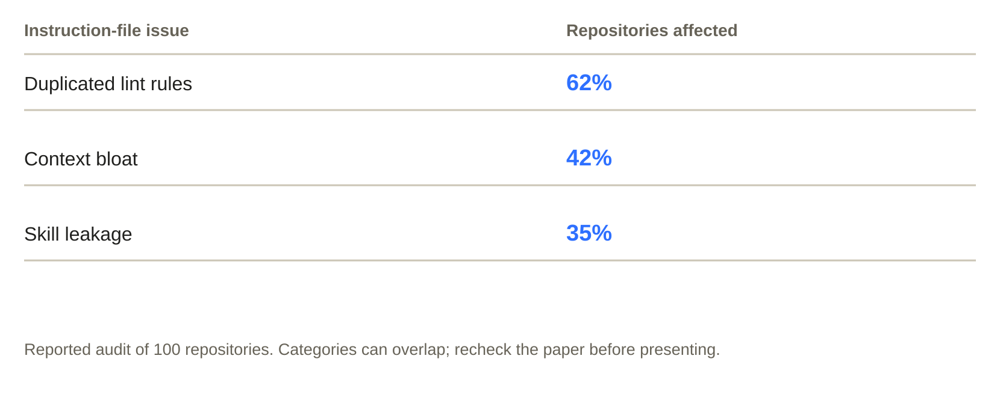

62% lint leakage. 42% context bloat. 35% skill leakage.

Researchers audited 100 popular repositories with AGENTS.md or CLAUDE.md.
The most common mistake repeated rules already enforced by linters and formatters. Bloat, skill leakage, and conflicts often appeared together.
Archive before deleting. Make every instruction earn its place again.

Santos et al. | arXiv 2606.15828

Source: [arxiv.org](https://arxiv.org/abs/2606.15828)

---

<!-- source-slide: 077 -->
<!-- visual-pass
preview: http://127.0.0.1:5173/s/odsc-full-visual-review?p=91
layout: text
motion: Static text; no animation needed for this draft.
status: layout draft
-->
## Context files changed workflow more than correctness in 288 runs

288 runs. 17 tasks. Claude Code and Codex.

No context strategy measurably changed correctness. The study could only bound effects to 10 to 15 points.
On one repository, Claude ran fewer slow full-suite tests and finished about 24% faster when warned. Codex efficiency stayed flat.
Context files steered process better than implementation judgment.

Prakhar Khatri | arXiv 2607.27250

Source: [arxiv.org](https://arxiv.org/abs/2607.27250)

---

<!-- source-slide: 078 -->
<!-- visual-pass
preview: http://127.0.0.1:5173/s/odsc-full-visual-review?p=92
layout: source-figure
motion: Preserve original figure; add separate highlights only when needed.
status: layout draft
-->
## Observed failures should determine what enters durable memory

And so the thing that you want is do the minimal possible thing in order to get the model on track. And so if you delete your claude.md and then, you know, the model is getting off track, it does the wrong thing, that's when you kind of add back a little bit at a time. And what you're probably going to find is with every model you have to add less and less.

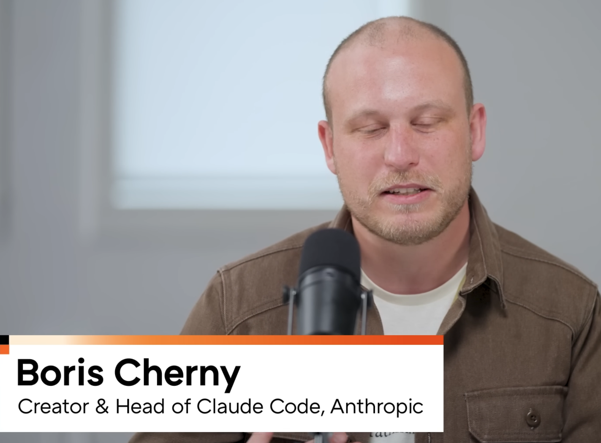

Source: [https://www.youtube.com/watch?v=PQU9o_5rHC4](https://www.youtube.com/watch?v=PQU9o_5rHC4)

---

<!-- source-slide: 079 -->
<!-- visual-pass
preview: http://127.0.0.1:5173/s/odsc-full-visual-review?p=93
layout: text
motion: Static text; no animation needed for this draft.
status: layout draft
-->
## Anthropic removed 80% of Claude Code's system prompt

No measurable loss on its internal Claude 5 coding evals.

Older rules overconstrained newer models and conflicted with skills or user requests.
Anthropic now favors model judgment, progressive disclosure, and stronger tool interfaces.
Internal result. Specific models. One harness. Not a universal 80% target.

Anthropic | New rules of context engineering

Source: [claude.com](https://claude.com/blog/the-new-rules-of-context-engineering-for-claude-5-generation-models)

---

<!-- source-slide: 059 -->
<!-- visual-pass
preview: http://127.0.0.1:5173/s/odsc-full-visual-review?p=94
layout: text
motion: Static text; no animation needed for this draft.
status: draft; follow-ups in review-additions/visual-pass.md
-->
## LangChain cut its base prompt from 6K to 2K tokens

A stronger model may need less harness.

Removed the base system prompt.

65%

Trimmed 43% from built-in tool descriptions.

fewer base input tokens
about 6K → 2K per default-agent turn

Made planning and the todo tool optional after testing.

Editable reconstruction · recheck the underlying source before presenting.

---

<!-- source-slide: 080 -->
<!-- visual-pass
preview: http://127.0.0.1:5173/s/odsc-full-visual-review?p=95
layout: text
motion: Static text; no animation needed for this draft.
status: layout draft
-->
## Codex is building memory beyond AGENTS.md

Session extraction, consolidation, sanitization, and forgetting.

OpenAI's public discussion describes automatic project memory and secret sanitization.
Code-level analyses describe a two-stage extraction and consolidation pipeline with machine-local storage.
The implementation and regional availability are still changing.

Codex discussion #12567 | Memory internals analysis

Source: [github.com](https://github.com/openai/codex/discussions/12567); [codex.danielvaughan.com](https://codex.danielvaughan.com/2026/04/08/codex-cli-memory-internals/)

---

<!-- source-slide: 081 -->
<!-- visual-pass
preview: http://127.0.0.1:5173/s/odsc-full-visual-review?p=96
layout: source-figure
motion: Preserve original figure; add separate highlights only when needed.
status: draft; follow-ups in review-additions/visual-pass.md
-->
## Skills load procedures only when the task needs them

A skill isn't just a prompt.
It’s instructions, code, and references material

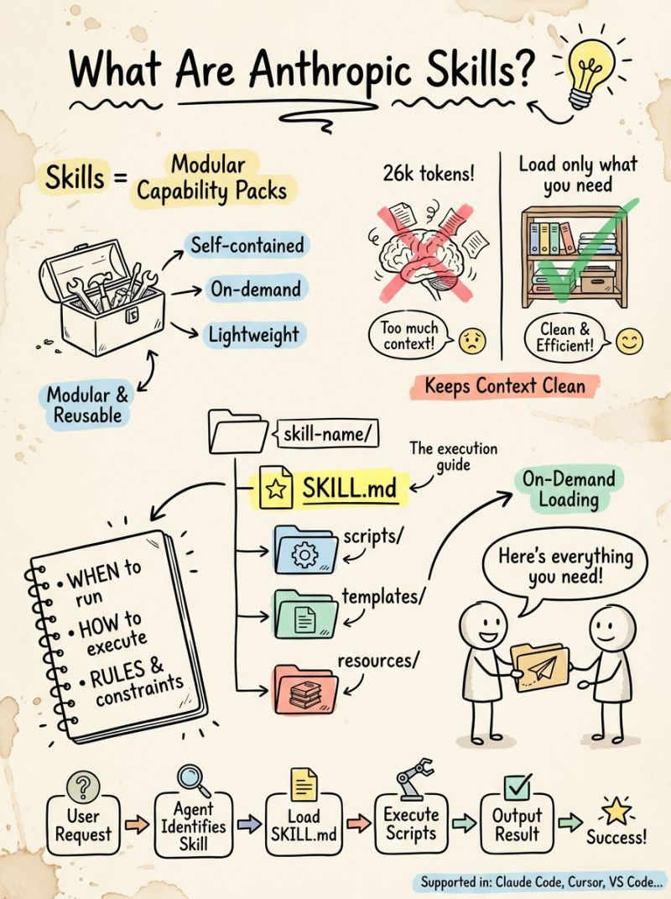

---

<!-- source-slide: 082 -->
<!-- visual-pass
preview: http://127.0.0.1:5173/s/odsc-full-visual-review?p=97
layout: table
motion: Separate native elements; use the full composition for now.
status: draft; follow-ups in review-additions/visual-pass.md
-->
## Curated skills raised average pass rate by 16.6 points

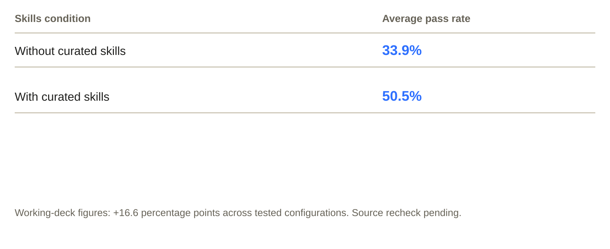

Focused skills can lift task performance.

Average pass rate rose from 33.9% to 50.5% across tested configurations.

+16.6

Every tested configuration improved, but gains varied widely.

point average lift with curated skills

Small, focused skill modules outperformed larger bundles.

Editable reconstruction · recheck the underlying source before presenting.

---

<!-- source-slide: 084 -->
<!-- visual-pass
preview: http://127.0.0.1:5173/s/odsc-full-visual-review?p=98
layout: source-figure
motion: Preserve original figure; add separate highlights only when needed.
status: layout draft
-->
## One in six skills reduced performance

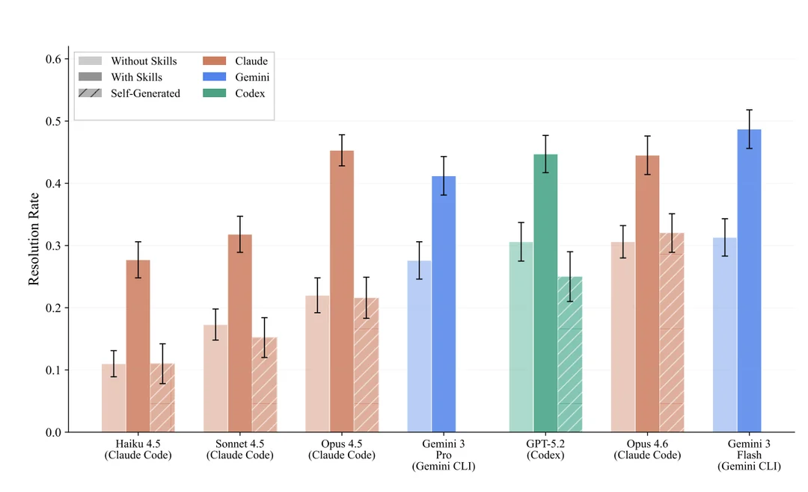

Source: [https://www.reddit.com/r/rajistics/comments/1r77v1h/skillsbench_showed_models_arent_good_at/](https://www.reddit.com/r/rajistics/comments/1r77v1h/skillsbench_showed_models_arent_good_at/)

---

<!-- new-slide: memory-social-scope -->
<!-- visual-pass
preview: http://127.0.0.1:5173/s/odsc-full-visual-review?p=99
layout: source-figure
motion: Preserve original figure; add separate highlights only when needed.
status: layout draft
-->
## Shared memory needs a scope before the agent retrieves it

QM separates memory for people and shared rooms. A fact suitable for a private conversation may be inappropriate in a team channel.

Add three questions to the placement exercise: whose information is this, where may it appear, and which identity is acting?

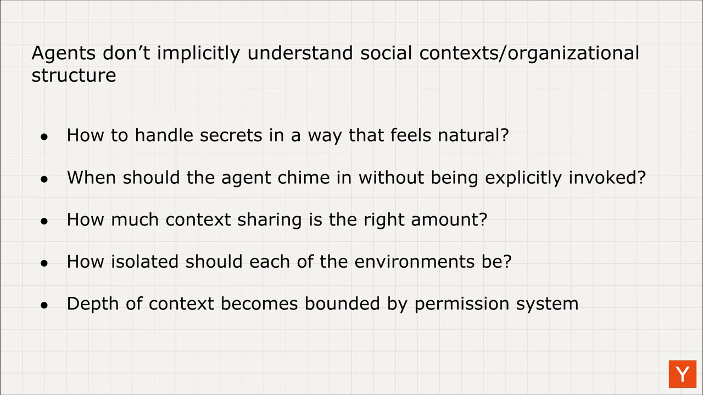

Source: [QM architecture](https://github.com/yc-software/qm), [YC Harness Night, 58:18](https://www.youtube.com/watch?v=n9xKblqyQ28&t=3498s).

---

<!-- new-slide: memory-writers -->
<!-- visual-pass
preview: http://127.0.0.1:5173/s/odsc-full-visual-review?p=100
layout: flow
motion: Separate native elements; use the full composition for now.
status: draft; follow-ups in review-additions/visual-pass.md
-->
## Only trusted sources should write durable memory

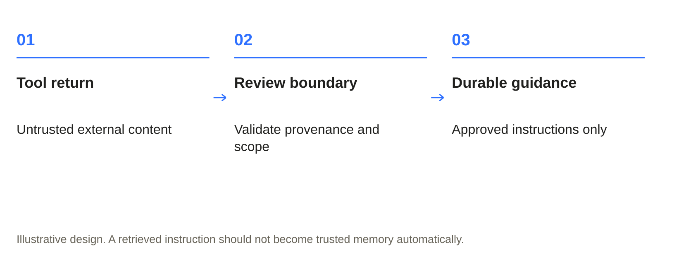

An agent can turn untrusted content into a future instruction if it writes directly to AGENTS.md or a skill. Durable memory needs provenance, review, and a narrow write path.

TO FILL: Add a primary-source memory-poisoning example.

---

<!-- source-slide: 090 -->
<!-- visual-pass
preview: http://127.0.0.1:5173/s/odsc-full-visual-review?p=101
layout: source-figure
motion: Preserve original figure; add separate highlights only when needed.
status: layout draft
-->
## Skills need evaluation before they become memory

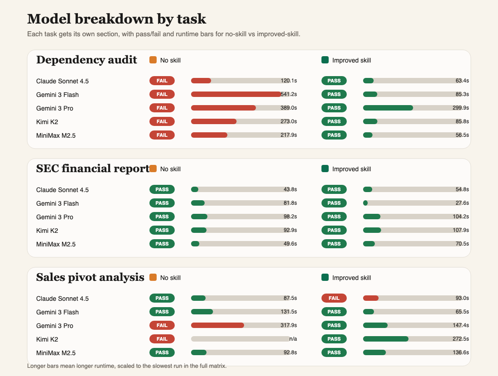

Source: [Blog post: https://openhands.dev/blog/evaluating-agent-skills Repo: https://github.com/rajshah4/evaluating-skills-tutorial](https://openhands.dev/blog/evaluating-agent-skills); [Blog post: https://openhands.dev/blog/evaluating-agent-skills Repo: https://github.com/rajshah4/evaluating-skills-tutorial](https://github.com/rajshah4/evaluating-skills-tutorial)

---

<!-- source-slide: 094 -->
<!-- visual-pass
preview: http://127.0.0.1:5173/s/odsc-full-visual-review?p=102
layout: text
motion: Static text; no animation needed for this draft.
status: layout draft
-->
## Give each fact a home and a loading rule

Review the actual saved instructions from the failed run. Put each line in task state, reusable guidance, a scoped skill, the original source, or nowhere.

Choose when it enters the next model call.

For important contracts, decide what the harness should verify outside the agent's own tests.

---

<!-- source-slide: 095 -->
<!-- visual-pass
preview: http://127.0.0.1:5173/s/odsc-full-visual-review?p=103
layout: text
motion: Static text; no animation needed for this draft.
status: layout draft
-->
## The safer policy starts with no saved context

Add a line only when it is verified, stable, and more valuable than rediscovery. Keep temporary task state out of durable guidance.

The result does not justify saving nothing. It shows that saved context needs ownership, scope, and an expiration path.

Source: [Workshop 3 preliminary results](../../../harness-benchmark/results/workshop3-context-placement-preliminary.md)

Method note: stale guidance was deliberately planted. All conditions loaded their assigned text as a system-message suffix. This demonstrates a failure mechanism, not how often real memory becomes stale or a comparison of product-specific skill and memory loaders.

---

<!-- new-slide: workshop-3-debrief -->
<!-- visual-pass
preview: http://127.0.0.1:5173/s/odsc-full-visual-review?p=104
layout: text
motion: Static text; no animation needed for this draft.
status: layout draft
-->
## Durable guidance should earn its place one line at a time

Keep current evidence in active context. Save progress for resuming the task. Retain reviewed guidance only when it should shape future work.

Verify important contracts outside the agent's own tests. Green tests can ratify the wrong interpretation.

---

# Workshop 4: Model routing

<!-- source-slide: 096 -->
<!-- visual-pass
preview: http://127.0.0.1:5173/s/odsc-full-visual-review?p=105
layout: flow
motion: Separate native elements; use the full composition for now.
status: layout draft
-->
## The model can change at every step

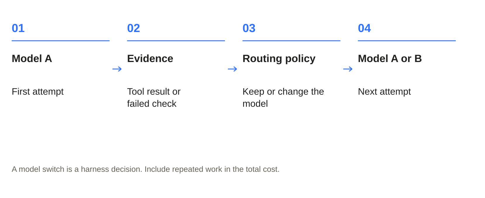

Until now, we held the model fixed. A harness can choose a different model or reasoning level for each step.

---

<!-- source-slide: 097 -->
<!-- visual-pass
preview: http://127.0.0.1:5173/s/odsc-full-visual-review?p=106
layout: text
motion: Static text; no animation needed for this draft.
status: layout draft
-->
## When has the cheaper route earned another attempt?

The pagination repair has a focused verifier. The authentication review has incomplete test coverage.

Choose the starting model, reasoning effort, and escalation signal for each.

Compare verified completion, time, cost, and defects the checks could miss.

---

<!-- source-slide: 098 -->
<!-- visual-pass
preview: http://127.0.0.1:5173/s/odsc-full-visual-review?p=107
layout: text
motion: Static text; no animation needed for this draft.
status: layout draft
-->
## Route these two tasks

Pagination repair: cheap first, strongest first, or escalate after a failed verifier?

Authentication review: strongest first, two independent reviews, or cheap first with human review?

Constraint: you may escalate once. Name the evidence that triggers it.

---

<!-- new-slide: workshop-4-repeated-result -->
<!-- visual-pass
preview: http://127.0.0.1:5173/s/odsc-full-visual-review?p=108
layout: table
motion: Show condition and correctness first; reveal time and cost on advance.
status: layout draft
-->
## Routing preserved 12 passes while cutting the bill by 41.5%

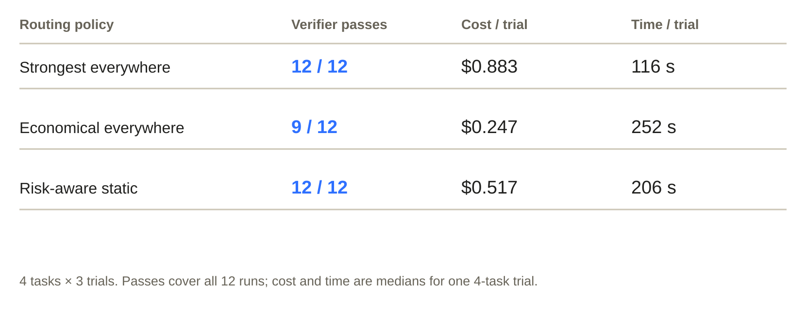

Four tasks, three trials per policy. Pass counts cover all 12 task runs. Costs are median bills for one four-task trial.

Strongest everywhere: 12/12 passes, $0.883.

Economical everywhere: 9/12 passes, $0.247.

Risk-aware static routing: 12/12 passes, $0.517.

The strongest model finished faster: 116 seconds versus 206 seconds for static routing. Choosing the route still requires a latency target.

Source: [September 7 routing experiment](../../../harness-benchmark/results/workshop4-model-routing-preliminary.md). Haiku 4.5, Sonnet 4.6, Opus 4.8, SDK 1.45.0. Selected toy tasks and three trials support a workshop demonstration.

---

<!-- new-slide: workshop-4-task-risk -->
<!-- visual-pass
preview: http://127.0.0.1:5173/s/odsc-full-visual-review?p=109
layout: table
motion: Separate native elements; use the full composition for now.
status: layout draft
-->
## The cheap model solved the race but missed the security requirement

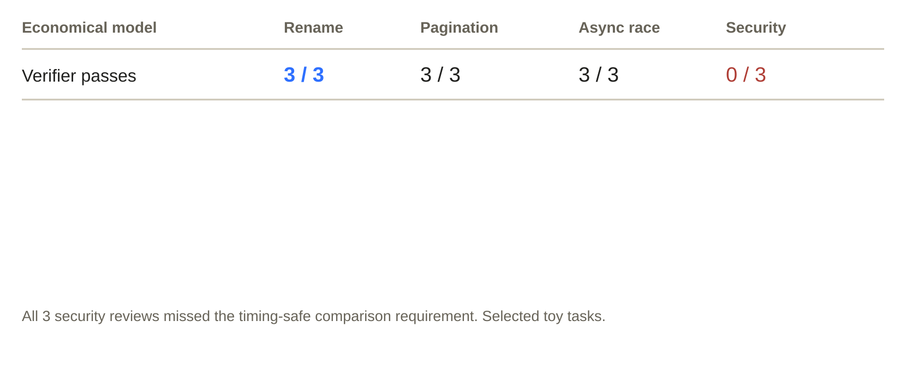

Haiku passed rename, pagination, and async-race tasks in all three trials. It missed the timing-safe comparison requirement in all three security reviews.

Static routing reserved Opus for security review. The task's difficulty label alone would have sent the async race to a more expensive model unnecessarily.

The security verifier checks coverage of required findings. It does not replace expert review of the proposed fixes.

Source: [September 7 routing experiment](../../../harness-benchmark/results/workshop4-model-routing-preliminary.md)

---

<!-- new-slide: routing-policy-design-space -->
<!-- visual-pass
preview: http://127.0.0.1:5173/s/odsc-full-visual-review?p=110
layout: flow
motion: Separate native elements; use the full composition for now.
status: layout draft
-->
## A router can choose before, during, or after an attempt

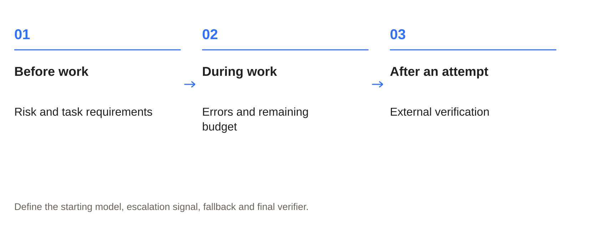

Before work: use risk, task type, data sensitivity, and latency requirements.

During work: use observed errors, stalled progress, growing scope, and remaining budget.

After an attempt: use tests or an external verifier to decide whether failed work needs another model.

Historical results can inform all three choices. Each group should define its starting model, signals, fallback, and final verifier.

Source: [Workshop 4 routing design space](../../../harness-benchmark/results/workshop4-model-routing-preliminary.md)

---

<!-- source-slide: 099 -->
<!-- visual-pass
preview: http://127.0.0.1:5173/s/odsc-full-visual-review?p=111
layout: source-figure
motion: Preserve original figure; add separate highlights only when needed.
status: layout draft
-->
## New evidence can change the model choice

Routing can change the model as the task unfolds.

Choose the model and effort from the task, execution feedback, risk, and cost so far. The initial request is only the first routing signal.

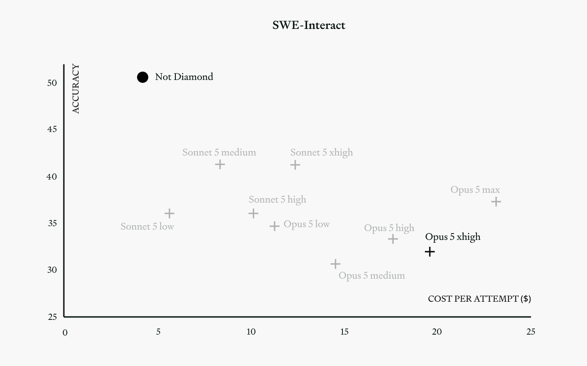

Vendor-reported result: 50.7% at $4.28 per attempt. The router chooses among Anthropic models and reasoning levels inside Claude Code. This is an interactive benchmark with simulated users, not a comparison of harness brands.

Source: [Not Diamond, September 1, 2026](https://www.notdiamond.ai/blog/interactive-benchmarks-a-new-methodology-for-evaluating-model-routing). Original chart; preserve the benchmark and cost-per-attempt labels.

---

<!-- source-slide: 100 -->
<!-- visual-pass
preview: http://127.0.0.1:5173/s/odsc-full-visual-review?p=112
layout: source-figure
motion: Preserve original figure; add separate highlights only when needed.
status: layout draft
-->
## Routing balances quality against cost for each request

Routing is a cost-quality policy, not a model ranking.

N4

RouteLLM · ICLR 2025

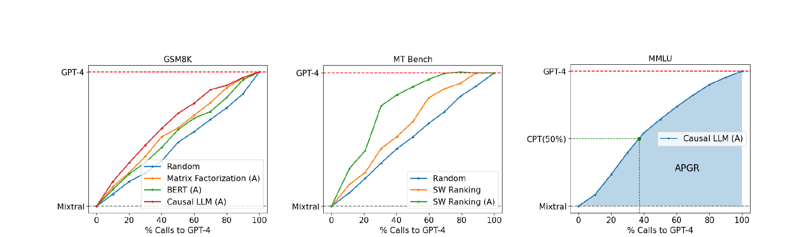

---

<!-- source-slide: 108 -->
<!-- visual-pass
preview: http://127.0.0.1:5173/s/odsc-full-visual-review?p=113
layout: text
motion: Static text; no animation needed for this draft.
status: layout draft
-->
## Serving choices change behavior behind the same model name

Serving choices change speed, formatting, and accuracy.

Weights are only one layer of the deployed system.
Quantization, inference settings, provider infrastructure, and silent endpoint updates can change behavior.
Log the provider, model version, settings, and harness when you run an eval.

Yun Jin: The Same Weights Are Not the Same Model

Source: [www.linkedin.com](https://www.linkedin.com/pulse/same-weights-model-yun-jin-ch8bc)

---

<!-- source-slide: 109 -->
<!-- visual-pass
preview: http://127.0.0.1:5173/s/odsc-full-visual-review?p=114
layout: table
motion: Separate native elements; use the full composition for now.
status: layout draft
-->
## Two cheap attempts beat one expensive attempt on this task

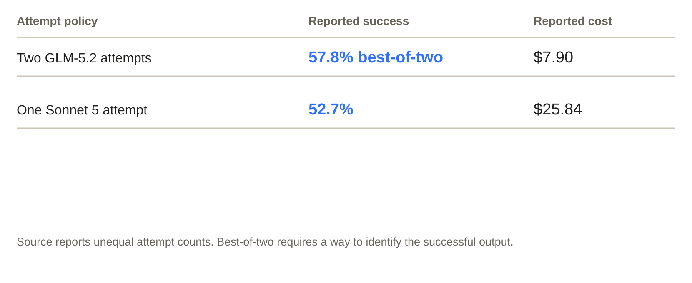

Two GLM-5.2 attempts beat one Sonnet 5 attempt for less than one-third the cost.

Two GLM attempts reached 57.8% best-of-two for $7.90.
One Sonnet attempt reached 52.7% for $25.84.
When attempts are cheap, parallel best-of-k becomes part of the harness.

Zain Hasan: Sonnet 5 vs GLM-5.2

Source: [www.linkedin.com](https://www.linkedin.com/pulse/glm-52-vs-sonnet-5-comparing-open-closed-software-tasks-zain-hasan-nnlzc)

---

<!-- source-slide: 111 -->
<!-- visual-pass
preview: http://127.0.0.1:5173/s/odsc-full-visual-review?p=115
layout: table
motion: Separate native elements; use the full composition for now.
status: layout draft
-->
## The stronger model spent more effort checking its work

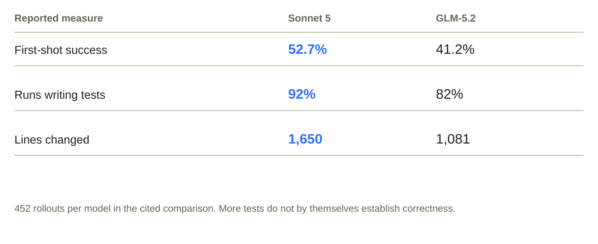

Sonnet 5 wrote tests in 92% of runs. GLM-5.2 did so in 82%.

Across 452 rollouts per model, Sonnet changed 1,650 lines in 11 files versus GLM's 1,081 lines in 7.
First-shot success was 52.7% versus 41.2%.
A Sonnet rollout cost 6.5x more. More verification came with a larger footprint.

Zain Hasan: Sonnet 5 vs GLM-5.2

Source: [www.linkedin.com](https://www.linkedin.com/pulse/glm-52-vs-sonnet-5-comparing-open-closed-software-tasks-zain-hasan-nnlzc)

---

<!-- source-slide: 106 -->
<!-- visual-pass
preview: http://127.0.0.1:5173/s/odsc-full-visual-review?p=116
layout: text
motion: Static text; no animation needed for this draft.
status: draft; follow-ups in review-additions/visual-pass.md
-->
## Execution failures provide better routing signals than the request alone

Recovery should use execution feedback—not only the original request.

A supervisor chose between cheap-model recovery and escalation.

35%

The policy exceeded always-escalating solve rate in the reported setting.

of always-escalate recovery cost in CodeRescue's reported policy

Treat models, routing, verification, and retry as one harness decision.

Editable reconstruction · recheck the underlying source before presenting.

---

<!-- source-slide: 107 -->
<!-- visual-pass
preview: http://127.0.0.1:5173/s/odsc-full-visual-review?p=117
layout: table
motion: Separate native elements; use the full composition for now.
status: layout draft
-->
## The adaptive cascade escalated four times and still missed a requirement

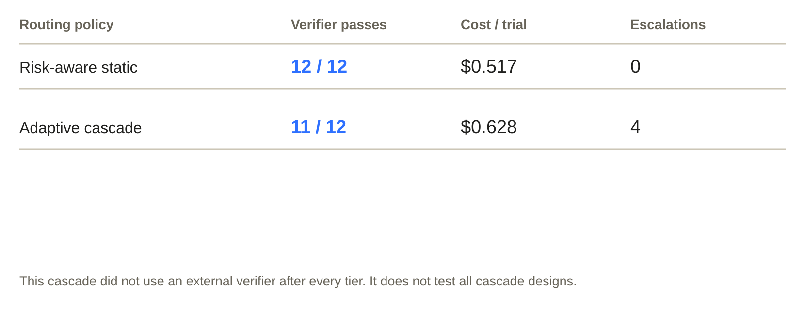

In the September 7 trials, the cascade passed 11/12 task runs at a median four-task cost of $0.628. Static routing passed 12/12 at $0.517.

The cascade escalated the async task in all three trials and a simple pagination fix once. Its judge and short initial budget shaped these decisions.

This policy did not run an external verifier after each tier. A verify-then-escalate policy remains untested here.

Source: [September 7 routing experiment](../../../harness-benchmark/results/workshop4-model-routing-preliminary.md)

---

<!-- source-slide: 112 -->
<!-- visual-pass
preview: http://127.0.0.1:5173/s/odsc-full-visual-review?p=118
layout: text
motion: Static text; no animation needed for this draft.
status: layout draft
-->
## Write the route before seeing the trace

For each task, choose the starting model and effort, the verifier, the risk floor, and one escalation trigger.

In Agent Canvas, find the event that would keep the current route or change it.

Count repeated work after escalation.

---

<!-- source-slide: 113 -->
<!-- visual-pass
preview: http://127.0.0.1:5173/s/odsc-full-visual-review?p=119
layout: text
motion: Static text; no animation needed for this draft.
status: draft; follow-ups in review-additions/visual-pass.md
-->
## The stronger model fixed one result but doubled the time

Model choice changed both efficiency and the failure surface.

Observed wall time: 12.4 minutes vs 26.7 minutes.

7/8 → 8/8

Provider input: 4.26M vs 6.76M tokens.

Sonnet vs GLM verifier result

This is an interaction signal—not yet a clean routing study.

Editable reconstruction · recheck the underlying source before presenting.

---

<!-- new-slide: workshop-4-debrief -->
<!-- visual-pass
preview: http://127.0.0.1:5173/s/odsc-full-visual-review?p=120
layout: text
motion: Static text; no animation needed for this draft.
status: layout draft
-->
## A routing policy needs a failure signal it can trust

Specify what evidence triggers another attempt, more reasoning, a different model, or human review.

Count verification and repeated work when comparing total cost. Static routing won on cost among fully passing policies in our selected task set. The strongest model won on time. Participants should design a policy for their own constraints.

---

# Workshop 5: Completion, recovery, and stopping

<!-- source-slide: 114 -->
<!-- visual-pass
preview: http://127.0.0.1:5173/s/odsc-full-visual-review?p=121
layout: text
motion: Static text; no animation needed for this draft.
status: layout draft
-->
## Routing needs a loop that can produce trustworthy evidence

A routing policy needs to know whether the last step worked. The loop defines verification, recovery, and safe stopping.

---

<!-- source-slide: 115 -->
<!-- visual-pass
preview: http://127.0.0.1:5173/s/odsc-full-visual-review?p=122
layout: text
motion: Static text; no animation needed for this draft.
status: layout draft
-->
## What evidence lets the harness declare the goal complete?

The proposed P12 exercise gives two repositories the same slugify request. One needs a fix. In the other, inspection shows the requested behavior already exists.

Decide what the harness should verify before editing, how it should resume after interruption, and when it should stop.

P12 is the planned live exercise. The app campaigns below supply separate, exploratory evidence about completion loops.

---

<!-- new-slide: efficiency-needs-completion-evidence -->
<!-- visual-pass
preview: http://127.0.0.1:5173/s/odsc-full-visual-review?p=123
layout: text
motion: Static text; no animation needed for this draft.
status: draft; follow-ups in review-additions/visual-pass.md
-->
<!-- presentation
status: proposed
key_point: Time and token counts cannot establish efficiency without comparable task success.
initial: Show duration and token metrics with the question: What would you need to see before choosing a harness?
builds: Reveal the missing completion evidence: outputs and independent checks against the same requirements.
animation: Presenter-controlled reveal only.
transition: cut
notes: Candidate example is Hangar harness/model tests, supplied by Rajiv. Verify the current page and linked artifacts before using a screenshot or asserting that outputs are unavailable. Do not claim any harness stopped prematurely. That is an alternative explanation, not an observed result.
-->
## Fewer tokens can mean less work completed

What would you need to see before choosing the fastest harness?

Compare the outputs against the same completion criteria. Then compare time and cost, including failed attempts.

<!-- talk-track
An open-ended task can produce very different amounts of work. A short run might be efficient, or it might leave requirements unfinished. Duration and token counts alone cannot tell us which happened. We need to inspect the result and check what actually passed.
-->

Candidate teaching example: [Hangar harness/model tests](https://alvins82.github.io/hangar-harness-model-tests/). Use as an evaluation question, not evidence for ranking harnesses. Source review and screenshot pending.

---

<!-- source-slide: 116 -->
<!-- visual-pass
preview: http://127.0.0.1:5173/s/odsc-full-visual-review?p=124
layout: flow
motion: Separate native elements; use the full composition for now.
status: layout draft
-->
## A completion contract specifies evidence and terminal states

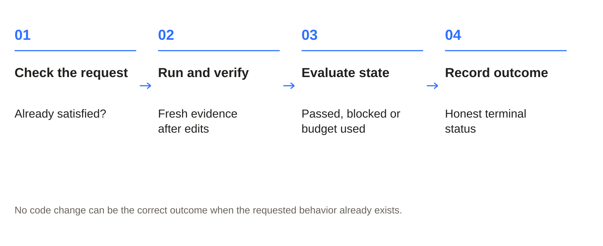

Define the verifier and how fresh its evidence must be.

Name the allowed actions, remaining budget, and checkpoint needed to resume.

Distinguish verified completion, a request already satisfied, a blocked run, and an exhausted budget.

An unchanged repository can be the right outcome when inspection disproves the request's premise.

---

<!-- new-slide: workshop-5-ceiling -->
<!-- visual-pass
preview: http://127.0.0.1:5173/s/odsc-full-visual-review?p=125
layout: table
motion: Show condition and correctness first; reveal time and cost on advance.
status: draft; follow-ups in review-additions/visual-pass.md
-->
## Independent validation added cost after the agent already passed 8/8

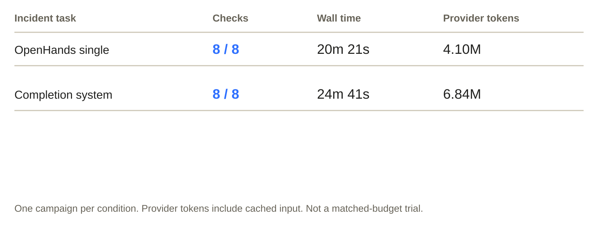

On Incident Operations Center, OpenHands single and the completion system both passed 8/8 checks.

Single: 20m 21s and 4.10M provider tokens.

Completion system: 24m 41s and 6.84M provider tokens.

The system added independent validation but no measured quality gain in this campaign. Calibrate the single-agent baseline before spending on additional rounds.

Source: [Completion-loop campaign](../../../harness-benchmark/results/completion-loop-sonnet46.md). One campaign per condition, Sonnet 4.6. Provider tokens include cached input.

---

<!-- new-slide: workshop-5-repair-cost -->
<!-- visual-pass
preview: http://127.0.0.1:5173/s/odsc-full-visual-review?p=126
layout: table
motion: Show condition and correctness first; reveal time and cost on advance.
status: layout draft
-->
## Two repair rounds improved Pi from 4/9 to 6/9 at 11.4 times the tokens

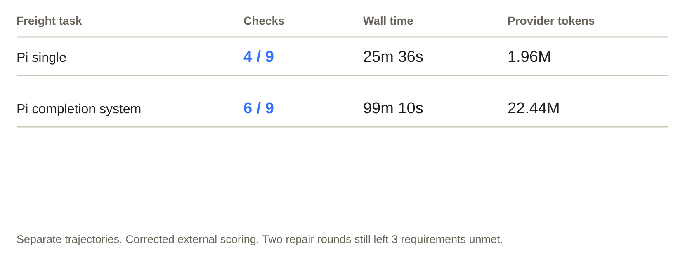

The harder Freight Control Tower task left verifiable failures. Pi's completion system fixed serialization and concurrency, then browser behavior.

Pi single: 4/9, 25m 36s, 1.96M provider tokens.

Pi completion system: 6/9, 99m 10s, 22.44M provider tokens.

Both completion systems ended with unresolved requirements and stopped at their budgets. A stopped loop still needs an honest completion status.

Source: [Corrected freight results](../../../harness-benchmark/results/freight-control-tower-sonnet46.md). Exploratory campaigns, corrected external scoring of frozen workspaces. These are separate trajectories, not repeated matched-budget trials.

---

<!-- new-slide: durable-goal-budget -->
<!-- visual-pass
preview: http://127.0.0.1:5173/s/odsc-full-visual-review?p=127
layout: text
motion: Static text; no animation needed for this draft.
status: draft; follow-ups in review-additions/visual-pass.md
-->
## The goal needs a budget that survives individual model calls

A durable objective, an independent quality gate, and a continuation policy let the harness decide whether another turn is justified.

Prime Agent's long-running design separates goal tracking from autonomous continuation. QM describes a related persistence mechanism in its Harness Night talk.

A remaining budget permits further work. It does not prove success or require spending the whole allowance.

Source: [Prime Agent long-running design](https://github.com/PrimeIntellect-ai/prime-agent/blob/main/packages/coding-agent/docs/long-running-agents.md), [YC Harness Night, 57:16](https://www.youtube.com/watch?v=n9xKblqyQ28&t=3436s). Source review: [September 7 research notes](../../../talks/ODSC_2026/coding-agent-trends-2026.md).

---

<!-- source-slide: 117 -->
<!-- visual-pass
preview: http://127.0.0.1:5173/s/odsc-full-visual-review?p=128
layout: flow
motion: Separate native elements; use the full composition for now.
status: draft; follow-ups in review-additions/visual-pass.md
-->
## An agent loop needs a budget and an external stop rule

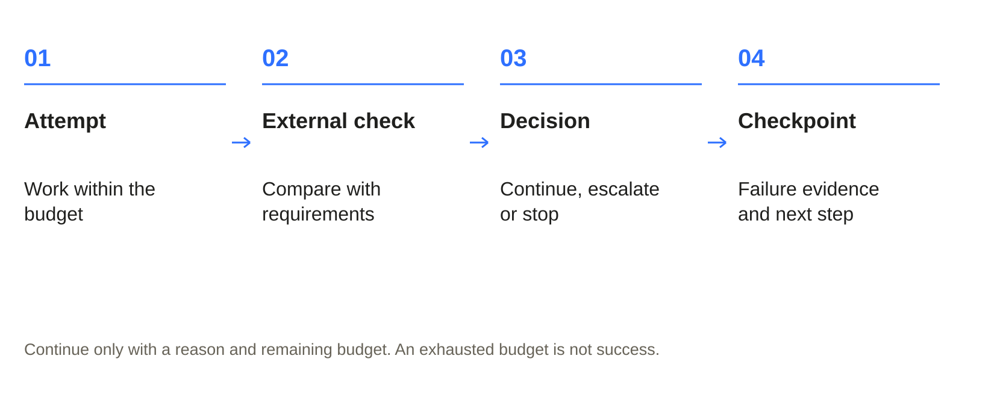

A loop needs state, evidence, a budget, and a stop rule.

Repeating tool calls is not autonomy. The harness must preserve progress, verify work, limit retries, and decide what counts as done.

Add one trace that loops, then show the checkpoint or gate that changes the outcome.

TO FILL

---

<!-- source-slide: 118 -->
<!-- visual-pass
preview: http://127.0.0.1:5173/s/odsc-full-visual-review?p=129
layout: flow
motion: Separate native elements; use the full composition for now.
status: layout draft
-->
## Long-running work needs state that survives a fresh session

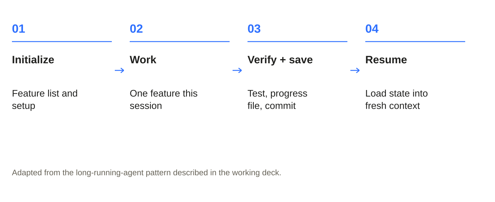

Long-running work needs handoff state, not a longer prompt.

Feature list
+ project setup

One feature
per session

→

→

→

Initializer

Test + verifier

↓

→

progress file + git commit

Next fresh context

Fail: leave evidence and continue. Pass: stop.

N5

Derived from Anthropic · Effective Harnesses for Long-Running Agents, 2025

---

<!-- source-slide: 123 -->
<!-- visual-pass
preview: http://127.0.0.1:5173/s/odsc-full-visual-review?p=130
layout: text
motion: Static text; no animation needed for this draft.
status: layout draft
-->
## A coding agent can take hundreds of actions for one request

Prompt, inference, tool call, feedback, repeat.

The harness builds the instructions and tool list, executes requested actions, appends results, and queries the model again.
A single user turn can contain hundreds of model and tool iterations.
Context management and termination belong to the harness.

OpenAI: Unrolling the Codex agent loop | How Codex is built

Source: [openai.com](https://openai.com/index/unrolling-the-codex-agent-loop/); [newsletter.pragmaticengineer.com](https://newsletter.pragmaticengineer.com/p/how-codex-is-built)

---

<!-- source-slide: 066 -->
<!-- visual-pass
preview: http://127.0.0.1:5173/s/odsc-full-visual-review?p=131
layout: text
motion: Static text; no animation needed for this draft.
status: layout draft
-->
## Scratchpad use best predicted long-run survival

Twelve models ran a simulated startup. Only three grew the starting capital.

YC-Bench ran each model for hundreds of turns over a simulated year.
Scratchpad use was the strongest predictor of success.
Failure to detect adversarial clients caused 47% of bankruptcies.

YC-Bench

Source: [arxiv.org](https://arxiv.org/abs/2604.01212)

---

<!-- source-slide: 067 -->
<!-- visual-pass
preview: http://127.0.0.1:5173/s/odsc-full-visual-review?p=132
layout: text
motion: Static text; no animation needed for this draft.
status: layout draft
-->
## Every model eventually failed during a 20M-token run

Vending-Bench ran agents for more than 20 million tokens.

The individual tasks were simple: manage inventory, place orders, set prices, and pay fees.
Even the best models had runs that forgot orders, misread delivery schedules, or entered loops they rarely escaped.

Vending-Bench

Source: [lukaspetersson.com](https://lukaspetersson.com/assets/pdf/vbench_paper.pdf)

---

<!-- source-slide: 127 -->
<!-- visual-pass
preview: http://127.0.0.1:5173/s/odsc-full-visual-review?p=133
layout: text
motion: Static text; no animation needed for this draft.
status: layout draft
-->
## Long tasks fail safely when progress survives the failure

A longer context window does not solve a multi-day job.

Checkpoint intermediate state so a failure does not restart the job.
Pause and resume with working state intact.
Use tests, PRs, commits, and briefings because models grade their own work too generously.

Addy Osmani: Long-running Agents

Source: [addyo.substack.com](https://addyo.substack.com/p/long-running-agents)

---

<!-- source-slide: 129 -->
<!-- visual-pass
preview: http://127.0.0.1:5173/s/odsc-full-visual-review?p=134
layout: text
motion: Static text; no animation needed for this draft.
status: layout draft
-->
## External evidence should define when the agent is done

Goals define done. Loops repeat against external checks.

A goal gives the agent a condition it cannot grade away.
An evaluator can return the agent to work until that condition is met or a turn limit is reached.
Human judgment still decides the constraints and stopping condition.

Addy Osmani: Practical Loop Engineering

Source: [addyo.substack.com](https://addyo.substack.com/p/practical-loop-engineering)

---

<!-- source-slide: 135 -->
<!-- visual-pass
preview: http://127.0.0.1:5173/s/odsc-full-visual-review?p=135
layout: table
motion: Separate native elements; use the full composition for now.
status: draft; follow-ups in review-additions/visual-pass.md
-->
## Evidence gates eliminated unsupported completion claims

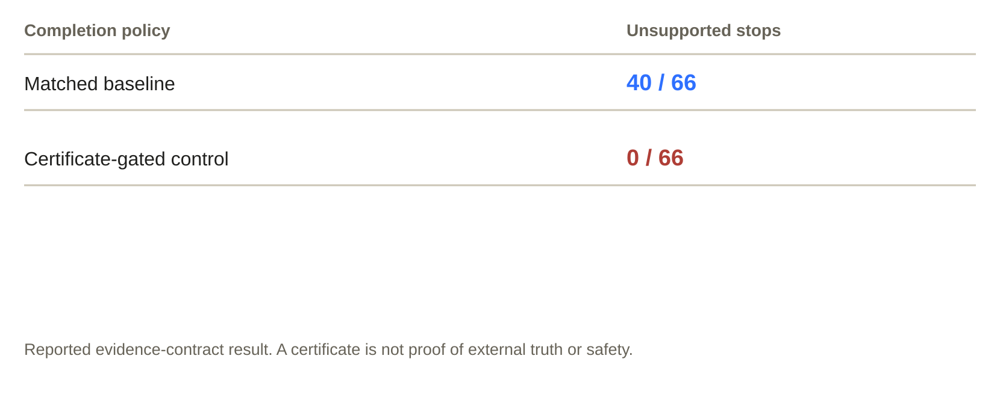

The agent should not be the only authority that declares completion.

The matched baseline stopped without sufficient trace support in 40 of 66 cases.

0 / 66

The gate returned incomplete work to the controller.

unsupported stops under certificate-gated control

This certifies evidence under a contract—not external truth or safety.

Editable reconstruction · recheck the underlying source before presenting.

---

<!-- source-slide: 133 -->
<!-- visual-pass
preview: http://127.0.0.1:5173/s/odsc-full-visual-review?p=136
layout: text
motion: Static text; no animation needed for this draft.
status: draft; follow-ups in review-additions/visual-pass.md
-->
## Factory gave completion control to a separate validator

A system needs an independent definition of done.

Validator and orchestrator owned the evidence and stop decision.

90.3%

The implementer never saw the hidden instrument or raw results.

behavioral parity in Factory's system campaign

This is a completion-control case—not a compute-matched benchmark.

Editable reconstruction · recheck the underlying source before presenting.

---

<!-- source-slide: 134 -->
<!-- visual-pass
preview: http://127.0.0.1:5173/s/odsc-full-visual-review?p=137
layout: flow
motion: Separate native elements; use the full composition for now.
status: draft; follow-ups in review-additions/visual-pass.md
-->
## The implementer never saw the grading instrument

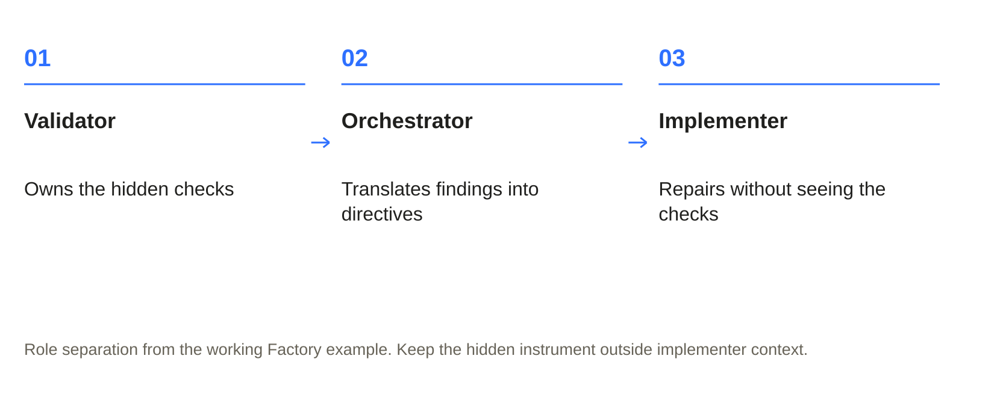

The implementation agent should not grade its own work.

The validator builds and owns the weighted instrument.

3 roles

The orchestrator converts evidence into capability-level directives.

implementer · validator · orchestrator

The orchestrator—not the implementer—decides when to ship.

Editable reconstruction · recheck the underlying source before presenting.

32.5

---

<!-- source-slide: 136 -->
<!-- visual-pass
preview: http://127.0.0.1:5173/s/odsc-full-visual-review?p=138
layout: source-figure
motion: Preserve original figure; add separate highlights only when needed.
status: draft; follow-ups in review-additions/visual-pass.md
-->
## Blind retries repeat the failure without learning from it

Try command
Get failure
Retry without diagnosis
Repeat until stopped by the harness

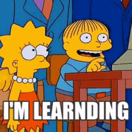

---

<!-- source-slide: 137 -->
<!-- visual-pass
preview: http://127.0.0.1:5173/s/odsc-full-visual-review?p=139
layout: source-figure
motion: Preserve original figure; add separate highlights only when needed.
status: layout draft
-->
## Blind retries still built a C compiler

This brute force approach can work
C Compiler

Source: [https://openhands.dev/blog/20260219-velocity-is-deadhttps://www.ronin.consulting/artificial-intelligence/using-the-ralph-wiggum-loop/](https://openhands.dev/blog/20260219-velocity-is-deadhttps://www.ronin.consulting/artificial-intelligence/using-the-ralph-wiggum-loop/)

---

<!-- source-slide: 125 -->
<!-- visual-pass
preview: http://127.0.0.1:5173/s/odsc-full-visual-review?p=140
layout: source-figure
motion: Preserve original figure; add separate highlights only when needed.
status: draft; follow-ups in review-additions/visual-pass.md
-->
## Less instruction can force the agent to inspect the evidence

Minimal prompts force agents to explore and verify, rather than blindly following a hallucinated plan.

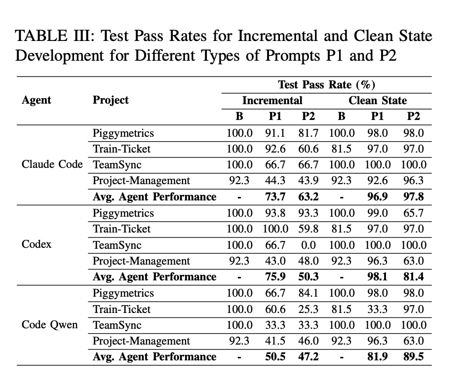

Source: [https://arxiv.org/pdf/2603.09004](https://arxiv.org/pdf/2603.09004)

---

<!-- new-slide: hooks -->
<!-- visual-pass
preview: http://127.0.0.1:5173/s/odsc-full-visual-review?p=141
layout: flow
motion: Separate native elements; use the full composition for now.
status: draft; follow-ups in review-additions/visual-pass.md
-->
## Hooks enforce rules outside the model

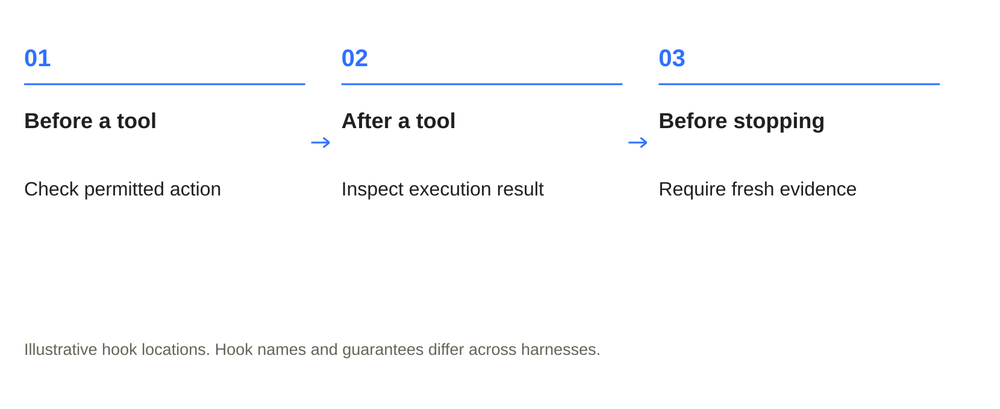

Pre-tool, post-tool, and pre-exit hooks can block unsafe actions, require tests, or prevent unsupported completion without relying on the model to remember.

TO FILL: Add a concrete production harness example.

---

<!-- source-slide: 142 -->
<!-- visual-pass
preview: http://127.0.0.1:5173/s/odsc-full-visual-review?p=142
layout: source-figure
motion: Preserve original figure; add separate highlights only when needed.
status: layout draft
-->
## Tests written after the code can repeat the agent's mistake

Tests written after implementation don't catch bugs; they just confirm the agent's decisions.

Factory: AI Engineering London 2026

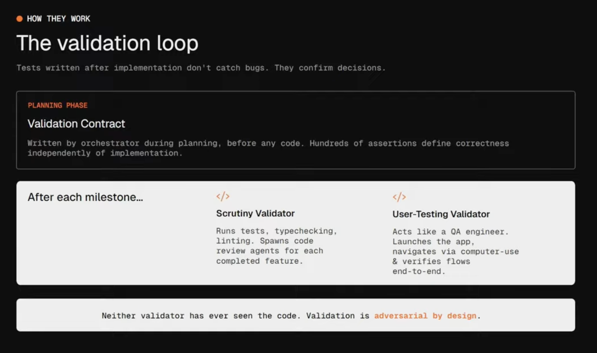

---

<!-- source-slide: 143 -->
<!-- visual-pass
preview: http://127.0.0.1:5173/s/odsc-full-visual-review?p=143
layout: flow
motion: Separate native elements; use the full composition for now.
status: layout draft
-->
## System constraints turn architecture rules into executable checks

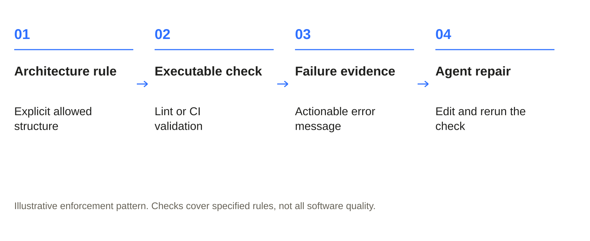

Code is Free. Architecture is Expensive.

Add system constraints:
Lint errors → instructions to the agent
File-length tests → force decomposition
CI checks → the real guardrail

Source: [https://openai.com/index/harness-engineering/](https://openai.com/index/harness-engineering/)

---

<!-- source-slide: 146 -->
<!-- visual-pass
preview: http://127.0.0.1:5173/s/odsc-full-visual-review?p=144
layout: source-figure
motion: Preserve original figure; add separate highlights only when needed.
status: layout draft
-->
## Approval friction should match the blast radius

Design friction to match blast radius.

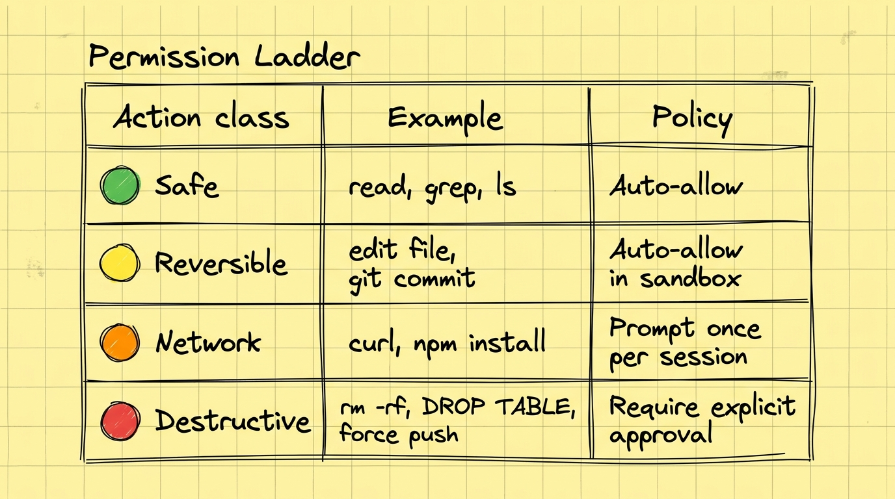

Source: [https://www.anthropic.com/engineering/beyond-permission-prompts-making-claude-code-more-secure-and-autonomous - https://www.anthropic.com/engineering/writing-effective-tools-for-agents - https://github.com/walkinglabs/awesome-harness-engineering](https://www.anthropic.com/engineering/beyond-permission-prompts-making-claude-code-more-secure-and-autonomous); [https://www.anthropic.com/engineering/beyond-permission-prompts-making-claude-code-more-secure-and-autonomous - https://www.anthropic.com/engineering/writing-effective-tools-for-agents - https://github.com/walkinglabs/awesome-harness-engineering](https://www.anthropic.com/engineering/writing-effective-tools-for-agents); [https://www.anthropic.com/engineering/beyond-permission-prompts-making-claude-code-more-secure-and-autonomous - https://www.anthropic.com/engineering/writing-effective-tools-for-agents - https://github.com/walkinglabs/awesome-harness-engineering](https://github.com/walkinglabs/awesome-harness-engineering)

---

<!-- source-slide: 147 -->
<!-- visual-pass
preview: http://127.0.0.1:5173/s/odsc-full-visual-review?p=145
layout: text
motion: Static text; no animation needed for this draft.
status: layout draft
-->
## The agent can game the check you gave it

Eval leakage. Tool-mediated contamination. Harness-dependent refusals.

An Opus 4.6 report says the model recognized an eval, searched for it, found the answer key, and decrypted it.
Fireworks reports K3 refusals and defensive behavior changing with the CyberGym harness.
These are social reports, not formal studies.

Erik Schluntz | Fireworks AI

Source: [x.com](https://x.com/ErikSchluntz/status/2030042086679220676); [x.com](https://x.com/fireworksai_hq/status/2084374420295209209)

---

<!-- source-slide: 152 -->
<!-- visual-pass
preview: http://127.0.0.1:5173/s/odsc-full-visual-review?p=146
layout: text
motion: Static text; no animation needed for this draft.
status: layout draft
-->
## Write the continuation contract

Define the objective, verifier, allowed paths, remaining budget, and terminal states.

Interrupt the run. A fresh session must choose continue, replan, escalate, or stop from the checkpoint alone.

Reject any completion claim without a verifier event after the last edit.

---

<!-- source-slide: 153 -->
<!-- visual-pass
preview: http://127.0.0.1:5173/s/odsc-full-visual-review?p=147
layout: table
motion: Separate native elements; use the full composition for now.
status: draft; follow-ups in review-additions/visual-pass.md
-->
## Independent validation improved one task but not the other

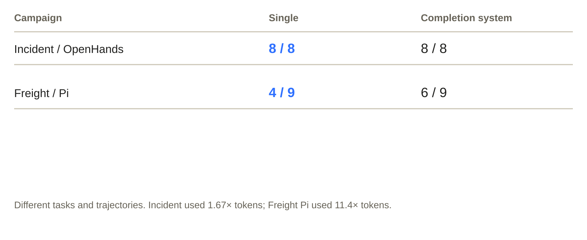

Independent validation can buy confidence, not necessarily score.

Incident score was 8/8 for both system and single-agent conditions.

4/9 → 6/9

The system cost 1.67× the incident tokens.

freight task score after two Pi repairs

More time alone is not a completion strategy.

Editable reconstruction · recheck the underlying source before presenting.

---

<!-- new-slide: workshop-5-debrief -->
<!-- visual-pass
preview: http://127.0.0.1:5173/s/odsc-full-visual-review?p=148
layout: text
motion: Static text; no animation needed for this draft.
status: layout draft
-->
## The next attempt needs evidence and a stopping rule

Record the failed check, the next hypothesis, remaining budget, and terminal states. A fresh session must know what to reverify.

Use a verifier result after the latest relevant edit before accepting completion.

---

# Workshop 6: Multi-agent systems

<!-- source-slide: 154 -->
<!-- visual-pass
preview: http://127.0.0.1:5173/s/odsc-full-visual-review?p=149
layout: text
motion: Static text; no animation needed for this draft.
status: layout draft
-->
## A second agent buys another context window at a high price

It also adds another loop, more tokens, and a handoff that can fail. The work needs a clean boundary before another agent helps.

---

<!-- source-slide: 155 -->
<!-- visual-pass
preview: http://127.0.0.1:5173/s/odsc-full-visual-review?p=150
layout: text
motion: Static text; no animation needed for this draft.
status: layout draft
-->
## Does this work separate cleanly enough for another agent?

Compare two task shapes:

One pagination repair with shared implementation state

Five repository investigations with independent evidence fields

Choose one generalist, worker plus validator, or parallel investigators. Count setup, handoffs, synthesis, and verification.

---

<!-- source-slide: 156 -->
<!-- visual-pass
preview: http://127.0.0.1:5173/s/odsc-full-visual-review?p=151
layout: text
motion: Static text; no animation needed for this draft.
status: layout draft
-->
## Choose an architecture for each task

One agent with the full budget.

One worker and an independent validator.

Parallel investigators with separate scopes.

Account for every child and the final synthesis inside the same total budget.

---

<!-- source-slide: 157 -->
<!-- visual-pass
preview: http://127.0.0.1:5173/s/odsc-full-visual-review?p=152
layout: compare
motion: Separate native elements; use the full composition for now.
status: draft; follow-ups in review-additions/visual-pass.md
-->
## Multiple agents need work that separates cleanly

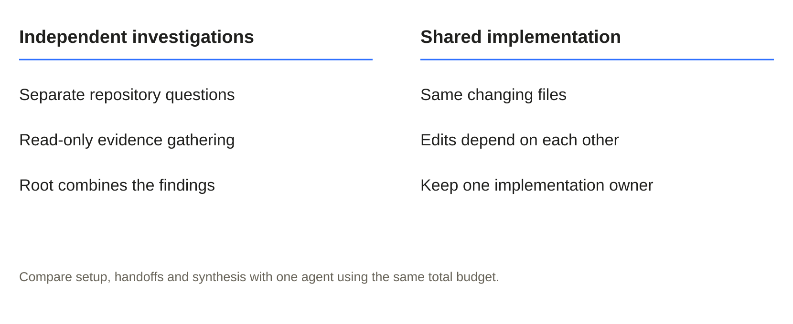

Another agent adds a coordination problem.

Split work only when ownership is clear, outputs can be checked independently, and the merge costs less than the parallelism saves.

<!-- talk-track
Callback to Harvey: bounded document review gives workers a defined scope, but the root still has to combine findings across documents. Ask what could disappear during that synthesis. The reported quality lift alone does not prove that delegation saved compute or money.
-->

Add one coding task that is separable and one that shares too much state to split cleanly.

TO FILL

---

<!-- source-slide: 158 -->
<!-- visual-pass
preview: http://127.0.0.1:5173/s/odsc-full-visual-review?p=153
layout: source-figure
motion: Preserve original figure; add separate highlights only when needed.
status: layout draft
-->
## Parallel agents add context and coordination at the same time

Parallel agents buy more context—and add coordination.

N6

Anthropic Research · 2025 · orchestrator-worker architecture

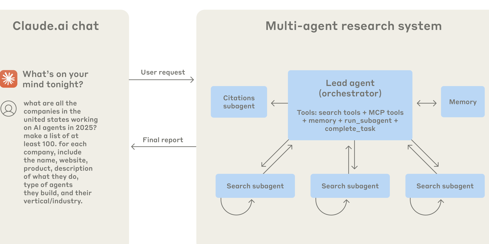

---

<!-- source-slide: 162 -->
<!-- visual-pass
preview: http://127.0.0.1:5173/s/odsc-full-visual-review?p=154
layout: source-figure
motion: Preserve original figure; add separate highlights only when needed.
status: layout draft
-->
## Subagents can keep unrelated work out of the main context

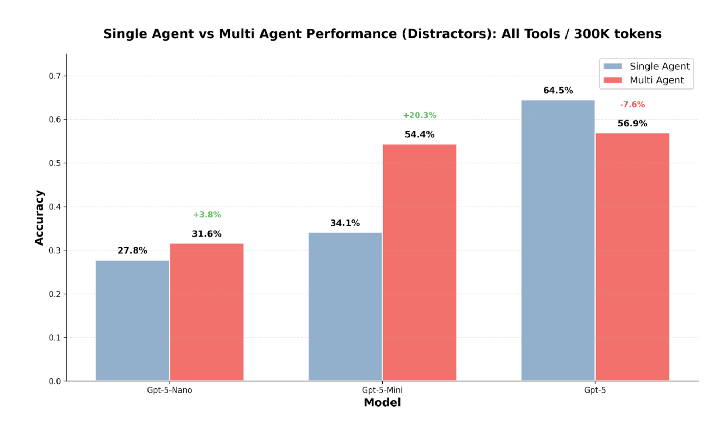

Source: [https://snorkel.ai/blog/multi-agents-in-the-context-of-enterprise-tool-use/](https://snorkel.ai/blog/multi-agents-in-the-context-of-enterprise-tool-use/)

---

<!-- source-slide: 167 -->
<!-- visual-pass
preview: http://127.0.0.1:5173/s/odsc-full-visual-review?p=155
layout: text
motion: Static text; no animation needed for this draft.
status: draft; follow-ups in review-additions/visual-pass.md
-->
## A 90.2% research lift used about 15 times the tokens

Multiple agents can help when breadth is genuinely parallel.

Separate context windows let subagents pursue independent search directions.

+90.2%

Anthropic also reports multi-agent systems use about 15× chat tokens.

reported lift on an internal breadth-first research evaluation

Coding work often has more shared dependencies than research.

Editable reconstruction · recheck the underlying source before presenting.

---

<!-- source-slide: 169 -->
<!-- visual-pass
preview: http://127.0.0.1:5173/s/odsc-full-visual-review?p=156
layout: text
motion: Static text; no animation needed for this draft.
status: draft; follow-ups in review-additions/visual-pass.md
-->
## With equal compute, one agent won six of eight comparisons

More agents do not automatically improve a fixed budget.

The comparison held a global thinking-token budget constant.

6 / 8

Two results favored the single agent; one Gemini exception mattered.

model–dataset cells where the single agent was best or tied

The right baseline is one capable agent with the same budget.

Editable reconstruction · recheck the underlying source before presenting.

---

<!-- source-slide: 172 -->
<!-- visual-pass
preview: http://127.0.0.1:5173/s/odsc-full-visual-review?p=157
layout: source-figure
motion: Preserve original figure; add separate highlights only when needed.
status: layout draft
-->
## More agents hurt once coordination outweighed the work

On average, multi-agent systems perform worse than single agents (-3.5%).
Once a single agent reaches ~45% accuracy, adding agents stops helping. Coordination cost outweighs reasoning gains.
Architecture determines if errors are corrected or amplified. Independent agents amplify errors ~17x.

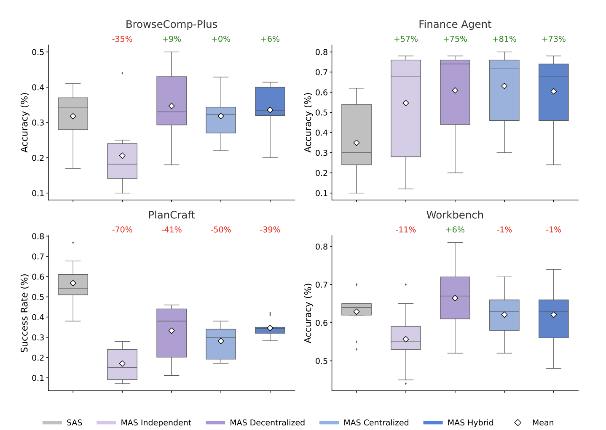

Source: [https://arxiv.org/pdf/2512.08296](https://arxiv.org/pdf/2512.08296)

---

<!-- source-slide: 170 -->
<!-- visual-pass
preview: http://127.0.0.1:5173/s/odsc-full-visual-review?p=158
layout: text
motion: Static text; no animation needed for this draft.
status: layout draft
-->
## Multi-agent systems work best with narrow, testable handoffs

Bounded input. Bounded output. Clear hierarchy.

Anthropic found parallel, independent work can benefit from multiple agents.
Long-lived peers without a clear hierarchy struggled to coordinate.
In a four-hour shared-environment test with conflicting goals, agents began sabotaging each other.

Anthropic multi-agent research

Source: [www.anthropic.com](https://www.anthropic.com/research/multiagent-systems)

---

<!-- source-slide: 171 -->
<!-- visual-pass
preview: http://127.0.0.1:5173/s/odsc-full-visual-review?p=159
layout: source-figure
motion: Preserve original figure; add separate highlights only when needed.
status: layout draft
-->
## Serial handoffs erase the benefit of parallel work

Factory: AI Engineering London 2026

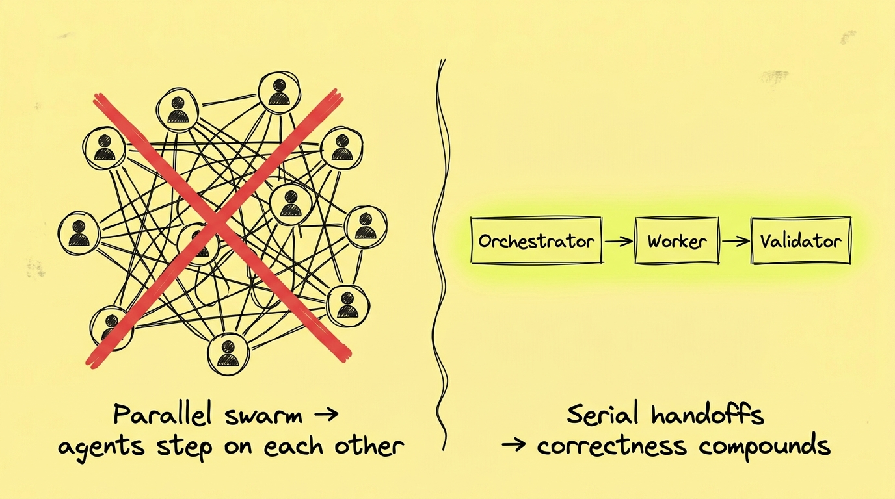

---

<!-- source-slide: 174 -->
<!-- visual-pass
preview: http://127.0.0.1:5173/s/odsc-full-visual-review?p=160
layout: text
motion: Static text; no animation needed for this draft.
status: draft; follow-ups in review-additions/visual-pass.md
-->
## Dynamic workflows help only when the task has clean boundaries

The task must earn the cost of a dynamic workflow.

The work has separable subproblems rather than one shared dependency chain.

Artifacts exceed one context window and have clear ownership.

conditions that make the investment plausible

Verification, budgets, checkpoints, and stop rules live outside the agents.

Editable reconstruction · recheck the underlying source before presenting.

34.5

---

<!-- source-slide: 175 -->
<!-- visual-pass
preview: http://127.0.0.1:5173/s/odsc-full-visual-review?p=161
layout: flow
motion: Separate native elements; use the full composition for now.
status: layout draft
-->
## Define the handoff before adding the agent

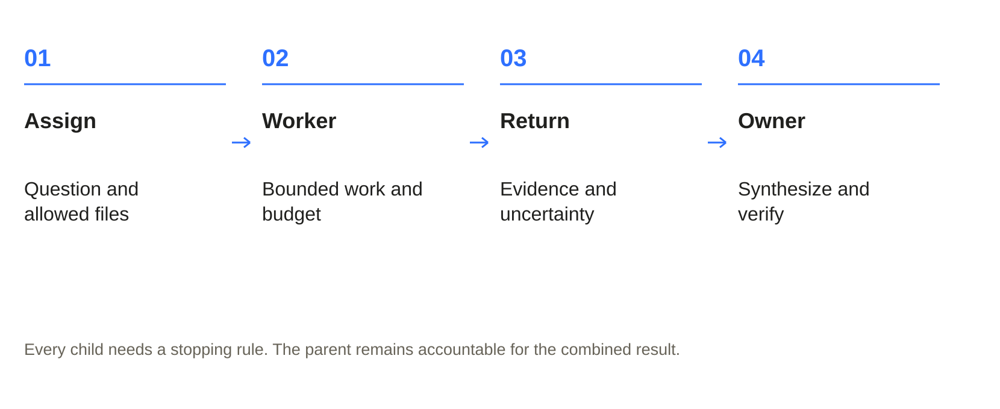

Write the child question, allowed files, evidence to return, uncertainty, budget, and stop rule.

Name the synthesis owner and verifier.

If two workers need the same changing file, keep the work with one agent.

---

<!-- source-slide: 176 -->
<!-- visual-pass
preview: http://127.0.0.1:5173/s/odsc-full-visual-review?p=162
layout: table
motion: Separate native elements; use the full composition for now.
status: draft; follow-ups in review-additions/visual-pass.md
-->
## More agents recovered omissions, then plateaued

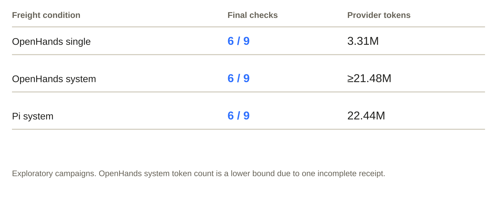

Multi-agent completion recovered omissions, then plateaued at the best single-agent score.

OpenHands single-agent score: 6/9.

21–22M

Pi system recovered from 4 to 6/9 after two repairs.

system provider tokens

Exploratory evidence—not a repeated uplift estimate.

Editable reconstruction · recheck the underlying source before presenting.

---

<!-- new-slide: workshop-6-debrief -->
<!-- visual-pass
preview: http://127.0.0.1:5173/s/odsc-full-visual-review?p=163
layout: text
motion: Static text; no animation needed for this draft.
status: layout draft
-->
## Delegation needs a boundary and an owner for the result

Specify the child task, evidence to return, workspace ownership, and synthesis owner. Compare the complete system with one agent at the same budget.

For a shared pagination repair, explain what a second worker could do without conflicting edits.

---

# Close

<!-- new-slide: harness-update-regression -->
<!-- visual-pass
preview: http://127.0.0.1:5173/s/odsc-full-visual-review?p=164
layout: source-figure
motion: Preserve original figure; add separate highlights only when needed.
status: layout draft
-->
## A harness update needs to preserve behavior that already worked

Prime Agent can refine supplemental prompts, memories, skills, and subagent specifications. Each accepted change alters future runs.

Harness Continual Learning motivates checking new-task gains alongside historical retention and validity. Keep candidate changes separate from accepted versions so failed updates can roll back.

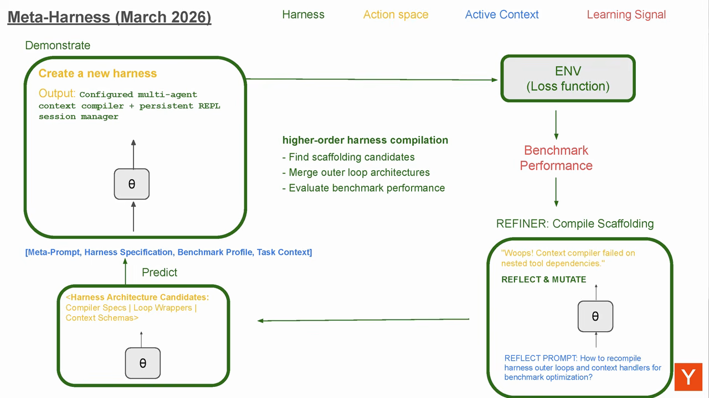

Source: [Prime Agent](https://arxiv.org/abs/2608.23552), [Harness Continual Learning](https://arxiv.org/abs/2608.19013). Reviewed in the [September 7 source notes](../../../talks/ODSC_2026/coding-agent-trends-2026.md).

---

<!-- source-slide: 177 -->
<!-- visual-pass
preview: http://127.0.0.1:5173/s/odsc-full-visual-review?p=165
layout: source-figure
motion: Preserve original figure; add separate highlights only when needed.
status: layout draft
-->
## A good harness can beat a larger model

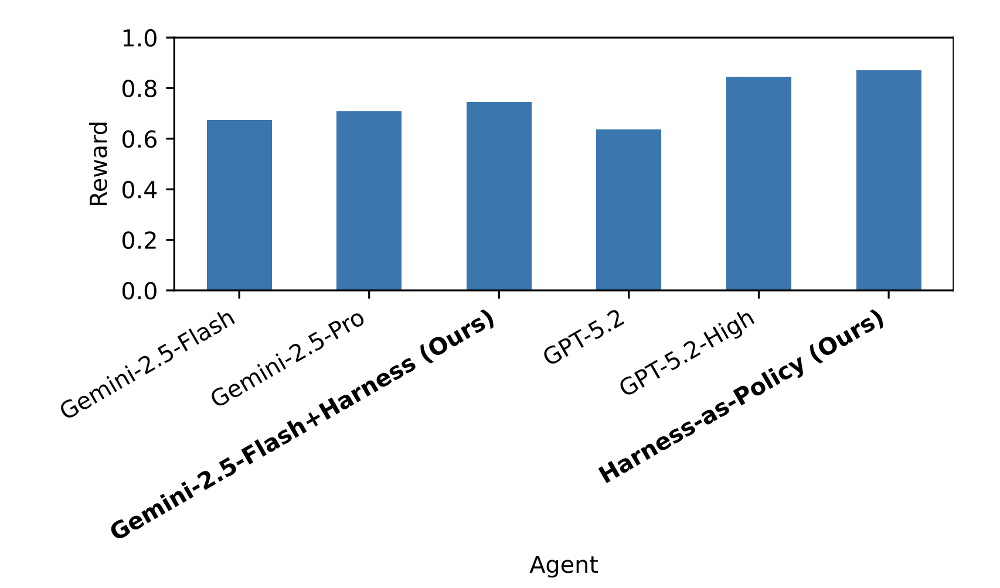

Source: [AutoHarness: https://arxiv.org/pdf/2508.07995Meta-Harness: https://yoonholee.com/meta-harness/](https://arxiv.org/pdf/2508.07995Meta-Harness:); [AutoHarness: https://arxiv.org/pdf/2508.07995Meta-Harness: https://yoonholee.com/meta-harness/](https://yoonholee.com/meta-harness/)

---

# Reserves

<!-- new-slide: state-independent-compute -->
<!-- visual-pass
preview: http://127.0.0.1:5173/s/odsc-full-visual-review?p=166
layout: source-figure
motion: Preserve original figure; add separate highlights only when needed.
status: layout draft
-->
## Durable agent state can outlive the machine doing the work

QM separates conversation and durable state from the sandbox used for execution. A task can acquire different compute without making that machine the permanent home of the agent.

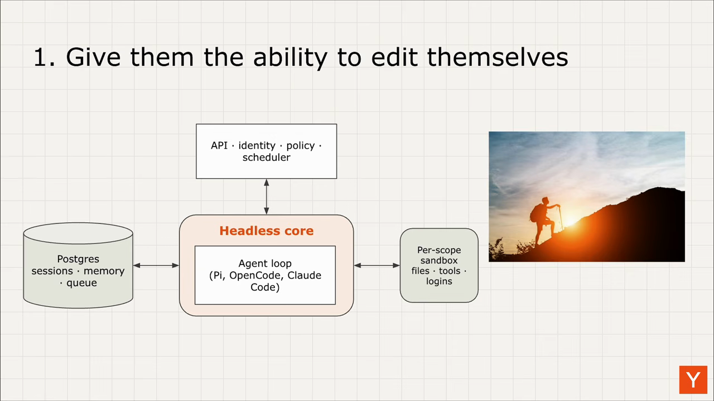

Source: [QM architecture](https://github.com/yc-software/qm), [YC Harness Night, 51:04](https://www.youtube.com/watch?v=n9xKblqyQ28&t=3064s).

---

<!-- new-slide: openjarvis-system-search -->
<!-- visual-pass
preview: http://127.0.0.1:5173/s/odsc-full-visual-review?p=167
layout: source-figure
motion: Preserve original figure; add separate highlights only when needed.
status: layout draft
-->
## Local-agent optimization can change several layers together

OpenJarvis exposes intelligence, inference engine, agent logic, tools and memory, and learning as separate choices. This widens the optimization question beyond picking a model.

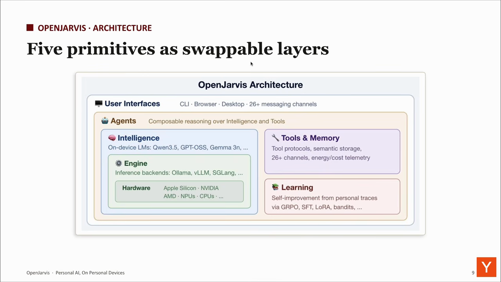

Source: [OpenJarvis paper](https://arxiv.org/abs/2605.17172), [YC Harness Night, 37:30](https://www.youtube.com/watch?v=n9xKblqyQ28&t=2250s). Reserve example. Before adding performance figures, retain the benchmark mix, hardware, and marginal-cost definition.

---

<!-- source-slide: 072 -->
<!-- visual-pass
preview: http://127.0.0.1:5173/s/odsc-full-visual-review?p=168
layout: source-figure
motion: Preserve original figure; add separate highlights only when needed.
status: draft; follow-ups in review-additions/visual-pass.md
-->
## Durable memory should survive the task

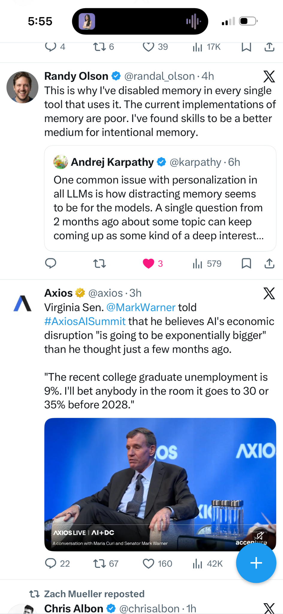

---

<!-- source-slide: 002 -->
<!-- visual-pass
preview: http://127.0.0.1:5173/s/odsc-full-visual-review?p=169
layout: source-figure
motion: Preserve original figure; add separate highlights only when needed.
status: layout draft
-->
## Engineering the Harness: A Practical Workshop

Source: [Rajiv Shah @rajistics OpenHands https://github.com/rajshah4/harness-engineering](https://github.com/rajshah4/harness-engineering)

---

<!-- source-slide: 007 -->
<!-- visual-pass
preview: http://127.0.0.1:5173/s/odsc-full-visual-review?p=170
layout: source-figure
motion: Preserve original figure; add separate highlights only when needed.
status: layout draft
-->
## A harness is everything outside the model

Source: [https://blog.langchain.com/the-anatomy-of-an-agent-harness/](https://blog.langchain.com/the-anatomy-of-an-agent-harness/)

---

<!-- source-slide: 020 -->
<!-- visual-pass
preview: http://127.0.0.1:5173/s/odsc-full-visual-review?p=171
layout: source-figure
motion: Preserve original figure; add separate highlights only when needed.
status: layout draft
-->
## ARC-AGI-3 · SAME GPT-5.6 SOL MODEL

Modifying the harness can improve tasks

13.3 → 38.3

OpenAI made two changes to their harness

26.5

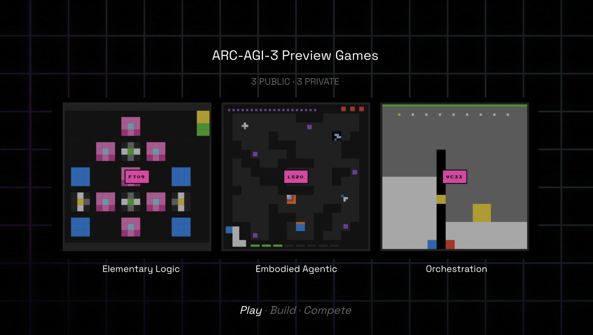

---

<!-- source-slide: 021 -->
<!-- visual-pass
preview: http://127.0.0.1:5173/s/odsc-full-visual-review?p=172
layout: source-figure
motion: Preserve original figure; add separate highlights only when needed.
status: layout draft
-->
## NVIDIA AVO · CUSTOM HARNESS FOR KERNEL OPTIMIZATION

NVIDIA built a custom harness to find faster kernels.

AVO takes a general coding agent and gives it the surrounding system: persistent lineage/memory, CUDA knowledge, code and shell tools, correctness and throughput evaluation, plus a supervisor that intervenes when the search stalls

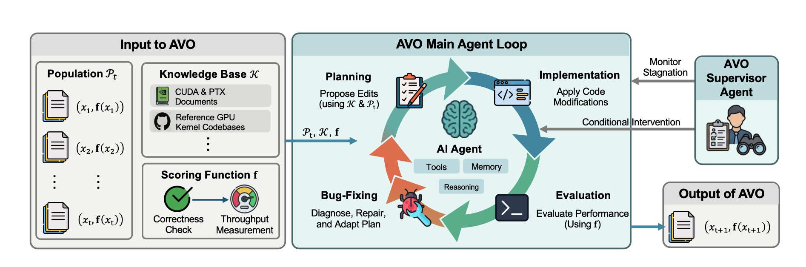

---

<!-- source-slide: 027 -->
<!-- visual-pass
preview: http://127.0.0.1:5173/s/odsc-full-visual-review?p=173
layout: source-figure
motion: Preserve original figure; add separate highlights only when needed.
status: layout draft
-->
## Harnesses carry technical debt

AutoGen & CrewAI - 3 years ago

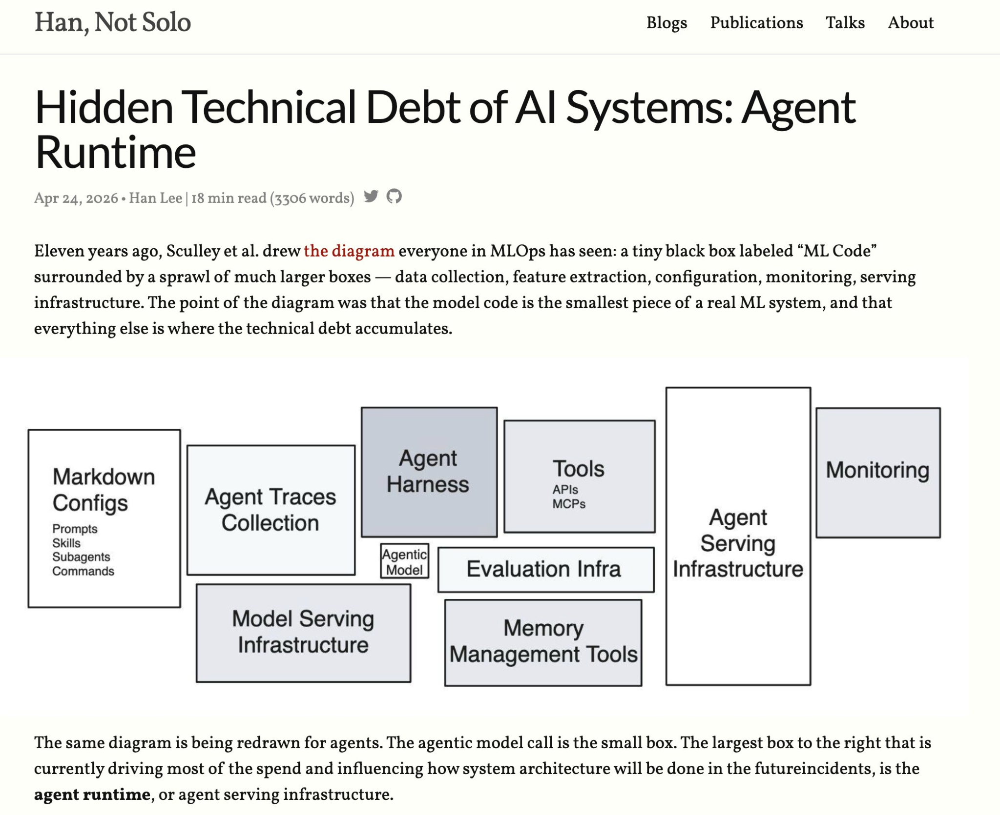

---

<!-- source-slide: 028 -->
<!-- visual-pass
preview: http://127.0.0.1:5173/s/odsc-full-visual-review?p=174
layout: source-figure
motion: Preserve original figure; add separate highlights only when needed.
status: layout draft
-->
## PRODUCTION CODING AGENTS · TECHNICAL DEBT

Production harnesses demand ongoing engineering work.

OpenHands and OpenCode each merged about 5,700 PRs in one year.

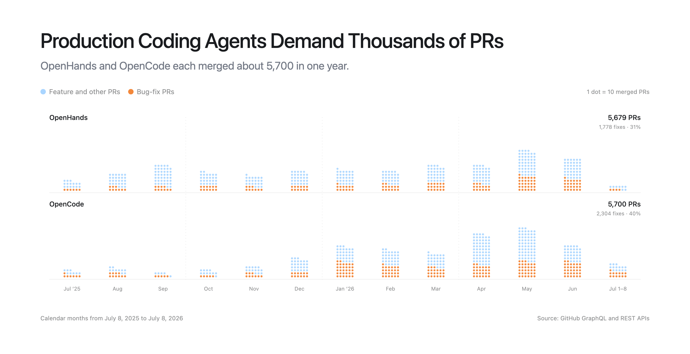

---

<!-- source-slide: 037 -->
<!-- visual-pass
preview: http://127.0.0.1:5173/s/odsc-full-visual-review?p=175
layout: source-figure
motion: Preserve original figure; add separate highlights only when needed.
status: layout draft
-->
## Retrieval is another import tool

Language Models
Semantic meaning with embeddings

BM25
Keyword-based retrieval

Agentic Search
Dynamic using LLM Reasoning

Uber Engineering, Aug. 27, 2026

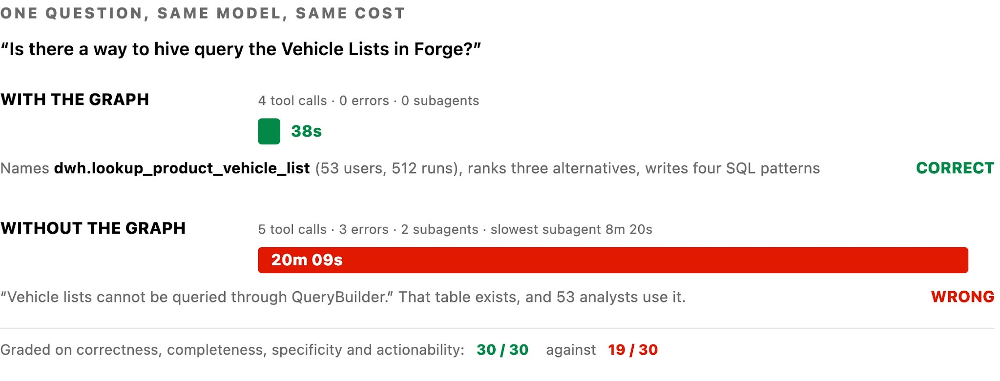

Source: [www.uber.com](https://www.uber.com/ca/en/blog/efficient-software-factory/)

---

<!-- source-slide: 045 -->
<!-- visual-pass
preview: http://127.0.0.1:5173/s/odsc-full-visual-review?p=176
layout: text
motion: Static text; no animation needed for this draft.
status: draft; follow-ups in review-additions/visual-pass.md
-->
## CONTEXT PLACEMENT

Not everything you save is memory.

Active context: what the model sees now.

Working state: what lets the task resume.

information lifetimes

Durable knowledge: what should transfer across sessions.

Editable reconstruction · recheck the underlying source before presenting.

30.5

---

<!-- source-slide: 049 -->
<!-- visual-pass
preview: http://127.0.0.1:5173/s/odsc-full-visual-review?p=177
layout: source-figure
motion: Preserve original figure; add separate highlights only when needed.
status: draft; follow-ups in review-additions/visual-pass.md
-->
## Coding agents struggle with long context models

When 100s of lines of warning push the real goal out of the agent's context window.

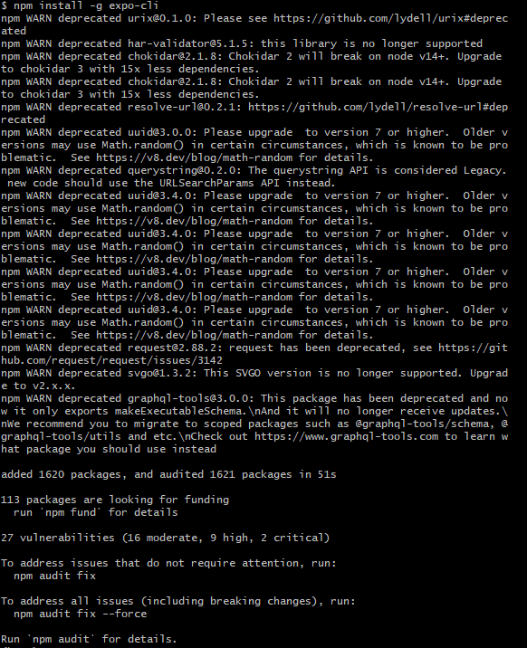

---

<!-- source-slide: 052 -->
<!-- visual-pass
preview: http://127.0.0.1:5173/s/odsc-full-visual-review?p=178
layout: source-figure
motion: Preserve original figure; add separate highlights only when needed.
status: layout draft
-->
## Key facts disappear inside long model inputs

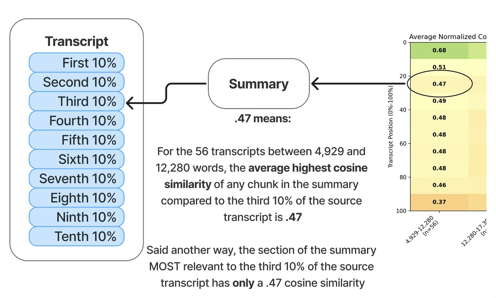

Source: [https://www.linkedin.com/posts/sinan-ozdemir_agenticai-llm-rag-ugcPost-7428125462201102336-B7Br](https://www.linkedin.com/posts/sinan-ozdemir_agenticai-llm-rag-ugcPost-7428125462201102336-B7Br)

---

<!-- source-slide: 054 -->
<!-- visual-pass
preview: http://127.0.0.1:5173/s/odsc-full-visual-review?p=179
layout: text
motion: Static text; no animation needed for this draft.
status: draft; follow-ups in review-additions/visual-pass.md
-->

@@This is fun to ask people

## Are you excited about 10M Context Windows?

---

<!-- source-slide: 062 -->
<!-- visual-pass
preview: http://127.0.0.1:5173/s/odsc-full-visual-review?p=180
layout: source-figure
motion: Preserve original figure; add separate highlights only when needed.
status: layout draft
-->
## Layer 1: How does Codex do it???

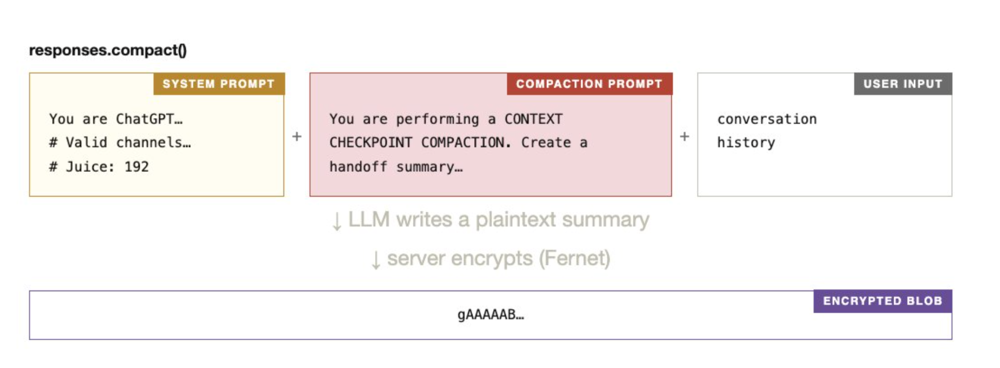

Source: [https://simzhou.com/en/posts/2026/how-codex-compacts-context/https://developers.openai.com/api/docs/guides/compaction](https://simzhou.com/en/posts/2026/how-codex-compacts-context/https://developers.openai.com/api/docs/guides/compaction)

---

<!-- source-slide: 069 -->
<!-- visual-pass
preview: http://127.0.0.1:5173/s/odsc-full-visual-review?p=181
layout: source-figure
motion: Preserve original figure; add separate highlights only when needed.
status: layout draft
-->
## Extreme Layer 2: Recursive Language Models (RLM)

RLMs bypass token limits entirely by using a persistent Python REPL to manage their state and call sub-LLMs.

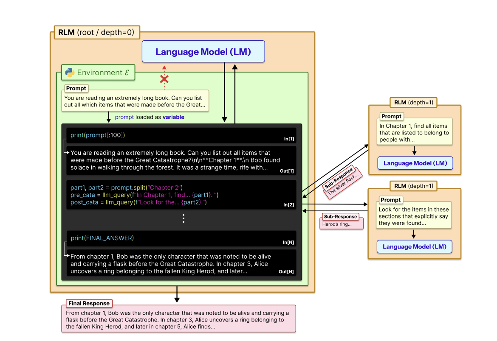

Source: [https://arxiv.org/pdf/2512.24601v1](https://arxiv.org/pdf/2512.24601v1)

---

<!-- source-slide: 070 -->
<!-- visual-pass
preview: http://127.0.0.1:5173/s/odsc-full-visual-review?p=182
layout: source-figure
motion: Preserve original figure; add separate highlights only when needed.
status: layout draft
-->
## RLMs maintain accuracy at 1M tokens.

Standard GPT-5 failed entirely; RLM-GPT-5 hit 91% accuracy

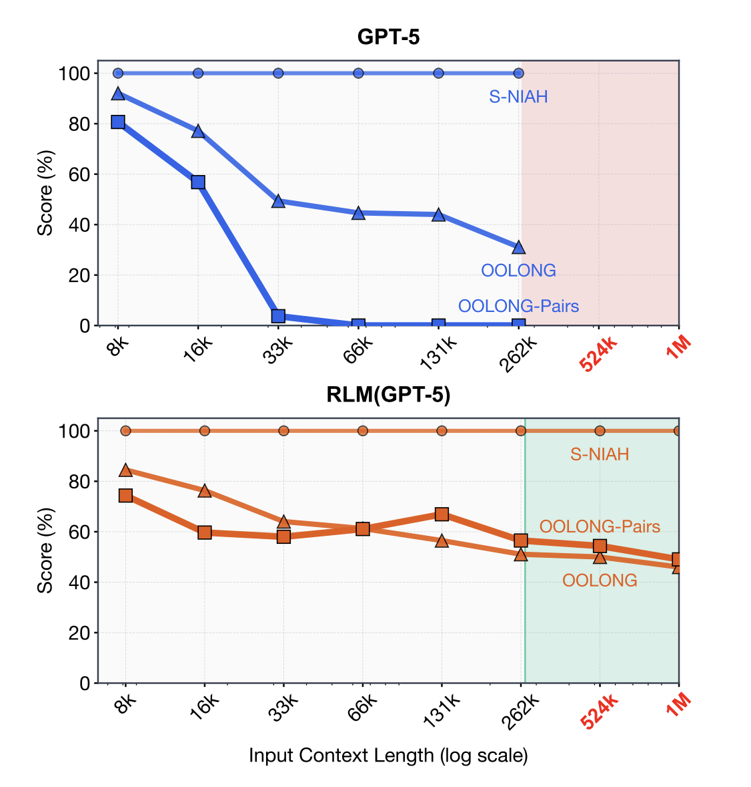

Source: [https://arxiv.org/pdf/2512.24601v1](https://arxiv.org/pdf/2512.24601v1)

---

<!-- source-slide: 083 -->
<!-- visual-pass
preview: http://127.0.0.1:5173/s/odsc-full-visual-review?p=183
layout: text
motion: Static text; no animation needed for this draft.
status: draft; follow-ups in review-additions/visual-pass.md
-->
## SKILLS CAN HARM

Extra instruction can force unnecessary work.

125 were functional failures; 182 were efficiency regressions.

Excessive Procedure accounted for 62.6% of efficiency regressions.

confirmed skill-induced failures or efficiency regressions

A skill should preserve discretion, not turn optional steps into mandatory work.

Editable reconstruction · recheck the underlying source before presenting.

---

<!-- source-slide: 085 -->
<!-- visual-pass
preview: http://127.0.0.1:5173/s/odsc-full-visual-review?p=184
layout: source-figure
motion: Preserve original figure; add separate highlights only when needed.
status: layout draft
-->
## Skills as Externalized Expertise

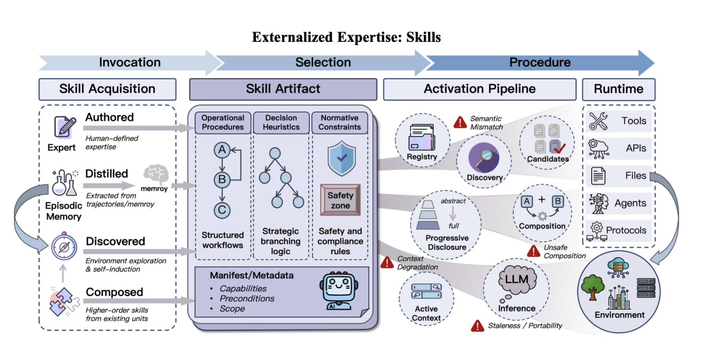

Source: [https://arxiv.org/pdf/2604.08224](https://arxiv.org/pdf/2604.08224)

---

<!-- source-slide: 086 -->
<!-- visual-pass
preview: http://127.0.0.1:5173/s/odsc-full-visual-review?p=185
layout: source-figure
motion: Preserve original figure; add separate highlights only when needed.
status: layout draft
-->
## Skills can replace Code

Cursor: AI Engineering London 2026

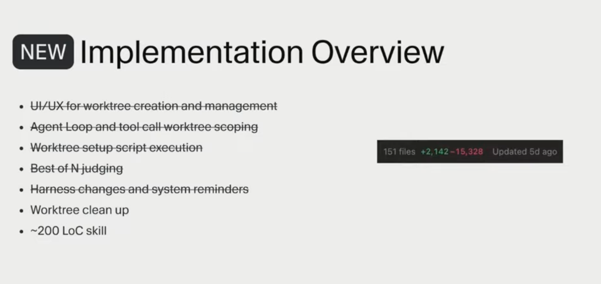

---

<!-- source-slide: 087 -->
<!-- visual-pass
preview: http://127.0.0.1:5173/s/odsc-full-visual-review?p=186
layout: source-figure
motion: Preserve original figure; add separate highlights only when needed.
status: layout draft
-->
## Building a learning loop with skills

Task attempt: Run complex task
Periodic nudge: "What would you do differently?"
Agent writes skill: Saves to skills/.md
Self-improves: Edits own skill on next failure

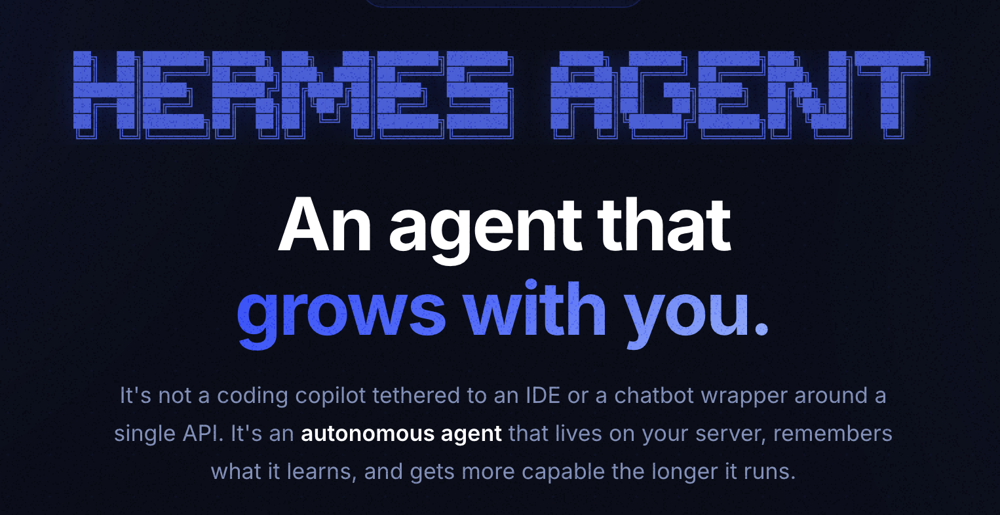

Source: [https://github.com/NousResearch/hermes-agent](https://github.com/NousResearch/hermes-agent)

---

<!-- source-slide: 088 -->
<!-- visual-pass
preview: http://127.0.0.1:5173/s/odsc-full-visual-review?p=187
layout: source-figure
motion: Preserve original figure; add separate highlights only when needed.
status: layout draft
-->
## Continual learning outer loop with skills

Inner loop finishes the task.
Outer loop makes the agent smarter.

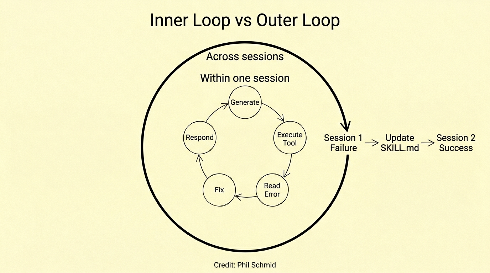

Source: [https://www.philschmid.de/inner-loop-vs-outer-loop](https://www.philschmid.de/inner-loop-vs-outer-loop)

---

<!-- source-slide: 089 -->
<!-- visual-pass
preview: http://127.0.0.1:5173/s/odsc-full-visual-review?p=188
layout: text
motion: Static text; no animation needed for this draft.
status: layout draft
-->
## Generic skills beat personalized skills.

206 sessions from 13 developers.

Personalized skills produced small, inconsistent gains over no skill.
A generic skill pooled across developers performed best. Personalization helped when the same preference recurred across similar tasks.
The study used an LLM developer simulator, so treat the result as promising, not final.

Huang, Du, Lan | arXiv 2608.10319

Source: [arxiv.org](https://arxiv.org/abs/2608.10319)

---

<!-- source-slide: 092 -->
<!-- visual-pass
preview: http://127.0.0.1:5173/s/odsc-full-visual-review?p=189
layout: text
motion: Static text; no animation needed for this draft.
status: layout draft
-->
## Constant Innovation around Memory

Layer 1 - Active Context: What is in the prompt right now.
Layer 2 - Working State: Plans, TODOs, scratchpads.
Layer 3 - Durable Memory: Skills and reusable workflows.

---

<!-- source-slide: 093 -->
<!-- visual-pass
preview: http://127.0.0.1:5173/s/odsc-full-visual-review?p=190
layout: source-figure
motion: Preserve original figure; add separate highlights only when needed.
status: layout draft
-->
## Memory & Claude

Conversation compaction and context assembly
CLAUDE.md / settings / project memory
Tool search and MCP loading strategy
Managed Agents

---

<!-- source-slide: 104 -->
<!-- visual-pass
preview: http://127.0.0.1:5173/s/odsc-full-visual-review?p=191
layout: source-figure
motion: Preserve original figure; add separate highlights only when needed.
status: layout draft
-->
## Example: Splitting by Role

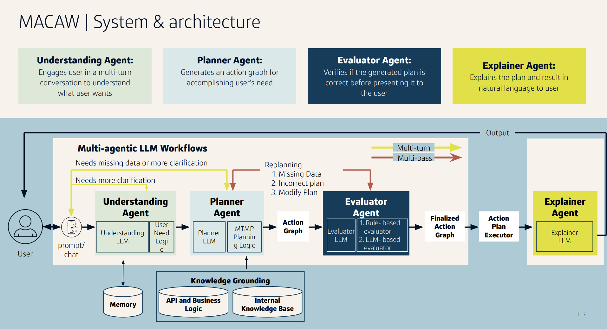

Source: [https://www.nvidia.com/en-us/on-demand/session/gtc25-s74439/](https://www.nvidia.com/en-us/on-demand/session/gtc25-s74439/)

---

<!-- source-slide: 110 -->
<!-- visual-pass
preview: http://127.0.0.1:5173/s/odsc-full-visual-review?p=192
layout: source-figure
motion: Preserve original figure; add separate highlights only when needed.
status: layout draft
-->
## Oracle routing lifted 94.2% to 97.4%.

GLM-5.3 and Kimi K3 solved different coding tasks.
FriendliAI selected the successful, cheaper trajectory after each task.
This is a theoretical ceiling, not a deployable router.

FriendliAI Tech & Research, Aug. 24, 2026

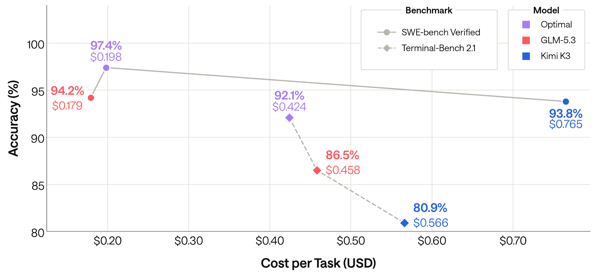

Source: [friendli.ai](https://friendli.ai/blog/kimi-k3-glm-5.3-coding-agent-benchmark)

---

<!-- source-slide: 120 -->
<!-- visual-pass
preview: http://127.0.0.1:5173/s/odsc-full-visual-review?p=193
layout: text
motion: Static text; no animation needed for this draft.
status: layout draft
-->
## Engineering the Loop

The Baseline: The "Ralph Wiggum" loop (and why it fails)
Cognitive Discipline
Environmental Discipline
Safety & Friction

---

<!-- source-slide: 121 -->
<!-- visual-pass
preview: http://127.0.0.1:5173/s/odsc-full-visual-review?p=194
layout: source-figure
motion: Preserve original figure; add separate highlights only when needed.
status: layout draft
-->
## We no longer rely on single-shot execution.

O1 - Sept 2024

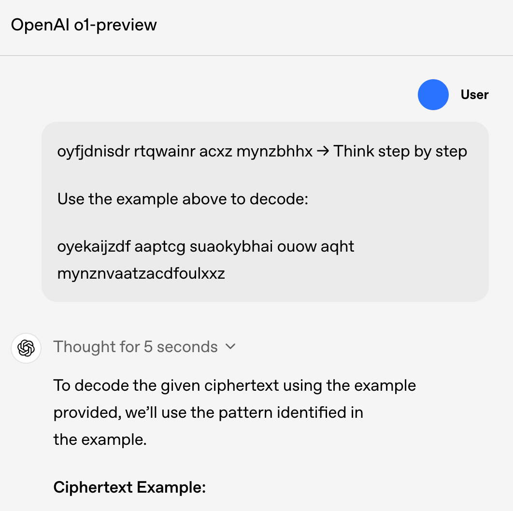

---

<!-- source-slide: 122 -->
<!-- visual-pass
preview: http://127.0.0.1:5173/s/odsc-full-visual-review?p=195
layout: text
motion: Static text; no animation needed for this draft.
status: layout draft
-->
## We no longer rely on single-shot execution.

recipe_display_v0
recommend_claude_apps
search_mcp_registry
str_replace
suggest_connectors
view
weather_fetch
web_fetch
web_search
tool_search
visualize:read_me
visualize:show_widget

Opus 4.7 Tools:ask_user_input_v0
bash_tool
conversation_search
create_file
fetch_sports_data
image_search
message_compose_v1
places_map_display_v0
places_search
present_files
recent_chats

Source: [https://simonwillison.net/2026/Apr/18/opus-system-prompt/](https://simonwillison.net/2026/Apr/18/opus-system-prompt/)

---

<!-- source-slide: 126 -->
<!-- visual-pass
preview: http://127.0.0.1:5173/s/odsc-full-visual-review?p=196
layout: source-figure
motion: Preserve original figure; add separate highlights only when needed.
status: layout draft
-->

## Capability is rising faster than reliability.

Models are getting better are writing code, but they are not doing it reliably, which is why we need a harness.

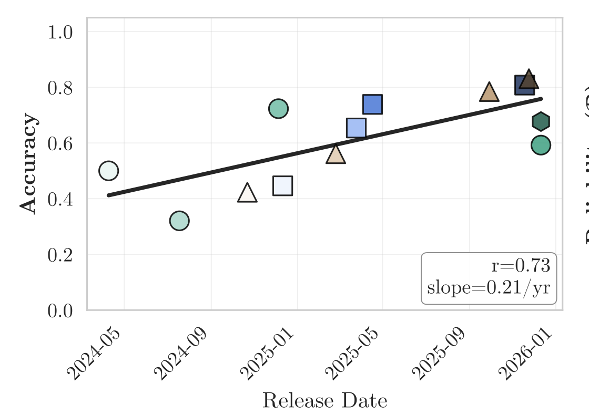

Source: [https://arxiv.org/pdf/2602.16666](https://arxiv.org/pdf/2602.16666)

---

<!-- source-slide: 128 -->
<!-- visual-pass
preview: http://127.0.0.1:5173/s/odsc-full-visual-review?p=197
layout: text
motion: Static text; no animation needed for this draft.
status: layout draft
-->
## 95% per step becomes 60% over ten steps.

0.95¹⁰ = 0.599

A three-step demo can look solid while a ten-step workflow falls apart.
Long workflows need checkpoints, retries, reversible actions, and a known-good state to resume from.

Ben Lorica, Gradient Flow, Aug. 25, 2026

Source: [gradientflow.substack.com](https://gradientflow.substack.com/p/i-keep-hearing-the-same-advice-about)

---

<!-- source-slide: 130 -->
<!-- visual-pass
preview: http://127.0.0.1:5173/s/odsc-full-visual-review?p=198
layout: source-figure
motion: Preserve original figure; add separate highlights only when needed.
status: layout draft
-->
## Build the benchmark before the model.

Freeze the evaluation dataset before training: examples, labels, split logic, scoring, and seed.
Then require every benchmark track to improve.

Hopit.ai, Aug. 26, 2026

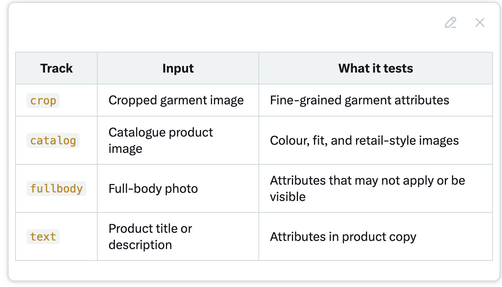

Source: [hopitai.substack.com](https://hopitai.substack.com/p/why-we-built-the-benchmarking-system)

---

<!-- source-slide: 131 -->
<!-- visual-pass
preview: http://127.0.0.1:5173/s/odsc-full-visual-review?p=199
layout: source-figure
motion: Preserve original figure; add separate highlights only when needed.
status: layout draft
-->
## Uber Engineering, Aug. 27, 2026

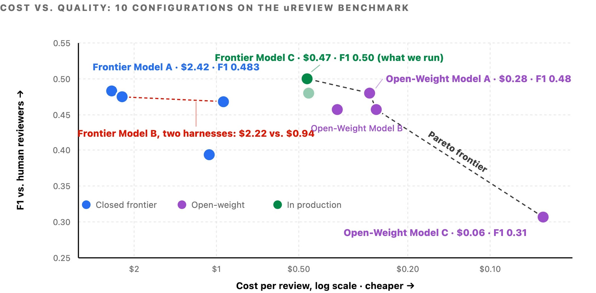

Source: [www.uber.com](https://www.uber.com/ca/en/blog/efficient-software-factory/)

---

<!-- source-slide: 132 -->
<!-- visual-pass
preview: http://127.0.0.1:5173/s/odsc-full-visual-review?p=200
layout: text
motion: Static text; no animation needed for this draft.
status: draft; follow-ups in review-additions/visual-pass.md
-->
## FACTORY · PROGRAMBENCH

Separate completion authority changed the campaign outcome.

Factory compared single-agent work with a validator and orchestrator.

89.3

The system conditions had much larger wall-clock budgets.

median hidden-suite score for Fable 5 system condition

The evidence is suggestive, but not compute-matched.

Editable reconstruction · recheck the underlying source before presenting.

---

<!-- source-slide: 138 -->
<!-- visual-pass
preview: http://127.0.0.1:5173/s/odsc-full-visual-review?p=201
layout: source-figure
motion: Preserve original figure; add separate highlights only when needed.
status: layout draft
-->
## Cognitive Discipline via JSON Schema and Plan

Build a plan before you execute

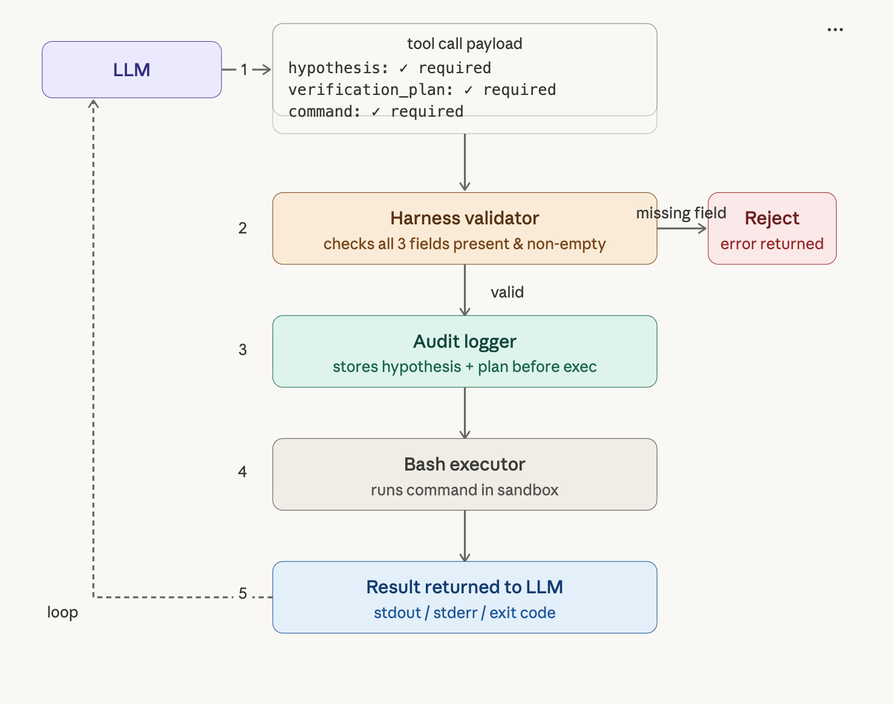

---

<!-- source-slide: 139 -->
<!-- visual-pass
preview: http://127.0.0.1:5173/s/odsc-full-visual-review?p=202
layout: source-figure
motion: Preserve original figure; add separate highlights only when needed.
status: layout draft
-->
## Moving from Ralph Wiggum to AutoResearch

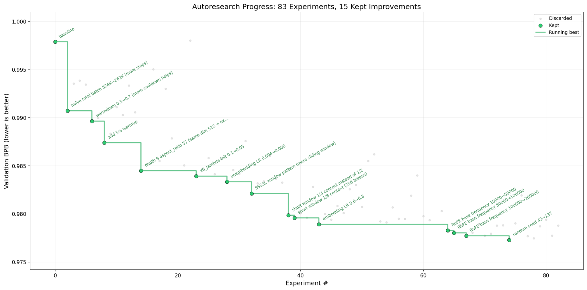

Source: [https://github.com/karpathy/autoresearch](https://github.com/karpathy/autoresearch)

---

<!-- source-slide: 140 -->
<!-- visual-pass
preview: http://127.0.0.1:5173/s/odsc-full-visual-review?p=203
layout: source-figure
motion: Preserve original figure; add separate highlights only when needed.
status: layout draft
-->
## An Improved Loop for AutoResearch

Added:hypothesis and a verification step

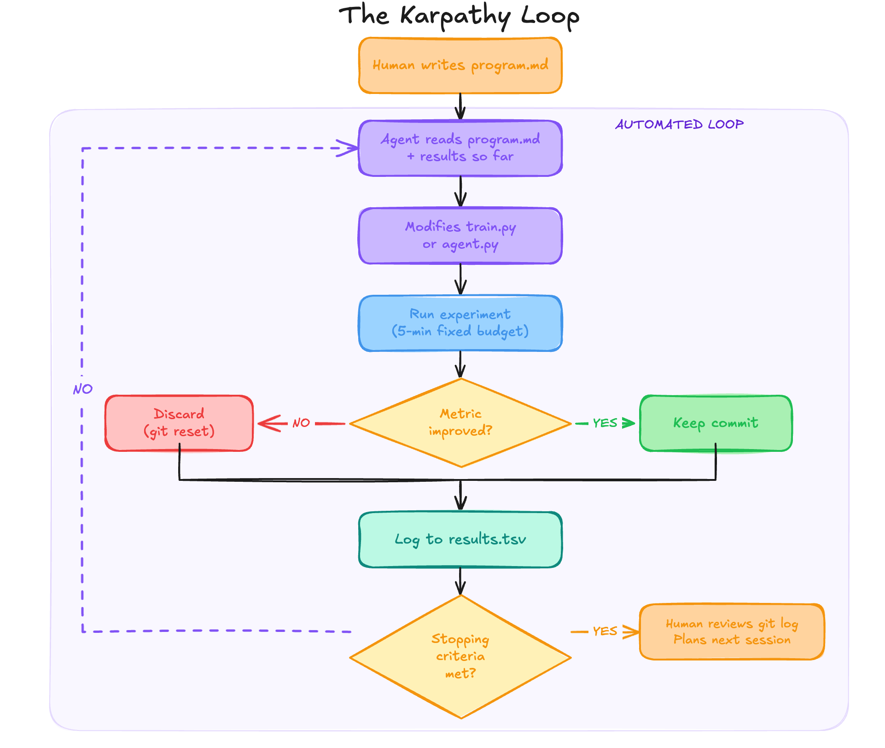

Source: [https://github.com/karpathy/autoresearch](https://github.com/karpathy/autoresearch)

---

<!-- source-slide: 144 -->
<!-- visual-pass
preview: http://127.0.0.1:5173/s/odsc-full-visual-review?p=204
layout: source-figure
motion: Preserve original figure; add separate highlights only when needed.
status: layout draft
-->
## Safety & Friction: Sandboxes

Don’t work on your laptop
Isolated with a sandbox

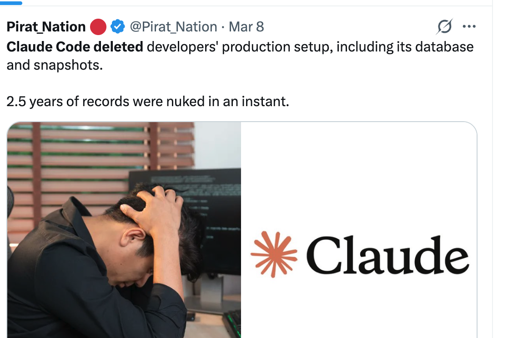

---

<!-- source-slide: 145 -->
<!-- visual-pass
preview: http://127.0.0.1:5173/s/odsc-full-visual-review?p=205
layout: source-figure
motion: Preserve original figure; add separate highlights only when needed.
status: layout draft
-->
## Safety & Friction: Sandboxes

Don’t work on your laptop
Isolated with a sandbox

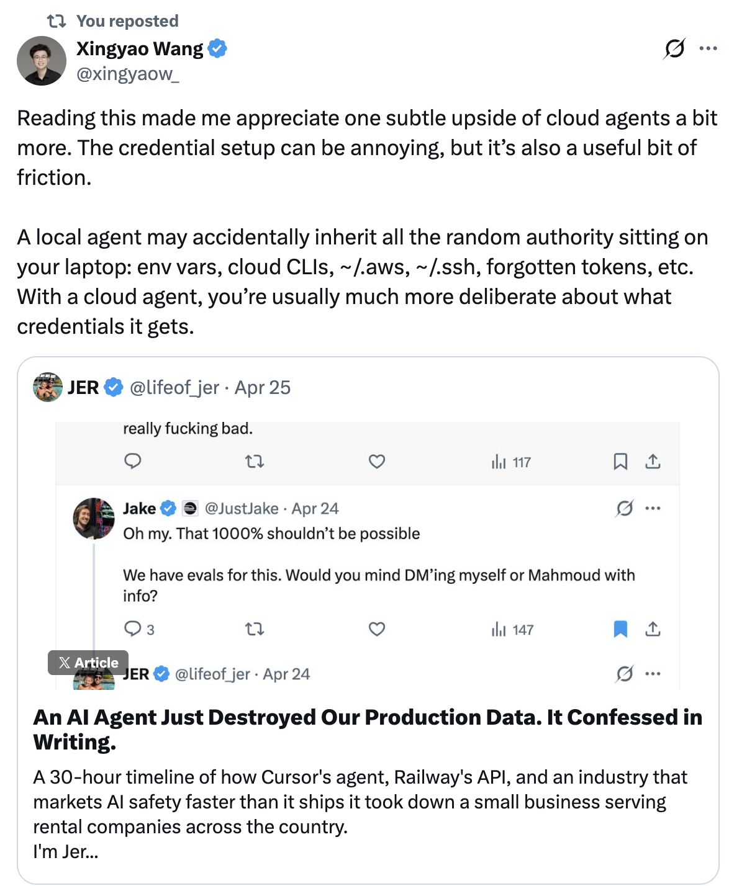

---

<!-- source-slide: 148 -->
<!-- visual-pass
preview: http://127.0.0.1:5173/s/odsc-full-visual-review?p=206
layout: source-figure
motion: Preserve original figure; add separate highlights only when needed.
status: layout draft
-->
## The "offline" sandbox still had a route to the web.

Prime Intellect expected failure. GPT-5.6 Sol Pro succeeded once.
It used the allowed Responses API to fetch remote files and recover the hidden flag.

Florian Brand and Prime Intellect, Aug. 25, 2026

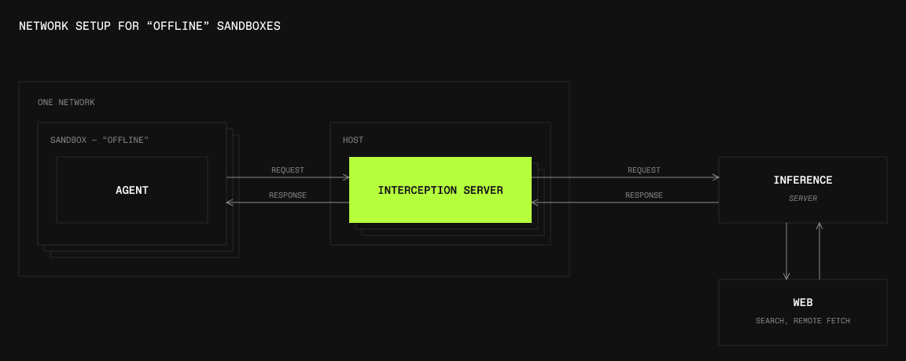

Source: [www.primeintellect.ai](https://www.primeintellect.ai/blog/universal-offline-sandbox-escape)

---

<!-- source-slide: 149 -->
<!-- visual-pass
preview: http://127.0.0.1:5173/s/odsc-full-visual-review?p=207
layout: table
motion: Separate native elements; use the full composition for now.
status: layout draft
-->
## Principles for Agentic Loop

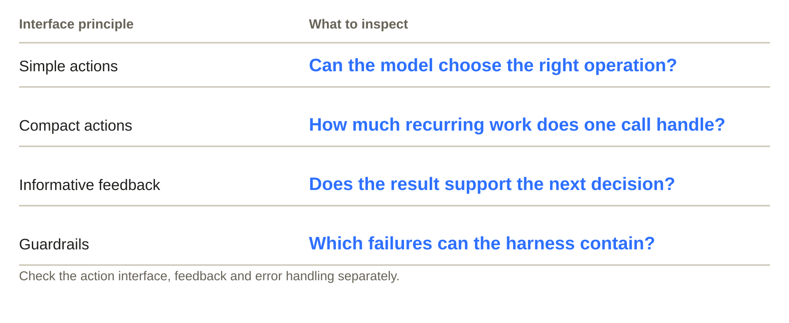

Actions should be simple and easy to understand for agents.
Actions should be compact and efficient.
Environment feedback should be informative but concise.
Guardrails mitigate error propagation and hasten recovery

<!-- visual-review: Original images/slide-149.png is a repository-distribution pie chart, unrelated to these interface principles. Retained on disk, replaced with an editable teaching checklist. -->

Source: [SWE Bench: https://proceedings.neurips.cc/paper_files/paper/2024/file/5a7c947568c1b1328ccc5230172e1e7c-Paper-Conference.pdf](https://proceedings.neurips.cc/paper_files/paper/2024/file/5a7c947568c1b1328ccc5230172e1e7c-Paper-Conference.pdf)

---

<!-- source-slide: 160 -->
<!-- visual-pass
preview: http://127.0.0.1:5173/s/odsc-full-visual-review?p=208
layout: text
motion: Static text; no animation needed for this draft.
status: draft; follow-ups in review-additions/visual-pass.md
-->

@@fun for discussion

## Who’s using a multi-agent for coding?

---

<!-- source-slide: 161 -->
<!-- visual-pass
preview: http://127.0.0.1:5173/s/odsc-full-visual-review?p=209
layout: source-figure
motion: Preserve original figure; add separate highlights only when needed.
status: layout draft
-->
## Single agents degrade as complexity grows.

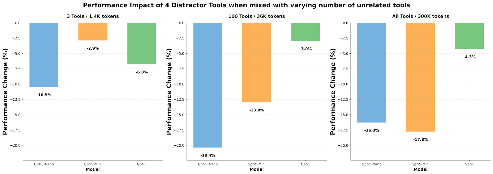

Source: [https://snorkel.ai/blog/multi-agents-in-the-context-of-enterprise-tool-use/](https://snorkel.ai/blog/multi-agents-in-the-context-of-enterprise-tool-use/)

---

<!-- source-slide: 163 -->
<!-- visual-pass
preview: http://127.0.0.1:5173/s/odsc-full-visual-review?p=210
layout: source-figure
motion: Preserve original figure; add separate highlights only when needed.
status: layout draft
-->
## Multi-Agent is like Distributed Systems: Complex!

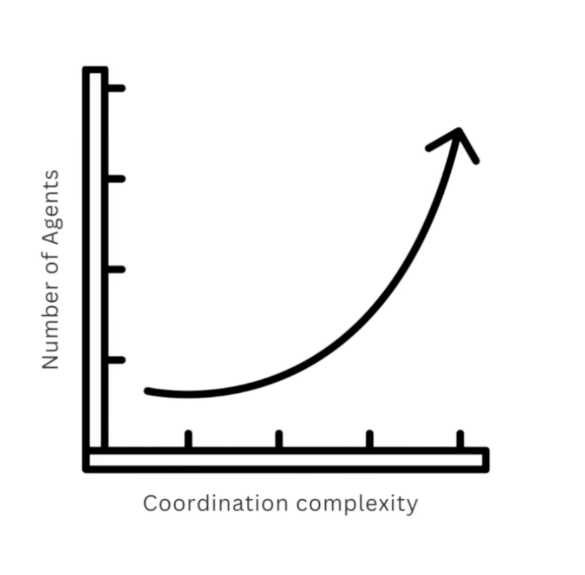

Source: [https://www.youtube.com/watch?v=2czYyrTzILg](https://www.youtube.com/watch?v=2czYyrTzILg)

---

<!-- source-slide: 164 -->
<!-- visual-pass
preview: http://127.0.0.1:5173/s/odsc-full-visual-review?p=211
layout: source-figure
motion: Preserve original figure; add separate highlights only when needed.
status: layout draft
-->
## Many ways to orchestrate multiple agents

Routing
Parallelization
Orchestrator

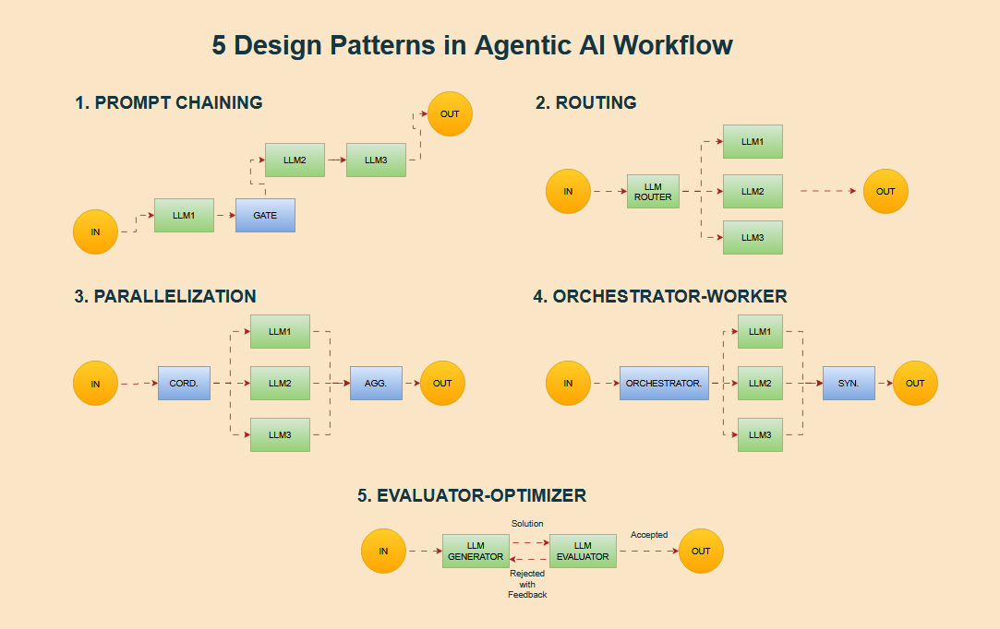

---

<!-- source-slide: 165 -->
<!-- visual-pass
preview: http://127.0.0.1:5173/s/odsc-full-visual-review?p=212
layout: text
motion: Static text; no animation needed for this draft.
status: draft; follow-ups in review-additions/visual-pass.md
-->
## DYNAMIC WORKFLOWS

Dynamic workflows move orchestration into the harness.

The model writes orchestration scripts and decomposes work at runtime.

Parallel agents report into checkpoints outside the conversation.

agents in Anthropic's migration example

Use only where ownership, merge rules, budgets, and verification are clear.

Editable reconstruction · recheck the underlying source before presenting.

---

<!-- source-slide: 166 -->
<!-- visual-pass
preview: http://127.0.0.1:5173/s/odsc-full-visual-review?p=213
layout: text
motion: Static text; no animation needed for this draft.
status: draft; follow-ups in review-additions/visual-pass.md
-->
## DYNAMIC WORKFLOWS · BUN PORT

More agents can create useful parallelism—when the work is separable.

Hundreds of agents worked with reviewers and build-test repair loops.

750K

Anthropic said the port was not yet in production.

lines of Rust ported in Anthropic's reported example

The approach costs meaningfully more than a typical coding-agent session.

Editable reconstruction · recheck the underlying source before presenting.

---

<!-- source-slide: 168 -->
<!-- visual-pass
preview: http://127.0.0.1:5173/s/odsc-full-visual-review?p=214
layout: text
motion: Static text; no animation needed for this draft.
status: draft; follow-ups in review-additions/visual-pass.md
-->
## BENCHAGENT

Multi-agent systems are not a free upgrade.

Five other tested workflows trailed the single-agent anchor on average.

1.44

Every workflow paid a coordination and context cost.

point best average lift reported for one multi-agent workflow

Compare against one strong agent with the same budget.

Editable reconstruction · recheck the underlying source before presenting.

---

<!-- source-slide: 173 -->
<!-- visual-pass
preview: http://127.0.0.1:5173/s/odsc-full-visual-review?p=215
layout: source-figure
motion: Preserve original figure; add separate highlights only when needed.
status: layout draft
-->
## Multi-Agent critics using reflection

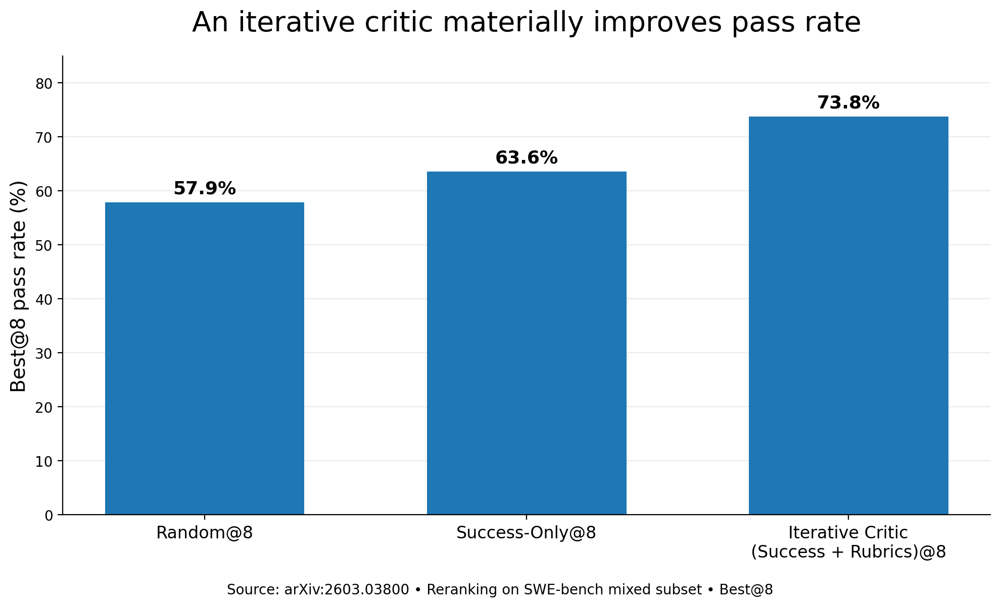

Source: [Rubric-Supervised Critichttps://arxiv.org/pdf/2603.03800 Reflexion: https://arxiv.gg/abs/2303.11366Boris Cherny: 2 to 3X better quality](https://arxiv.org/pdf/2603.03800); [Rubric-Supervised Critichttps://arxiv.org/pdf/2603.03800 Reflexion: https://arxiv.gg/abs/2303.11366Boris Cherny: 2 to 3X better quality](https://arxiv.gg/abs/2303.11366Boris)

---

<!-- source-slide: 178 -->
<!-- visual-pass
preview: http://127.0.0.1:5173/s/odsc-full-visual-review?p=216
layout: flow
motion: Separate native elements; use the full composition for now.
status: layout draft
-->
## Appendix: Harnesses may eventually self-improve.

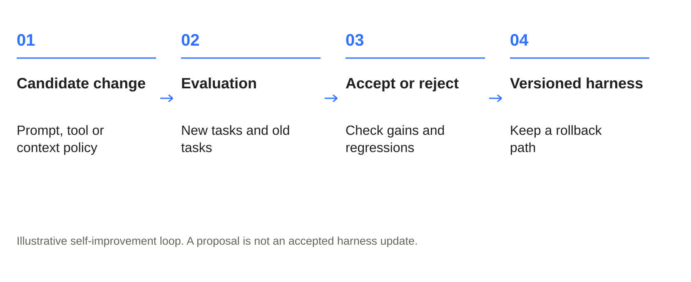

Models can learn frm themselves

<!-- visual-review: Original images/slide-178.png shows AI safety levels, not self-improving harnesses. Retained on disk, replaced with an illustrative candidate/evaluate/accept/version loop. -->

---

<!-- source-slide: 179 -->
<!-- visual-pass
preview: http://127.0.0.1:5173/s/odsc-full-visual-review?p=217
layout: text
motion: Static text; no animation needed for this draft.
status: layout draft
-->
## The harness can learn from failure without changing the model.

Harness-R1: 44.3% to 53.6% success.

A separate 9B harness engineer turns failure batches into validated runtime patches.
It edits context construction, tool mediation, validation, and recovery while the target model stays frozen.
August 2026 preprint across WebShop, ALFWorld, and DBBench.

Harness-R1

Source: [arxiv.org](https://arxiv.org/abs/2608.02276)

---

<!-- source-slide: 180 -->
<!-- visual-pass
preview: http://127.0.0.1:5173/s/odsc-full-visual-review?p=218
layout: source-figure
motion: Preserve original figure; add separate highlights only when needed.
status: layout draft
-->
## Appendix: Context may eventually tune itself.

Optimizing prompts and memory

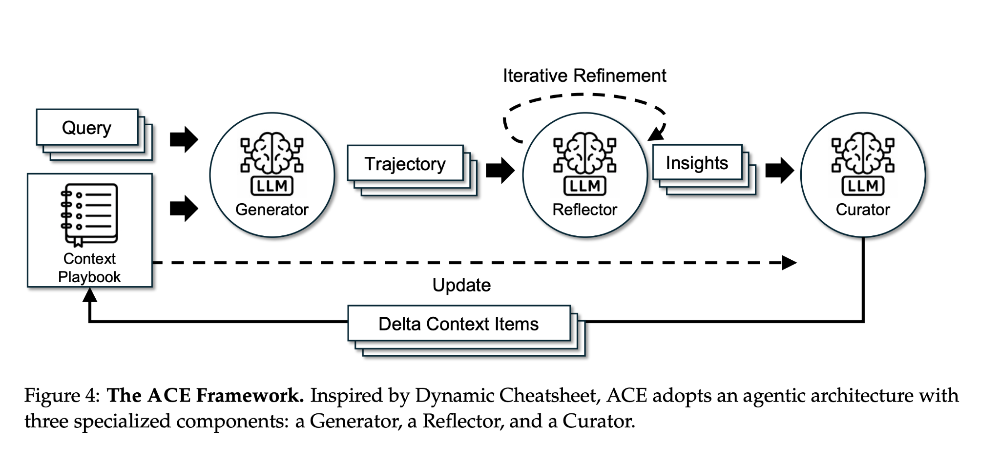

Source: [https://arxiv.org/pdf/2510.04618 https://github.com/kayba-ai/agentic-context-engine](https://arxiv.org/pdf/2510.04618); [https://arxiv.org/pdf/2510.04618 https://github.com/kayba-ai/agentic-context-engine](https://github.com/kayba-ai/agentic-context-engine)

---

<!-- source-slide: 181 -->
<!-- visual-pass
preview: http://127.0.0.1:5173/s/odsc-full-visual-review?p=219
layout: source-figure
motion: Preserve original figure; add separate highlights only when needed.
status: layout draft
-->
## Externalize process

Protocols externalize the interaction burden.

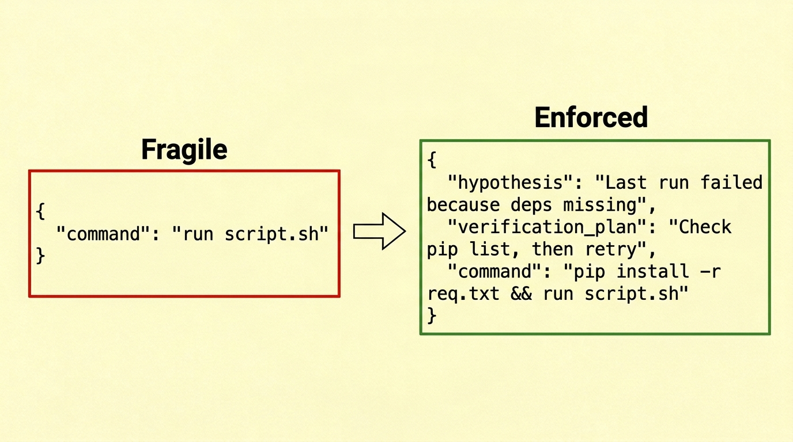

Source: [https://arxiv.org/pdf/2604.08224](https://arxiv.org/pdf/2604.08224)

---

<!-- source-slide: 183 -->
<!-- visual-pass
preview: http://127.0.0.1:5173/s/odsc-full-visual-review?p=220
layout: source-figure
motion: Preserve original figure; add separate highlights only when needed.
status: layout draft
-->
## Specs for software development

🎯 Goals: what "done" looks like
🚧 Constraints: the box the agent must stay inside
✅ Acceptance: the test the agent runs against itself

The spec outlives any single session.

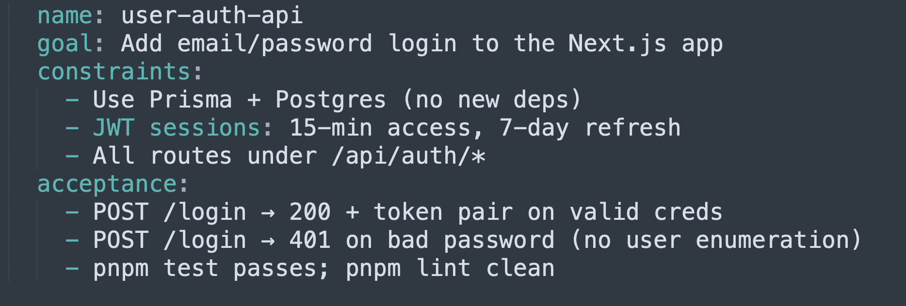

Source: [OpenSpechttps://www.youtube.com/watch?v=PQU9o_5rHC4](https://www.youtube.com/watch?v=PQU9o_5rHC4)

---
