# Slides removed at Rajiv's explicit @@delete marks

Removed from the working deck on September 8, 2026. Assets are retained. This is a recovery archive, not an active backlog. Non-delete review questions remain in the working deck.

<!-- source-slide: 184 -->

@@delete

## Six harness decisions shape the agent

Harness choice changes the path.

Tools define the available actions.

Context and memory decide what information remains useful.

Routing chooses the model for each step.

The loop controls recovery and completion.

Multi-agent design decides when separate work repays coordination.

---

<!-- source-slide: 185 -->

@@delete

## Harness engineering changes the system you actually run

Performance differences — same model, 2× gap
Know the knobs — 5 levers: retrieval, memory, loops, tools, architecture
Mind the lock-in — your harness owns your memory, context, and tools

Yesterday we asked which model.
Today, ask which harness?

---

<!-- source-slide: 186 -->

@@delete

## Harnesses will keep changing, so defaults will keep expiring

---

<!-- source-slide: 187 -->

@@delete

## Engineering the Harness: A Practical Workshop

Source: [Rajiv Shah @rajistics OpenHands https://github.com/rajshah4/harness-engineering](https://github.com/rajshah4/harness-engineering)

---

<!-- new-slide: routing-june-pilot-archived -->

@@delete

## The earlier routing pilot motivated a better controlled rerun

The June pilot reported 10/10 for all policies, with $1.60 frontier-only, $1.05 static routing, and $1.68 for the cascade.

The September 7 experiment supersedes this example in the main section. The old task setup could expose unrelated seeded defects and lacked the newer isolation and repeated-trial evidence.

Source: [Rerun methods and pilot correction](../../../../harness-benchmark/results/workshop4-model-routing-preliminary.md)

---

Slides below remain available for the three-hour master deck, but they are outside the current main line.

<!-- source-slide: 039 -->

@@delete

## What should the agent remember?

---

<!-- source-slide: 005 -->
## Slide 5

@@delete

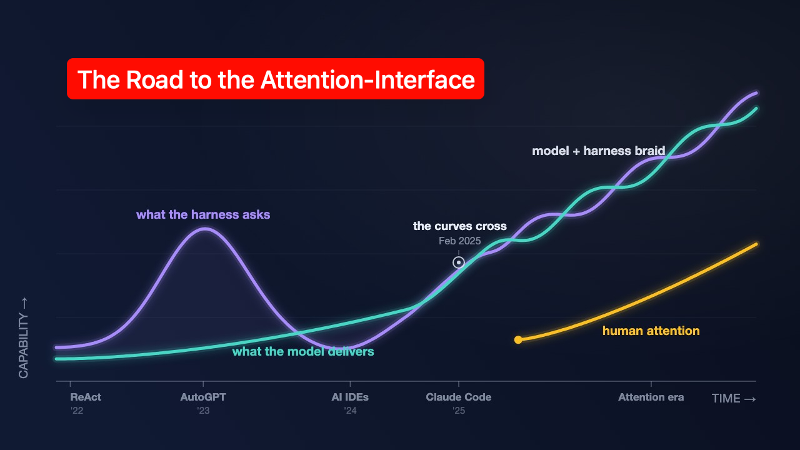

---

<!-- source-slide: 023 -->

@@delete

## A DESIGN SPACE—NOT A LEADERBOARD

Four harnesses make four different bets.

Hermes

Pi

Remember the user

Keep the core small

Learning loop · durable memory · skills from experience

Minimal agent loop · model choice · extension surface

Prime Agent

DeepSeek Harness

Make the harness programmable

Make every layer composable

Persistent REPL · subagents · continual refinement

Plugin-first architecture · event log · swappable loop

NOTE: The original in open slides looked much better

---

<!-- source-slide: 048 -->

@@delete

## Memory & State Agents don't fail because the context fills up. They fail because they forget what matters.

---

<!-- source-slide: 101 -->
## Models are rapidly getting better.

@@delete

Tradeoffs:
Capability
Speed
Cost

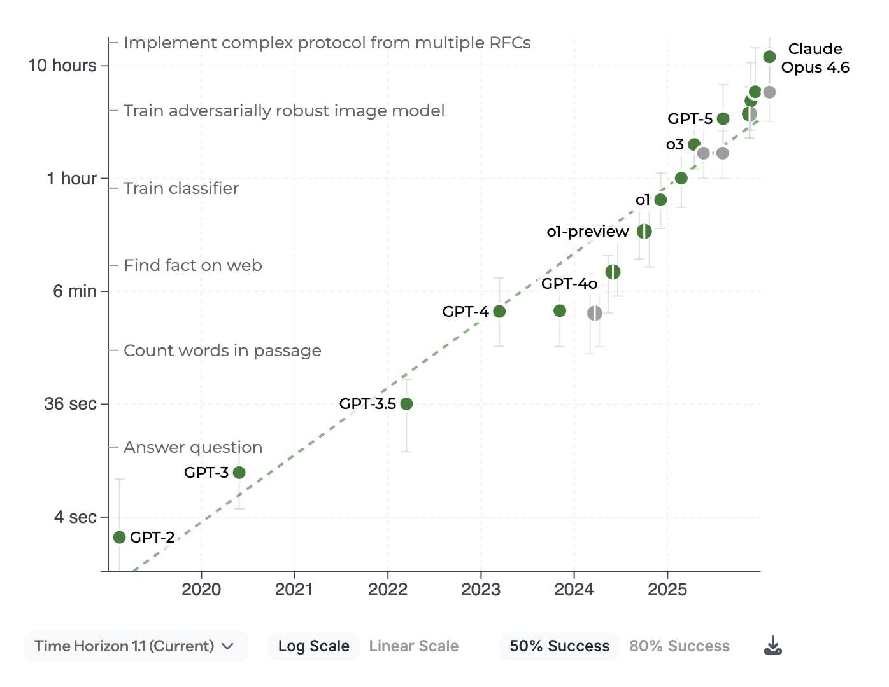

Source: [https://metr.org/](https://metr.org/)

---

<!-- source-slide: 105 -->

@@delete

## Model prices collapse faster than harnesses change.

A four-month-old flagship score now costs about one-thirteenth as much.

A dated August 2026 snapshot compared GPT-5.4 xhigh with Luna max at the same reported score.
Frontier-only policies can spend heavily while leaving cheaper capacity unused.
Treat model routing and budgets as harness decisions. Recheck the prices before presenting.

Nic Dunz | Rahul

Source: [x.com](https://x.com/nicdunz/status/2082884002201878824); [x.com](https://x.com/rahulgs/status/2068046943276663154)

---

<!-- source-slide: 119 -->

@@delete

## Agentic Loops and Tool Use A great loop forgives a mediocre prompt.

---

<!-- source-slide: 124 -->

@@delete

## Why this takes 12M tokens

Not one generation
Hundreds of iterations
Each step includes context + feedback
The model isn’t solving the problem. The system is.

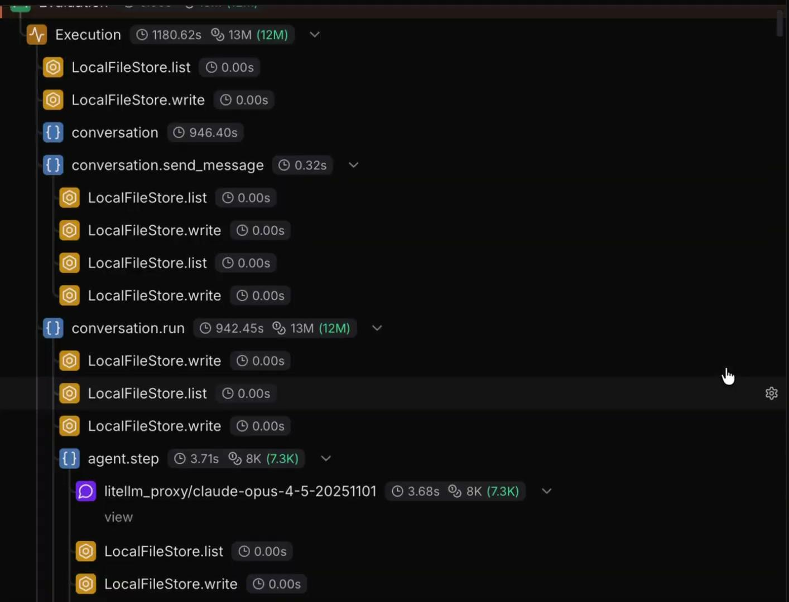

Source: [https://laminar.sh/shared/evals/c97e4a45-8a14-428f-8eac-f77ef6eb75a8](https://laminar.sh/shared/evals/c97e4a45-8a14-428f-8eac-f77ef6eb75a8)

---

<!-- source-slide: 141 -->
## Defensive Tool Returns.

@@delete

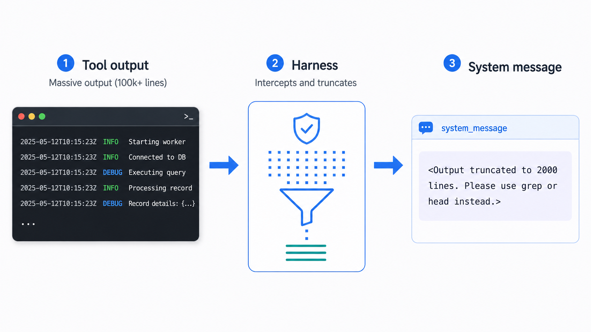

---

<!-- source-slide: 159 -->

@@delete

## System Architecture:Single versus Multi Agent

---

<!-- source-slide: 182 -->

@@delete

## It’s possible to build an independent standard

standardized format to represent agent trajectories across different harnesses, tools, and environments

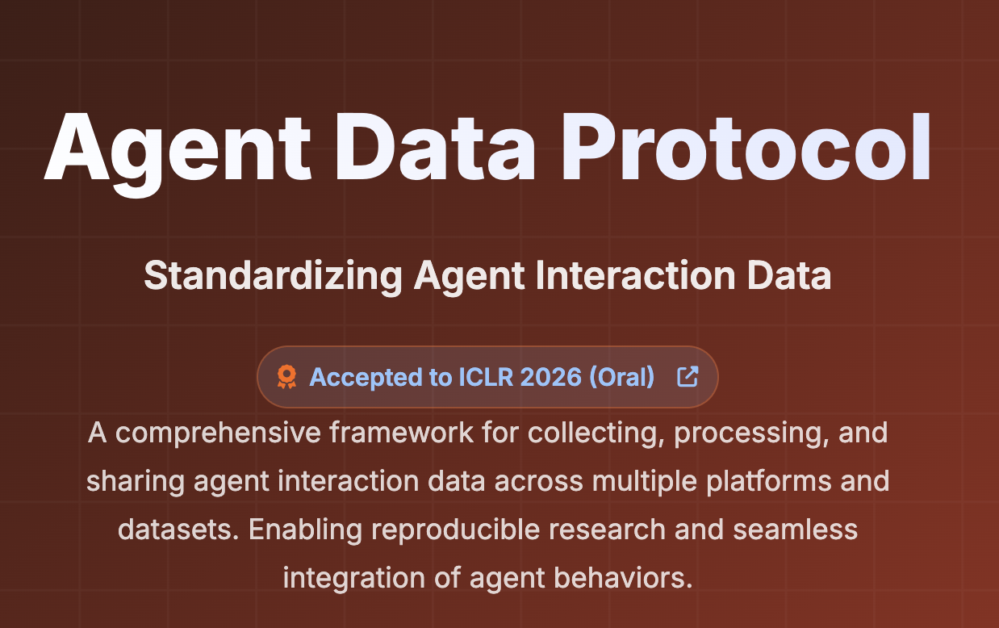

Source: [https://www.agentdataprotocol.com/](https://www.agentdataprotocol.com/)

---

<!-- source-slide: 188 -->

@@delete

## Appendix: BM25 rewards rare query terms.

Probabilistic lexical ranking function

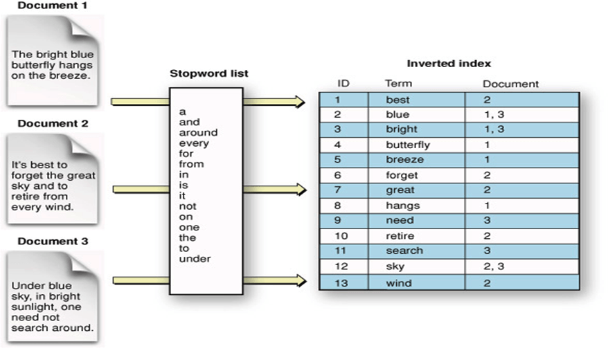

---

<!-- source-slide: 189 -->

@@delete

## Embeddings use the semantic meaning of words

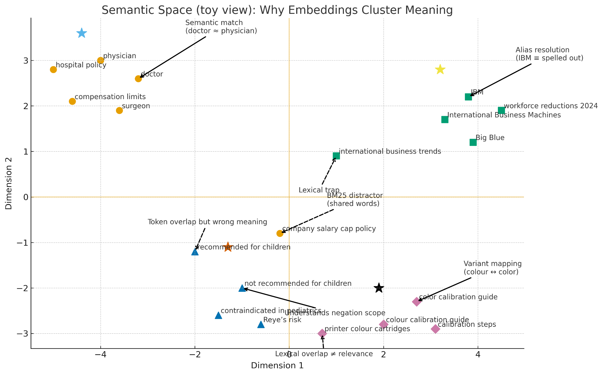

---

<!-- source-slide: 190 -->

@@delete

## Adding a loop with agentic search

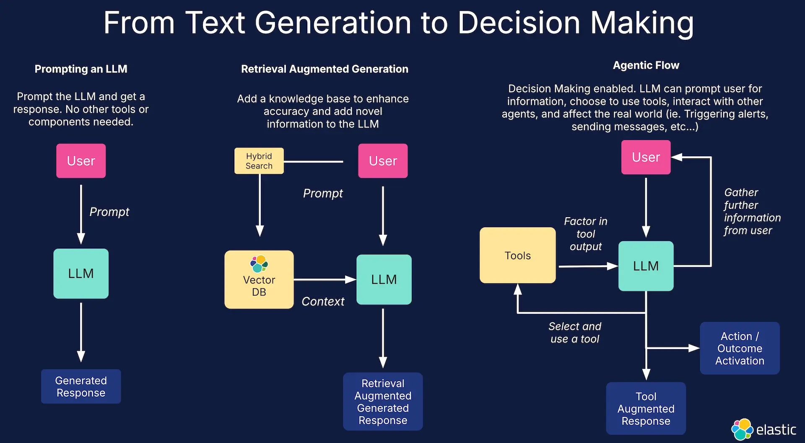

---

<!-- source-slide: 191 -->

@@delete

## BRIGHT dataset is a more challenging retrieval task

Requires reasoning
over retrieval

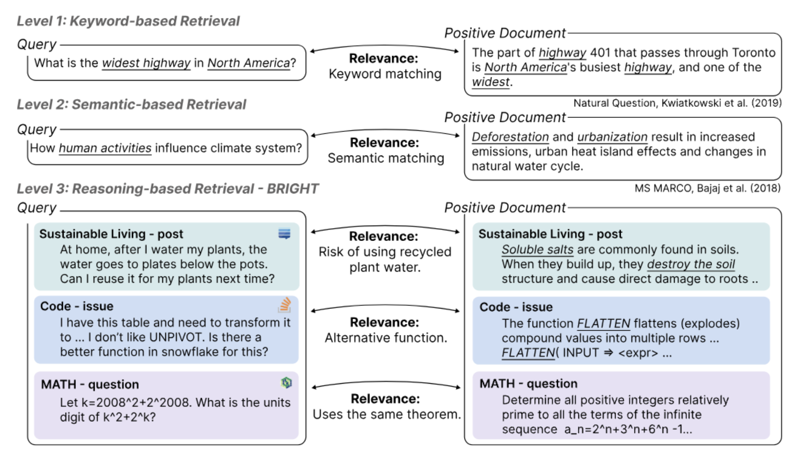

Source: [BRIGHT: https://arxiv.org/pdf/2407.12883](https://arxiv.org/pdf/2407.12883)

---

<!-- source-slide: 192 -->

@@delete

## Agentic BM25 beats Semantic Search on reasoning.

Querying with LLM using BM25!!
Agentic Search
LLMs know synonyums

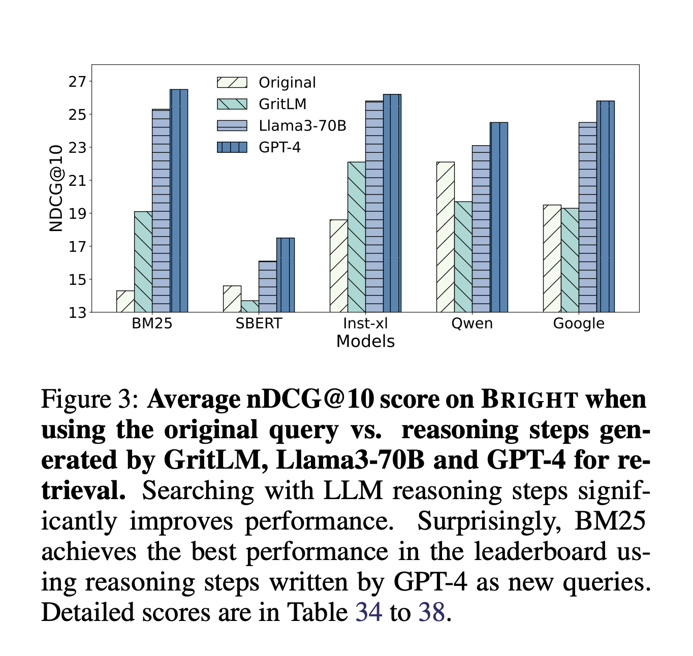

Source: [BRIGHT: https://arxiv.org/pdf/2407.12883](https://arxiv.org/pdf/2407.12883)

---

<!-- source-slide: 193 -->

@@delete

## The Status Quo: Hybrid Search.

Semantic
search

Reciprocal rank fusion

Filter via metadata

Query

Final retrievals

Reranker

Lexical search

Prioritizing
n=10

Prioritizing
n=100

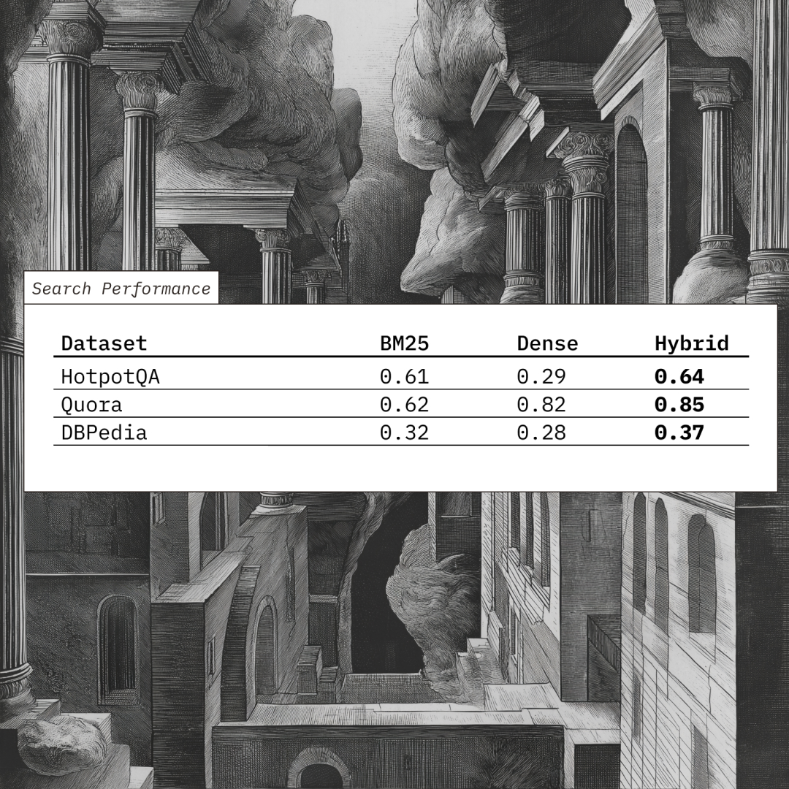

Source: [Chroma: https://x.com/trychroma/status/1983625513244750304](https://x.com/trychroma/status/1983625513244750304)

---

<!-- source-slide: 194 -->

@@delete

## Appendix: Navigate structured data; don’t stuff into a prompt

For structured data, file search worked better than placing schemas in prompts
Using nested navigation guide for lots of files

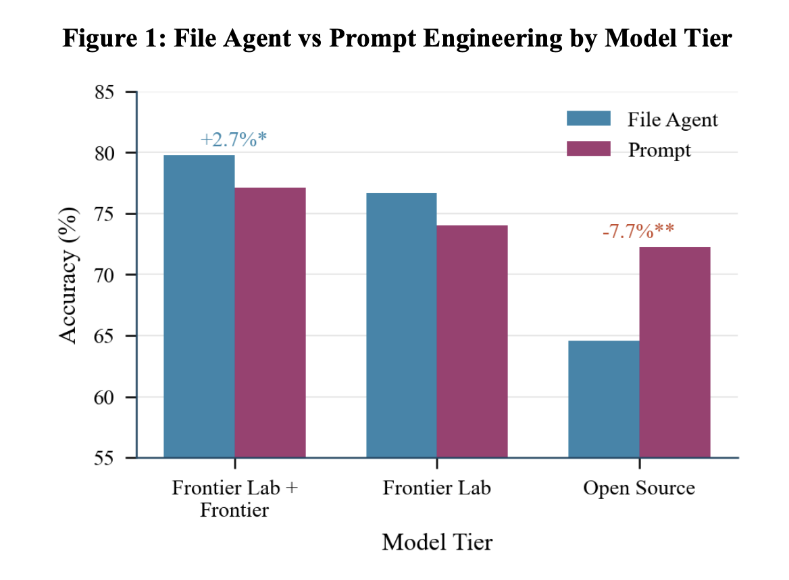

Source: [https://arxiv.org/pdf/2602.05447](https://arxiv.org/pdf/2602.05447)

---

<!-- source-slide: 195 -->

@@delete

## Large codebases need layered navigation.

Lean root instructions. Local instructions. Scoped tests. LSP for symbols.

Anthropic says too much starting context degrades performance.
Keep CLAUDE.md files lean and layered. Start inside the relevant subdirectory. Scope test commands locally.
When grep returns thousands of strings, use LSP to find the actual symbol.

Anthropic large-codebase guidance

Source: [claude.com](https://claude.com/blog/how-claude-code-works-in-large-codebases-best-practices-and-where-to-start)

---

<!-- source-slide: 198 -->
## So when should you move to a database

@@delete

Files stay the source of truth. Index on top when query cost bites.

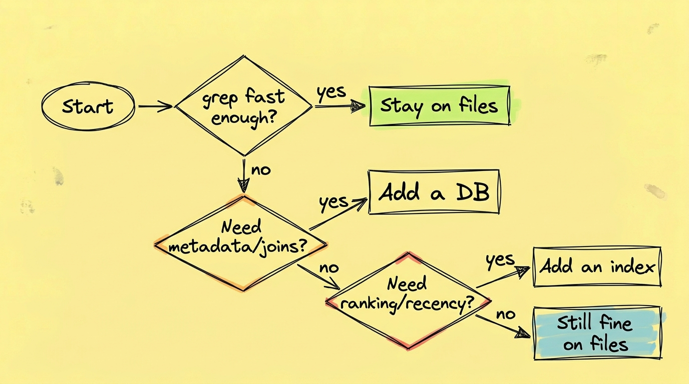

---

<!-- source-slide: 199 -->
## TroubleShooting Tools

@@delete

Many agent issues are tool-use problems.

Leonie Monigatti

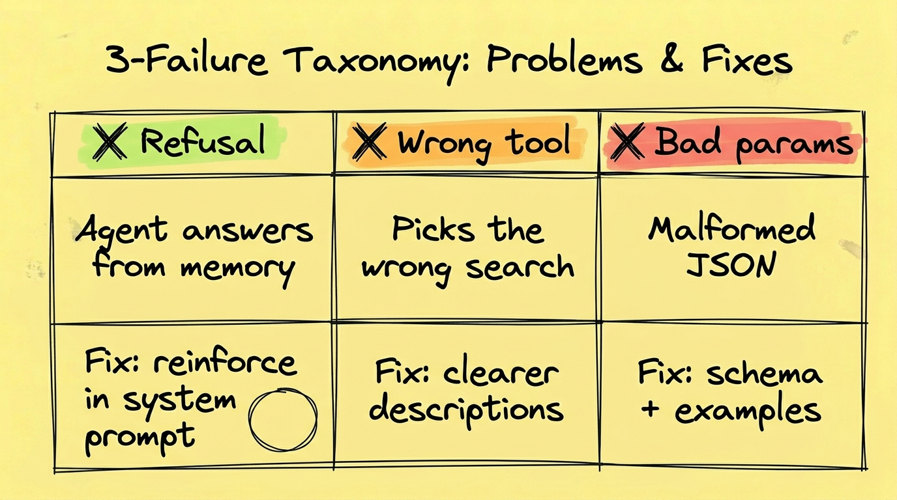

---

<!-- source-slide: 200 -->
## Engineering the Harness: A Practical Workshop

@@delete

Source: [Rajiv Shah @rajistics OpenHands https://github.com/rajshah4/harness-engineering](https://github.com/rajshah4/harness-engineering)

---

<!-- source-slide: 201 -->
## Let's start with how agents find what they need.

@@delete

The Model
Retrieval
Context & Memory
Agentic Loops & Tool Use
System Architecture

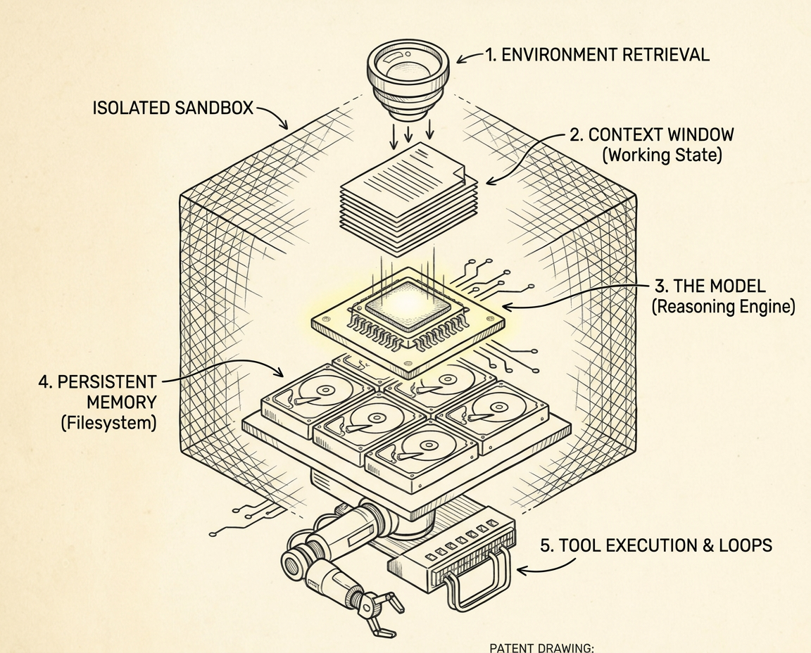

---

<!-- source-slide: 202 -->
## Let's start with how agents find what they need.

@@delete

The Model
Retrieval
Context & Memory
Agentic Loops & Tool Use
System Architecture

---

<!-- source-slide: 203 -->
## Protocols and The JSON Schema Fix

@@delete

The harness as cognitive environment. The Foundation Model (Agent Core) sits at the center.
Six harness dimensions form a coordinated ring around it.

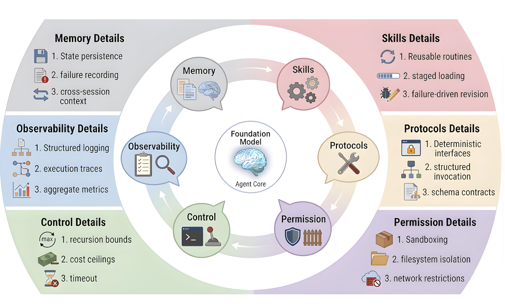

Source: [https://arxiv.org/pdf/2604.08224](https://arxiv.org/pdf/2604.08224)

---

<!-- source-slide: 204 -->
## Agentic Search trades latency for massive accuracy.

@@delete

Pick:
Accuracy
Latency
(5s versus 25s)

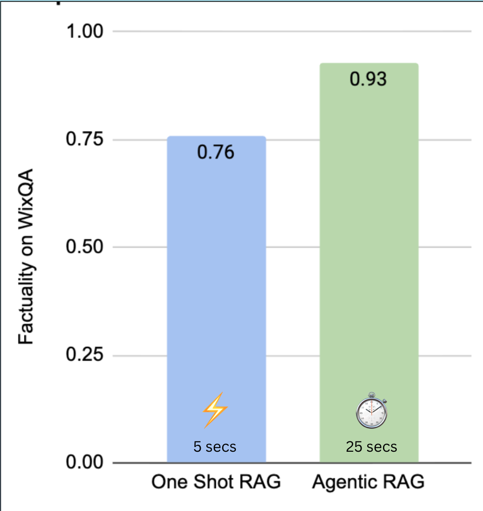

Source: [WIxQA: https://arxiv.org/abs/2505.08643](https://arxiv.org/abs/2505.08643)

---

<!-- source-slide: 206 -->
## Uber Engineering, Aug. 27, 2026

@@delete

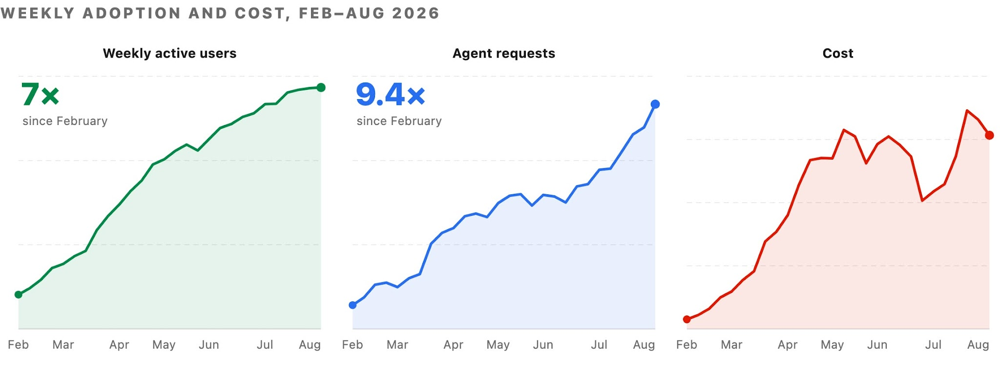

Source: [www.uber.com](https://www.uber.com/ca/en/blog/efficient-software-factory/)

---

<!-- source-slide: 207 -->
## Slide 207

@@delete

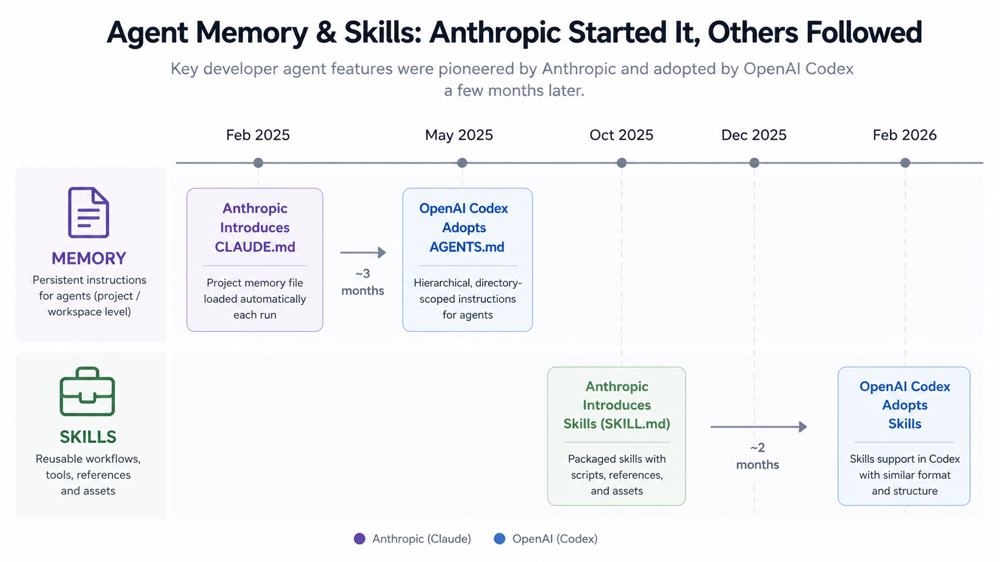

---

<!-- new-slide: trained-code-search-at-scale -->

@@delete

## At codebase scale, train the search behavior too

Applied Compute reports that a 15x larger corpus increased ripgrep latency by 11x, while turbopuffer search latency increased by 1.2x. In its large-scale setting, a small model trained to search an index made the median search nearly 3x faster and reduced marginal token cost by 100x.

The boundary matters. Filesystem tools worked well with frontier models in a single repository. Indexed retrieval became attractive when the same large corpus was searched repeatedly.

The economics depend on query volume, corpus churn, indexing cost, and the retrieval method. Treat these as vendor-reported results, not universal constants.

TO BUILD: Use the original latency-versus-corpus figure from the article. Pair it with a simple “single repository / repeated large-corpus search” boundary, not another dense benchmark table.

Source: [Applied Compute, “Training a Specialist Code Search Agent with turbopuffer,” Sept. 4, 2026](https://www.appliedcompute.com/case-studies/turbopuffer)
