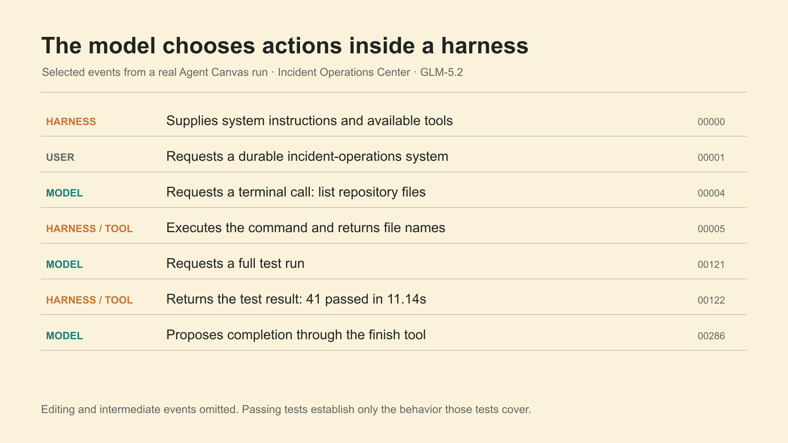

# Agent Canvas teaching pass

The working deck now has an annotated opening run, a repeatable harness-improvement method, a measured Pi intervention, three context chapters, and decision debriefs for all six workshops. New diagrams use 1920 × 1080 PNG previews with SVG and Excalidraw sources.

[Updated deck](../deck.md) · [Current headline outline](../headline-spine.md) · [Combined editable visual canvas](teaching-visuals-combined.excalidraw)

The exercises use a recurring illustrative pagination problem. Prepared results retain their original tasks and provenance. The incident trace and Pi intervention are real recorded evidence; the compaction example is illustrative.

## 1. Read a real Agent Canvas run

Opening, immediately after source 004. Selected recorded events show model decisions and harness execution.

[Editable SVG](teaching-visuals/agent-canvas-trace.svg) · [Excalidraw](teaching-visuals/agent-canvas-trace.excalidraw) · [3840 × 2160 PNG](teaching-visuals/agent-canvas-trace-2x.png)

## 2. Test one harness change

End of Workshop 1. Reuse this method and measurement vocabulary throughout the course.

[Editable SVG](teaching-visuals/harness-improvement-method.svg) · [Excalidraw](teaching-visuals/harness-improvement-method.excalidraw) · [3840 × 2160 PNG](teaching-visuals/harness-improvement-method-2x.png)

## 3. Pi cache-control experiment

End of Workshop 1. A measured before/after configuration change; the quality results are separate trajectories.

[Editable SVG](teaching-visuals/pi-cache-intervention.svg) · [Excalidraw](teaching-visuals/pi-cache-intervention.excalidraw) · [3840 × 2160 PNG](teaching-visuals/pi-cache-intervention-2x.png)

## 4. Place information by lifetime

Source 042. An illustrative pagination task spans active context, working state, and reusable guidance.

[Editable SVG](context-visuals/context-lifetimes.svg) · [Excalidraw](context-visuals/context-lifetimes.excalidraw) · [3840 × 2160 PNG](context-visuals/context-lifetimes-2x.png)

## 5. Compare the observed context footprint

Replaces the context-budget placeholder with measured totals. A component breakdown is still pending.

[Editable SVG](teaching-visuals/context-per-call.svg) · [Excalidraw](teaching-visuals/context-per-call.excalidraw) · [3840 × 2160 PNG](teaching-visuals/context-per-call-2x.png)

## 6. Inspect a continuation record

Replaces the summarization placeholder with a worked example. Clearly marked illustrative.

[Editable SVG](context-visuals/compaction-continuation.svg) · [Excalidraw](context-visuals/compaction-continuation.excalidraw) · [3840 × 2160 PNG](context-visuals/compaction-continuation-2x.png)

## Follow-up work

- Replace the illustrative compaction record with a real Agent Canvas event when one is captured.
- Add a measured breakdown of instructions, tools, retrieved evidence, and history across turns. Existing totals do not support inventing those segments.
- Rehearse the pagination scenarios in Canvas and link the exact prepared runs for each activity. Existing result slides refer to their original experiments.
- Capture the real trace in the current Canvas UI for a later screenshot-led layout.
- Apply the same focused evidence treatment to selected benchmark screenshots in a subsequent visual pass. Original benchmark images remain available.

## Source and review notes

[Trace and intervention provenance](trace-evidence.md). The headline outline is synced with the working deck. Prior deck and headline versions are retained next to the working files. PPTX and Open Slides synchronization remains a separate export step.
